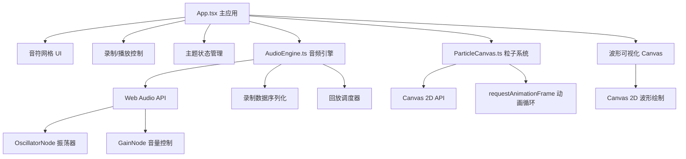

## 1. 架构设计



## 2. 技术描述
- **前端**：React 18 + TypeScript 5 + Vite 5
- **音频**：Web Audio API（OscillatorNode + GainNode）
- **可视化**：Canvas 2D API + requestAnimationFrame
- **状态管理**：React useState/useRef（轻量场景，无需状态管理库）
- **构建工具**：Vite
- **样式方案**：CSS-in-JS / 内联样式（动态主题色需要）

## 3. 目录结构
```
.
├── package.json
├── vite.config.js
├── tsconfig.json
├── index.html
└── src/
    ├── index.tsx          # 入口渲染
    ├── App.tsx            # 主应用组件（状态管理、协调数据流）
    ├── AudioEngine.ts     # 音频引擎（音符播放、录制、回放）
    └── ParticleCanvas.tsx # 粒子系统组件（Canvas粒子动画）
```

## 4. 模块设计

### 4.1 AudioEngine.ts 音频引擎
```typescript
interface NoteEvent {
  timestamp: number;
  noteId: number;
}

class AudioEngine {
  constructor();
  init(): void;                    // 初始化 AudioContext
  playNote(noteId: number): void;  // 播放指定音符
  startRecording(): void;          // 开始录制
  stopRecording(): NoteEvent[];    // 停止录制，返回事件序列
  startPlayback(events: NoteEvent[], onNote: (id: number) => void): void;  // 开始回放
  stopPlayback(): void;            // 停止回放
  getWaveformData(): Float32Array; // 获取波形数据用于可视化
  dispose(): void;                 // 资源清理
}
```

### 4.2 ParticleCanvas.tsx 粒子系统
```typescript
interface Particle {
  x: number;
  y: number;
  vx: number;
  vy: number;
  life: number;
  maxLife: number;
  color: string;
  size: number;
}

interface Props {
  themeColor: string;
}

// 外部调用: emitParticles(x, y, color)
```

### 4.3 App.tsx 主应用
- 管理 5x10 网格状态（活跃格子高亮）
- 管理录制/播放状态
- 协调点击事件 → AudioEngine + ParticleCanvas
- 管理主题色状态与切换
- 实现波形可视化绘制

## 5. 音符映射（5行10列 = 50音符）
- 音高范围：中央C (C4, 261.63Hz) 到 高音C (C6, 1046.50Hz) 附近
- 每行代表一个八度组，每列递增半音
- 使用 OscillatorNode 正弦波 + GainNode 包络（快速起音，缓慢衰减）

## 6. 性能优化
- **低延迟**：AudioContext 预先初始化，避免首次点击延迟
- **粒子池**：对象池复用粒子，减少 GC
- **动画帧合并**：粒子更新与波形绘制共享 rAF 循环
- **事件节流**：高频点击下的性能保护
- **资源清理**：组件卸载时断开所有音频节点、取消动画帧
