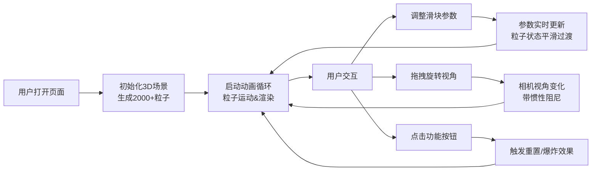

## 1. 产品概述

交互式3D粒子宇宙编辑器，帮助用户在浏览器中创建和编辑可视化粒子宇宙效果。解决数据可视化和艺术创作中难以直观调整大量粒子行为参数的问题，面向设计师、数据可视化工程师和创意编程爱好者。

## 2. 核心功能

### 2.1 用户角色
| 角色 | 注册方式 | 核心权限 |
|------|----------|----------|
| 普通用户 | 无需注册 | 使用全部编辑功能，调整粒子参数，查看效果 |

### 2.2 功能模块
1. **3D粒子宇宙场景**：2000+粒子实时渲染，粒子连线效果，物理运动模拟
2. **控制面板**：5个参数滑块，2个功能按钮，实时参数调整
3. **相机控制器**：鼠标拖拽旋转视角，滚轮缩放，惯性阻尼效果

### 2.3 页面详情
| 页面名称 | 模块名称 | 功能描述 |
|----------|----------|----------|
| 主页面 | 3D渲染区域 | 全屏粒子宇宙渲染，支持鼠标交互，深空渐变背景 |
| 主页面 | 控制面板 | 右侧悬浮面板，参数滑块（发射速度、粒子大小、颜色渐变、旋转速度、引力强度），功能按钮（重置、爆炸） |

## 3. 核心流程

## 4. 用户界面设计

### 4.1 设计风格
- **主色调**：深空蓝黑渐变背景 (#0a0a1a → #1a1a3a)
- **粒子颜色**：蓝色到紫色渐变 (#4a9eff → #9b59ff)，可动态调节
- **UI颜色**：滑块轨道 #3a3a5c，滑块 #7c7cff，悬停 #a0a0ff
- **字体**：Segoe UI, sans-serif，白色/浅蓝色字体
- **视觉效果**：毛玻璃控制面板（背景模糊10px，圆角12px），粒子发光，连线半透明

### 4.2 页面设计概述
| 页面名称 | 模块名称 | UI元素 |
|----------|----------|--------|
| 主页面 | 3D场景 | 全屏Canvas，深空渐变背景，2000+发光粒子，粒子间连线 |
| 主页面 | 控制面板 | 右侧悬浮，半透明毛玻璃，5个自定义滑块，2个按钮，标题说明文字 |
| 主页面 | 响应式抽屉 | 宽度<768px时，控制面板折叠为底部抽屉 |

### 4.3 响应式设计
- **桌面端**（≥768px）：右侧固定控制面板，宽度320px
- **移动端**（<768px）：底部抽屉式控制面板，可展开/收起
- **触控优化**：支持双指缩放，滑动旋转视角

### 4.4 3D场景设计
- **环境**：深空蓝黑渐变背景，无外部光源，粒子自发光
- **相机**：PerspectiveCamera，初始距离30，视角75°
- **运动**：粒子围绕Y轴缓慢旋转，支持引力、速度等物理参数调节
- **后处理**：粒子发光效果，线条抗锯齿
- **性能**：≥2000粒子稳定45FPS以上，响应延迟≤16ms
