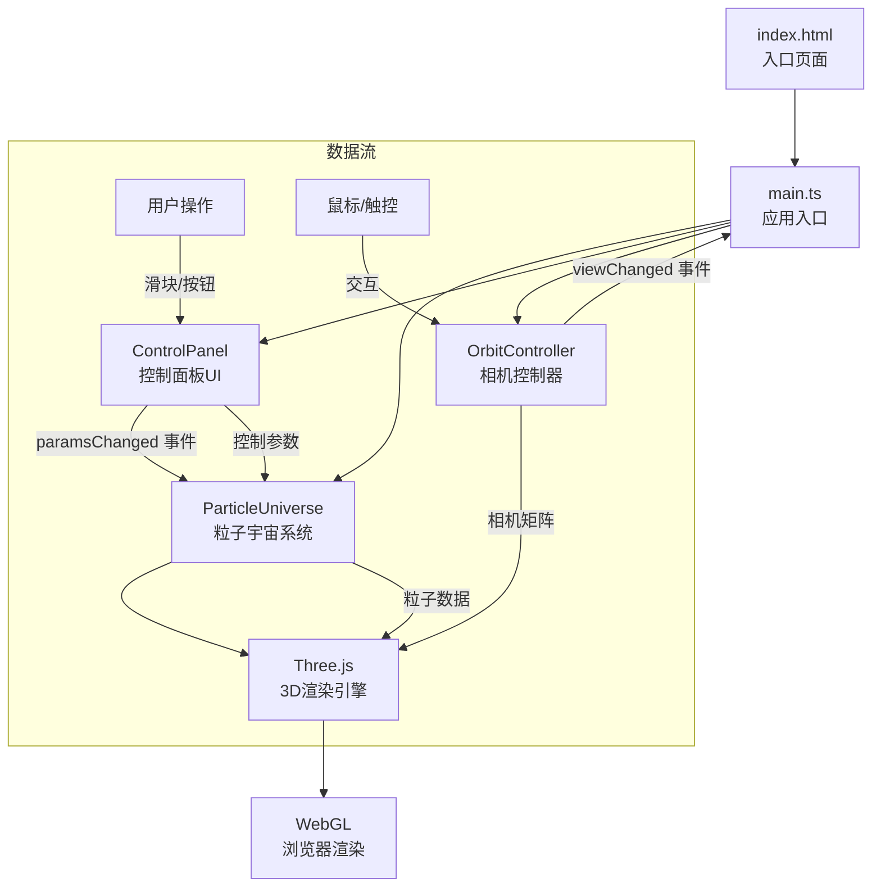

## 1. 架构设计



## 2. 技术描述

- **前端框架**：TypeScript + Three.js @0.160.0 + Vite
- **构建工具**：Vite 5.x，依赖预构建开启
- **3D引擎**：Three.js 0.160.0，使用BufferGeometry、Points、LineSegments
- **类型支持**：@types/three
- **语言标准**：TypeScript 严格模式，target ES2020，module ESNext

## 3. 项目结构

| 文件 | 说明 |
|------|------|
| `package.json` | 项目依赖配置，启动脚本 npm run dev |
| `vite.config.js` | Vite基础配置，入口index.html，开启预构建 |
| `tsconfig.json` | TypeScript严格模式配置 |
| `index.html` | 入口页面，全屏深空背景，div#container |
| `src/main.ts` | 入口文件，初始化场景/相机/渲染器，启动动画循环 |
| `src/particleUniverse.ts` | 粒子宇宙类，粒子生成/更新/渲染，连线逻辑 |
| `src/controlPanel.ts` | 控制面板类，UI生成，事件触发 |
| `src/orbitController.ts` | 自定义相机控制器，鼠标/触控交互，惯性阻尼 |

## 4. 数据模型与接口定义

### 4.1 控制参数类型

```typescript
interface ParticleParams {
  emissionSpeed: number;      // 发射速度 0-5
  particleSize: number;       // 粒子大小 0.1-2
  colorGradient: number;      // 颜色渐变 0-1 (蓝→紫→红)
  rotationSpeed: number;      // 旋转速度 0-2
  gravityStrength: number;    // 引力强度 -1-1
}
```

### 4.2 粒子数据结构

```typescript
interface ParticleData {
  position: Float32Array;     // x,y,z * N
  velocity: Float32Array;     // vx,vy,vz * N
  colors: Float32Array;       // r,g,b * N
  sizes: Float32Array;        // size * N
}
```

### 4.3 事件类型

```typescript
// ControlPanel 事件
type ParamsChangedEvent = CustomEvent<ParticleParams>;

// OrbitController 事件  
type ViewChangedEvent = CustomEvent<{
  position: THREE.Vector3;
  target: THREE.Vector3;
}>;
```

## 5. 核心算法

### 5.1 粒子生成算法
- 球面随机分布：在半径15的球体内均匀分布2000+粒子
- 初始速度：垂直于球心向量的切向速度 + 微小随机扰动
- 颜色渐变：HSL色彩空间插值，从蓝色到紫色

### 5.2 粒子运动物理
- 位置更新：`position += velocity * deltaTime`
- 引力计算：`velocity += gravity * (center - position).normalize()`
- 边界约束：超出半径20时施加向心力
- 缓动过渡：参数变化时使用lerp线性插值平滑过渡

### 5.3 连线渲染算法
- 空间网格划分：将空间分为2.5×2.5×2.5网格
- 邻域检测：仅检查相邻网格内的粒子
- 距离阈值：距离<2.5时绘制连线
- 透明度衰减：`alpha = 1 - distance / 2.5`

### 5.4 惯性阻尼算法
- 速度衰减：`velocity *= 0.95` 每帧
- 角度更新：`theta += velocityX`，`phi += velocityY`
- 边界限制：phi限制在0.1到π-0.1之间避免万向锁

## 6. 性能优化策略

1. **BufferGeometry**：使用单个BufferGeometry存储所有粒子数据，避免多次draw call
2. **空间索引**：连线检测使用网格空间划分，O(N)复杂度
3. **TypedArray**：使用Float32Array存储顶点数据，GPU友好
4. **帧率控制**：requestAnimationFrame，deltaTime归一化
5. **对象池**：LinesGeometry复用，避免频繁GC
6. **事件节流**：滑块输入使用requestAnimationFrame批量更新
