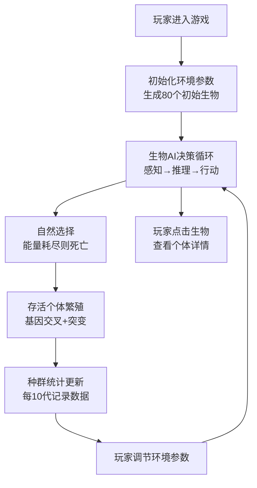

## 1. 产品概述

进化沙盒是一款基于达尔文进化论的策略演化模拟游戏，玩家扮演上帝角色调控环境参数，观察虚拟生物在自然选择压力下如何演化出不同形态和行为策略，直观感受物种进化的动态过程。

- 核心价值：通过可视化的演化过程，帮助用户理解自然选择、遗传变异、环境适应等进化论核心概念
- 目标用户：生物爱好者、学生、游戏玩家、对复杂系统和AI演化感兴趣的技术人群
- 市场定位：兼具教育性和娱乐性的互动模拟体验，填补演化模拟类游戏在国内市场的空白

## 2. 核心功能

### 2.1 用户角色

| 角色 | 注册方式 | 核心权限 |
|------|----------|----------|
| 上帝玩家 | 无需注册，直接体验 | 调节环境参数、观察生物演化、查看个体详情、控制模拟进程 |

### 2.2 功能模块

1. **模拟主场景**：俯视视角草原环境，动态渲染地形、食物、障碍物和80+生物个体
2. **环境控制面板**：5个核心参数滑块（温度、湿度、食物密度、障碍物密度、突变率），实时调节
3. **神经网络AI系统**：每个生物独立神经网络决策，支持权重突变和优良基因遗传
4. **遗传性状系统**：16个基因位点编码外观与行为属性，支持交叉和变异
5. **种群统计面板**：实时显示代数、个体数、平均速度、体型、基因多样性指数
6. **演化趋势图表**：每10代自动记录，Canvas绘制折线图，支持多参数切换
7. **个体详情查看**：点击生物显示基因指纹条形码、神经网络拓扑图、感知输入和决策输出

### 2.3 功能详情

| 页面/模块名称 | 子模块名称 | 功能描述 |
|---------------|------------|----------|
| 模拟主场景 | 地形渲染 | 根据湿度参数动态调整背景渐变色（沙漠黄→森林绿），俯视视角 |
| 模拟主场景 | 生物渲染 | 六边形像素风精灵，颜色、大小、速度、角须长度由基因决定 |
| 模拟主场景 | 交互系统 | 点击生物高亮跟随，查看详情；鼠标悬停显示基本信息 |
| 环境控制面板 | 参数滑块 | 5个滑块带实时数值显示，拖动时场景延迟<100ms实时响应 |
| 环境控制面板 | 视觉效果 | 深色半透明毛玻璃效果，切换参数0.3秒渐入渐出动画 |
| 神经网络AI | 决策系统 | 8输入→12隐藏→3输出的三层网络，单次推理<5ms |
| 神经网络AI | 遗传机制 | 存活超过30秒的个体可遗传网络参数，繁殖时5%概率权重突变 |
| 遗传性状系统 | 基因编码 | 16个基因位点：颜色RGB(3)、大小(2)、速度(2)、角须(2)、代谢率(2)、感知范围(2)、繁殖阈值(1)、食性(2) |
| 遗传性状系统 | 交叉变异 | 有性繁殖时基因随机交叉，整体突变率由环境参数控制 |
| 种群统计面板 | 实时数据 | 代数、存活数、平均速度、平均体型、基因多样性指数（香农熵计算） |
| 种群统计面板 | 趋势图表 | Canvas绘制折线图，可切换显示速度、体型、数量、多样性等变化趋势 |
| 个体详情窗口 | 基因指纹 | 16个基因位点的条形码可视化 |
| 个体详情窗口 | 网络拓扑 | 神经网络连接图，实时显示神经元激活状态 |
| 个体详情窗口 | 感知决策 | 当前8个感知输入值和3个决策输出值的仪表盘显示 |

## 3. 核心流程

### 主流程描述
1. 玩家进入应用，自动初始化模拟环境，随机生成80个初始生物个体
2. 玩家通过右侧控制面板调节环境参数，场景实时响应变化
3. 生物个体通过神经网络感知环境（最近食物方向、障碍距离、能量值等），输出移动、进食、繁殖决策
4. 自然选择：不适应环境的个体能量耗尽死亡，适应的个体存活并繁殖
5. 繁殖时基因交叉+突变，神经网络权重以5%概率突变，存活超30秒的个体基因可优先遗传
6. 种群统计面板实时更新数据，每10代自动记录演化数据生成趋势图
7. 玩家可点击任意生物查看详细基因、神经网络和决策信息

## 4. 用户界面设计

### 4.1 设计风格

- **设计基调**：有机自然主义 + 科技感。以生物演化为主线，融合自然色彩与科技可视化元素
- **主色调**：深森林绿(#1a472a)、泥土棕(#8b6914)、沙漠黄(#e6c88a)、基因蓝(#2563eb)作为科技点缀
- **辅助色**：活力橙(#f97316)用于警告/突变，翠绿(#10b981)用于健康/繁殖，玫红(#ec4899)用于高亮选中
- **字体**：展示字体使用"Space Grotesk"（现代几何感），正文字体使用"Inter"（清晰易读）
- **按钮风格**：圆角8px，轻微投影，hover时有微妙的缩放+发光效果
- **毛玻璃面板**：backdrop-filter: blur(12px)，半透明黑色背景(rgba(15, 23, 42, 0.7))，1px半透明白色边框
- **图标风格**：线性简洁图标，使用Lucide图标库

### 4.2 页面设计概述

| 模块名称 | UI元素 | 布局 | 颜色 | 动画 |
|----------|--------|------|------|------|
| 游戏主画布 | Phaser3 Canvas渲染 | 左侧3/4宽度，自适应高度 | 动态渐变背景，根据湿度从沙漠黄(#e6c88a)过渡到森林绿(#1a472a) | 生物移动平滑插值，选中高亮呼吸效果 |
| 控制面板 | 5个参数滑块组、数值显示、重置按钮 | 右侧1/4垂直堆叠，固定宽度320px | 深色毛玻璃背景，滑块轨道渐变，拖动手柄基因蓝发光 | 面板进入0.3s渐入，滑块拖动0.1s过渡，数值变化0.2s数字滚动 |
| 统计面板 | 代数、存活数、平均速度、平均体型、基因多样性数值显示，趋势图Canvas | 控制面板下方，堆叠布局 | 毛玻璃背景，数值用等宽字体，图表配色与统计项对应 | 数值更新0.3s数字动画，图表数据点0.5s渐入 |
| 个体详情窗口 | 基因条形码、神经网络拓扑图、感知/决策仪表盘、属性列表 | 可拖拽悬浮窗口，默认居中偏左 | 半透明深色背景，不同功能区用细边框分隔 | 窗口出现0.3s弹性缩放，数据更新0.2s平滑过渡 |

### 4.3 响应式设计

- **桌面优先**：核心分辨率1280x720及以上，布局比例固定（左侧3/4画布，右侧1/4面板）
- **自适应缩放**：使用CSS vmin单位确保元素在不同分辨率下比例协调
- **最小支持**：1280x720，低于此分辨率显示提示信息
- **触控优化**：滑块增大触控区域，点击命中范围≥40x40px

### 4.4 游戏场景设计

- **环境/背景氛围**：
  - 低湿度（沙漠）：#f4d03f → #ca8a04 暖色渐变，颗粒噪点纹理
  - 中湿度（草原）：#84cc16 → #166534 绿色渐变，柔和噪点
  - 高湿度（森林）：#065f46 → #064e3b 深绿渐变，增加阴影层次感
- **光照**：Phaser3环境光+方向光模拟日照，根据温度调节色温
- **生物视觉**：
  - 六边形基础形状，6个像素边构成
  - 身体颜色由RGB基因直接决定
  - 角须长度和粗细由基因控制，从六边形顶点向外延伸
  - 移动时有轻微的上下浮动和旋转摆动
- **交互反馈**：
  - 选中生物：粉色高亮边框 + 缩放1.1倍 + 呼吸脉动
  - 鼠标悬停：显示半透明信息框，含ID和能量值
  - 繁殖时：短暂绿色光晕特效
  - 死亡时：灰色淡出 + 缩小消散
