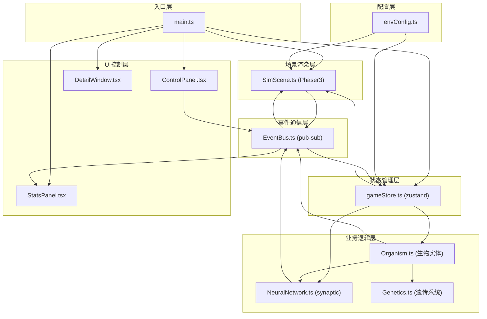

## 1. 架构设计

本项目为纯前端的演化模拟应用，采用模块化分层架构，通过事件总线实现模块间解耦，确保高性能和可扩展性。



**模块调用关系与数据流向：**

1. **main.ts** 作为入口，负责初始化所有模块，注册事件监听
2. **envConfig.ts** → 提供默认配置给 **gameStore.ts** 和 **SimScene.ts** 初始化使用
3. **gameStore.ts** 保存全局状态，**SimScene.ts** 和 AI模块读取状态进行渲染和决策
4. **ControlPanel.tsx** 用户操作 → **EventBus.ts** 发布事件 → **gameStore.ts** 更新状态 → **EventBus.ts** 通知 **SimScene.ts** 重绘
5. **Organism.ts** 生物实体 → 调用 **NeuralNetwork.ts** 进行决策 → 决策结果通过 **EventBus.ts** 发布
6. **SimScene.ts** 渲染循环 → 更新生物位置/状态 → 状态变化通知 **gameStore.ts** → **StatsPanel.tsx** 更新统计数据

## 2. 技术选型

| 技术 | 版本 | 用途 |
|------|------|------|
| TypeScript | ^5.0 | 类型安全的开发语言 |
| Vite | ^5.0 | 构建工具，支持依赖预构建 |
| Phaser | 3.80.0 | 2D游戏渲染引擎，负责场景和生物渲染 |
| synaptic | ^1.1.4 | 神经网络库，实现生物AI决策 |
| @types/synaptic | ^1.1.6 | synaptic的TypeScript类型定义 |
| zustand | ^4.4 | 轻量级状态管理，管理环境参数和种群数据 |
| @types/node | ^20.0 | Node.js类型定义 |
| lucide-react | ^0.294.0 | 图标库（用于UI面板） |

## 3. 项目目录结构

```
auto25/
├── .trae/documents/          # 项目文档
├── src/
│   ├── main.ts               # 应用入口
│   ├── config/
│   │   └── envConfig.ts      # 环境参数配置
│   ├── event/
│   │   └── EventBus.ts       # 事件总线
│   ├── store/
│   │   └── gameStore.ts      # 全局状态管理
│   ├── ai/
│   │   └── NeuralNetwork.ts  # 神经网络AI
│   ├── entities/
│   │   ├── Organism.ts       # 生物实体
│   │   ├── Genetics.ts       # 遗传系统
│   │   ├── Food.ts           # 食物实体
│   │   └── Obstacle.ts       # 障碍物实体
│   ├── scene/
│   │   └── SimScene.ts       # 模拟主场景
│   ├── ui/
│   │   ├── ControlPanel.tsx  # 环境控制面板
│   │   ├── StatsPanel.tsx    # 种群统计面板
│   │   ├── DetailWindow.tsx  # 个体详情窗口
│   │   └── TrendChart.tsx    # 趋势图组件
│   ├── types/
│   │   └── index.ts          # 全局类型定义
│   └── utils/
│       └── helpers.ts        # 工具函数
├── index.html                # HTML入口
├── vite.config.js            # Vite配置
├── tsconfig.json             # TypeScript配置
└── package.json              # 项目依赖
```

## 4. 核心数据结构

### 4.1 基因类型定义

```typescript
// 16个基因位点，每个范围0-1
interface Genes {
  colorR: number;      // 红色通道
  colorG: number;      // 绿色通道  
  colorB: number;      // 蓝色通道
  size: number;        // 体型大小
  sizeVariance: number;// 体型变异度
  speed: number;       // 移动速度
  acceleration: number;// 加速度
  whiskerLength: number;// 角须长度
  whiskerCount: number;// 角须数量
  metabolism: number;  // 代谢率
  energyEfficiency: number; // 能量效率
  senseRange: number;  // 感知范围
  senseAngle: number;  // 感知角度
  reproductionThreshold: number; // 繁殖能量阈值
  dietPreference: number; // 食性偏好（0草食1肉食）
  aggression: number;  // 攻击性
}
```

### 4.2 生物实体类型

```typescript
interface OrganismData {
  id: string;
  generation: number;
  genes: Genes;
  x: number;
  y: number;
  rotation: number;
  energy: number;
  maxEnergy: number;
  age: number;
  survivalTime: number;
  isAlive: boolean;
  isSelected: boolean;
  neuralNetwork: NeuralNetwork;
  perception: PerceptionInput;
  lastDecision: DecisionOutput;
}

interface PerceptionInput {
  nearestFoodDirection: number;  // -1到1，相对朝向
  nearestFoodDistance: number;   // 0到1，归一化距离
  nearestObstacleDirection: number;
  nearestObstacleDistance: number;
  nearestOrganismDirection: number;
  nearestOrganismDistance: number;
  energyLevel: number;           // 当前能量/最大能量
  temperature: number;           // 环境温度归一化
}

interface DecisionOutput {
  movement: number;     // -1后退到1前进
  rotation: number;     // -1左转到1右转
  action: number;       // 0无，1进食，2繁殖
}
```

### 4.3 全局状态类型

```typescript
interface GameState {
  // 环境参数
  environment: {
    temperature: number;     // 0-100
    humidity: number;        // 0-100
    foodDensity: number;     // 0-100
    obstacleDensity: number; // 0-100
    mutationRate: number;    // 0-20
  };
  
  // 模拟数据
  simulation: {
    generation: number;
    totalPopulation: number;
    organisms: OrganismData[];
    foods: FoodData[];
    obstacles: ObstacleData[];
    fps: number;
    timeScale: number;
    isPaused: boolean;
  };
  
  // 统计数据
  statistics: {
    averageSpeed: number;
    averageSize: number;
    geneticDiversity: number;
    trendHistory: TrendRecord[];
  };
  
  // 选中的生物
  selectedOrganismId: string | null;
  
  // Actions
  setEnvironment: (params: Partial<GameState['environment']>) => void;
  updateOrganism: (id: string, data: Partial<OrganismData>) => void;
  addOrganism: (organism: OrganismData) => void;
  removeOrganism: (id: string) => void;
  selectOrganism: (id: string | null) => void;
  nextGeneration: () => void;
  recordTrend: () => void;
  resetSimulation: () => void;
}
```

### 4.4 事件定义

```typescript
enum EventType {
  // 环境事件
  ENVIRONMENT_CHANGED = 'environment:changed',
  
  // 模拟事件
  SIMULATION_TICK = 'simulation:tick',
  GENERATION_COMPLETE = 'generation:complete',
  
  // 生物事件
  ORGANISM_CREATED = 'organism:created',
  ORGANISM_DIED = 'organism:died',
  ORGANISM_REPRODUCED = 'organism:reproduced',
  ORGANISM_SELECTED = 'organism:selected',
  
  // UI事件
  UI_PARAMETER_CHANGED = 'ui:parameter:changed',
  UI_RESET_REQUESTED = 'ui:reset:requested',
  
  // 性能事件
  FPS_UPDATED = 'fps:updated',
}
```

## 5. 性能优化策略

### 5.1 渲染性能
- **对象池模式**：食物和障碍物使用对象池复用，避免频繁GC
- **空间分区**：使用网格空间划分，将生物、食物、障碍物按网格索引，减少碰撞检测和最近邻搜索的时间复杂度从O(n²)降到O(n)
- **批量渲染**：Phaser3的StaticGroup和Group批量渲染相同类型对象
- **帧率控制**：逻辑更新与渲染分离，逻辑固定30FPS，渲染自适应屏幕刷新率

### 5.2 AI性能
- **神经网络缓存**：网络结构预计算，推理时仅做矩阵运算
- **WebWorker**：神经网络推理可移至Worker线程（视性能需求）
- **批量推理**：同帧内多个生物的神经网络推理向量化处理

### 5.3 状态更新性能
- **zustand选择性订阅**：UI组件只订阅需要的状态切片，避免不必要重渲染
- **节流更新**：统计数据每100ms更新一次，而非每帧更新
- **Immutable更新**：使用immer或手动保证状态更新的不可变性，提高比较效率

### 5.4 性能指标
- 生物数量≥80时，FPS稳定≥45
- 神经网络单次推理≤5ms
- 状态更新到场景渲染延迟≤50ms
- 滑块调节到场景响应延迟≤100ms

## 6. 关键算法

### 6.1 神经网络结构
```
输入层 (8个神经元):
├── 最近食物方向
├── 最近食物距离
├── 最近障碍方向
├── 最近障碍距离
├── 最近同类方向
├── 最近同类距离
├── 能量等级
└── 环境温度

隐藏层 (12个神经元):
└── 全连接，sigmoid激活函数

输出层 (3个神经元):
├── 移动 (-1~1)
├── 旋转 (-1~1)
└── 行为 (0无/1进食/2繁殖，取最大值)
```

### 6.2 遗传算法
- **选择**：存活时间≥30秒的个体才有繁殖资格，按能量值排序择优
- **交叉**：单点交叉，随机选择基因位点，父母基因各取一半
- **变异**：每位基因以`mutationRate`概率发生高斯突变(σ=0.1)，神经网络权重5%概率突变
- **多样性计算**：香农熵计算种群基因多样性，对每个基因位点计算等位基因分布

### 6.3 空间分区算法
- 网格大小 = 生物最大感知范围 × 1.5
- 每个对象维护所在网格索引
- 查找最近邻时只检查当前网格和相邻8个网格

## 7. 依赖安装说明

```bash
# 使用npm安装
npm install phaser@3.80.0 synaptic zustand lucide-react
npm install -D typescript vite @types/node @types/synaptic
```
