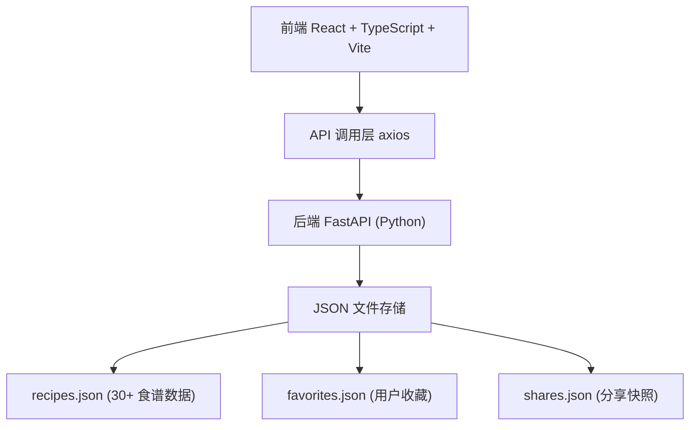
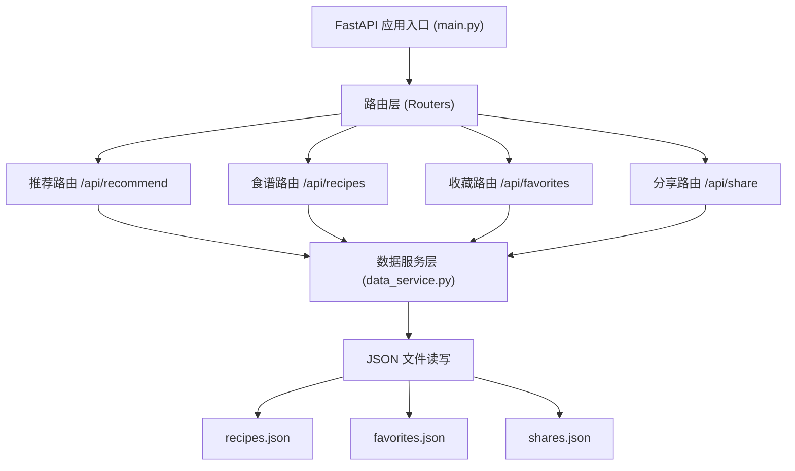
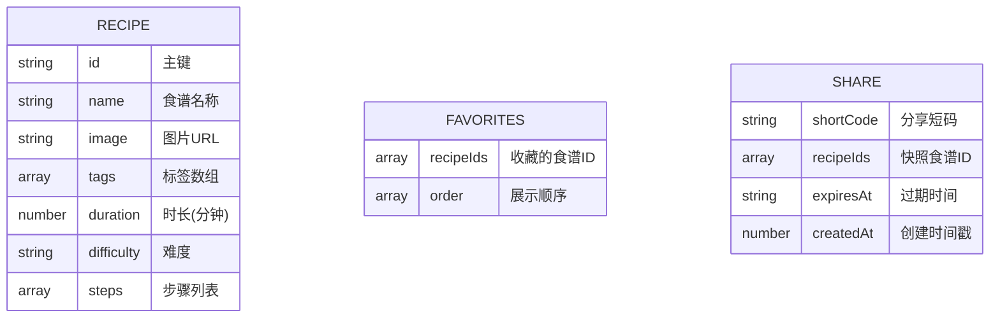

## 1. 架构设计



## 2. 技术描述

- **前端**：React 18 + TypeScript + Vite + React Router DOM + Axios
- **构建工具**：Vite（热更新、快速构建）
- **后端**：Python FastAPI + Uvicorn + Pydantic
- **数据存储**：JSON 文件（recipes.json, favorites.json, shares.json）
- **状态管理**：React useState + useContext（轻量级场景）
- **动画方案**：纯 CSS 过渡和关键帧动画（无额外动画库）
- **拖拽实现**：原生 HTML5 Drag and Drop API

## 3. 路由定义

| 路由 | 页面 | 用途 |
|-------|---------|-------|
| / | HomePage | 首页，随机推荐和标签筛选 |
| /favorites | FavoritesPage | 收藏夹页面，管理和分享收藏 |

## 4. API 定义

### 4.1 TypeScript 类型定义

```typescript
interface Recipe {
  id: string;
  name: string;
  image: string;
  tags: string[];
  duration: number;
  difficulty: '简单' | '中等' | '困难';
  steps: string[];
}

interface FavoritesResponse {
  recipeIds: string[];
  recipes: Recipe[];
  order: string[];
}

interface ShareResponse {
  shortCode: string;
  expiresAt: string;
  shareUrl: string;
}
```

### 4.2 API 接口列表

| 方法 | 路径 | 描述 | 请求参数 | 响应格式 |
|------|------|------|----------|----------|
| GET | /api/recommend | 获取随机推荐食谱 | count?: number | Recipe[] |
| GET | /api/recipes/tag/{tag} | 按标签筛选食谱 | tag: string | Recipe[] |
| GET | /api/favorites | 获取收藏列表 | - | FavoritesResponse |
| POST | /api/favorites | 添加收藏 | { recipeId: string } | { success: boolean } |
| DELETE | /api/favorites/{recipeId} | 移除收藏 | recipeId: string | { success: boolean } |
| POST | /api/favorites/order | 更新收藏顺序 | { order: string[] } | { success: boolean } |
| POST | /api/favorites/share | 生成分享链接 | - | ShareResponse |
| GET | /api/share/{shortCode} | 获取分享快照 | shortCode: string | Recipe[] |

## 5. 服务器架构图



## 6. 数据模型

### 6.1 数据模型定义



### 6.2 数据文件结构

**recipes.json**：
```json
[
  {
    "id": "recipe-001",
    "name": "番茄意大利面",
    "image": "https://images.unsplash.com/...",
    "tags": ["快捷", "素食"],
    "duration": 25,
    "difficulty": "简单",
    "steps": ["准备食材", "煮面条", "炒制酱料", "混合拌匀"]
  }
]
```

**favorites.json**：
```json
{
  "recipeIds": [],
  "order": []
}
```

**shares.json**：
```json
{
  "abc123": {
    "recipeIds": ["recipe-001", "recipe-002"],
    "expiresAt": "2026-06-14T17:49:00Z",
    "createdAt": 1718300940
  }
}
```

## 7. 前端目录结构

```
src/
├── App.tsx              # 主组件，路由配置
├── main.tsx             # 入口文件
├── index.css            # 全局样式
├── pages/
│   ├── HomePage.tsx     # 首页组件
│   └── FavoritesPage.tsx # 收藏夹页面
├── components/
│   ├── RecipeCard.tsx   # 食谱卡片组件
│   ├── RecipeModal.tsx  # 食谱详情模态框
│   └── TagFilter.tsx    # 标签筛选组件
└── api/
    └── recipes.ts       # API 调用封装
```

## 8. 性能优化策略

- **首页加载**：Vite 代码分割 + 按需加载，目标 < 2秒
- **标签筛选**：后端JSON内存读取，前端缓存热门标签结果，目标 < 500ms
- **拖拽排序**：纯前端状态管理，防抖保存到后端，目标 < 200ms
- **图片优化**：使用 loading="lazy" 懒加载，适当尺寸的图片URL
- **动画优化**：使用 transform 和 opacity 动画，触发 GPU 加速
