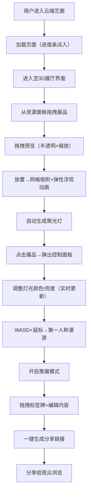

## 1. 产品概述

云端艺廊是一个浏览器端的互动式3D虚拟展厅创建与分享平台，致力于解决远程艺术展览时观众无法身临其境地观赏作品、缺乏空间叙事感和交互性的核心痛点。

- 目标用户：艺术家、策展人、画廊运营者、教育机构及艺术爱好者
- 核心价值：零门槛创建沉浸式3D虚拟展厅，通过第一人称漫游、可交互展品与策展工具，将物理展览的空间体验数字化，一键分享至全球观众

## 2. 核心功能

### 2.1 功能模块

1. **3D展厅主界面**：Three.js渲染的虚拟展厅空间，包含浅米色纹理墙壁、浅灰色网格地板、第一人称漫游控制器
2. **资源面板（左侧）**：预置至少5种不同主题的3D展品（雕塑、画作），支持拖拽放置到展厅地面
3. **展品系统**：拖拽预览（半透明+缩放动画）、网格吸附放置、弹性浮现动画（0.6s）、自动生成圆形聚光灯
4. **灯光控制面板**：点击展品弹出，色轮选择器调节灯光颜色，滑块调节亮度（0-100%），实时更新（<50ms延迟）
5. **第一人称漫游系统**：WASD移动，鼠标拖拽旋转视野，平滑镜头阻尼（响应时间约200ms）
6. **策展模式**：拖拽角落标签牌到展品旁，编辑文字与背景色，渐入动画（0.3s），一键生成分享链接
7. **加载与性能系统**：进度条淡入加载动画，12个展品同时运行帧率≥45fps

### 2.3 页面详情

| 页面名称 | 模块名称 | 功能描述 |
|----------|----------|----------|
| 展厅主页面 | 磨砂玻璃导航栏 | 顶部半透明导航栏，展示Logo、展厅标题、视角切换、策展模式按钮 |
| 展厅主页面 | 资源面板 | 左侧可折叠资源库，展示5+预置展品缩略图，支持拖拽到3D场景 |
| 展厅主页面 | 3D展厅场景 | Three.js渲染的展厅空间，墙壁、地板、灯光、展品、第一人称控制器 |
| 展厅主页面 | 悬浮工具栏 | 底部圆角胶囊形工具栏，包含撤销、清空、导出分享等快捷操作 |
| 展厅主页面 | 控制面板 | 点击展品后弹出的右侧浮层，含灯光色轮、亮度滑块、标签编辑功能 |
| 展厅主页面 | 加载遮罩 | 页面初始加载时显示，含进度条和淡入动画 |

## 3. 核心流程

用户打开云端艺廊首页，页面以进度条淡入方式加载Three.js场景。加载完成后，用户看到一个空的3D虚拟展厅，顶部为磨砂玻璃导航栏，左侧为资源面板，底部为悬浮工具栏。

用户从左侧资源面板拖拽展品模型到展厅中央地面：拖拽过程中模型半透明跟随鼠标并伴随缩放预览动画；释放鼠标后，展品自动吸附到最近的网格交点，播放从地面升起的弹性浮现动画（持续0.6秒），同时自动生成一盏圆形聚光灯跟随模型，呈现柔和光晕效果。

用户点击已放置的展品，右侧弹出控制面板：通过色轮选择器调整灯光颜色，通过滑块（0-100%）调节亮度，调整结果实时同步至3D场景（延迟低于50ms）。用户按下WASD键在展厅中前后左右移动，鼠标拖拽可旋转视野，镜头移动具有约200ms的平滑阻尼感。

用户开启策展模式后，可拖拽展厅角落的标签牌到展品旁，编辑标签文字内容和背景颜色，标签牌从透明渐变为不透明（0.3秒动画）。策展完成后，用户点击"生成分享链接"按钮，系统基于当前展品配置生成可分享的URL链接。

## 4. 用户界面设计

### 4.1 设计风格

- **设计语言**：极简北欧风格（Minimalist Nordic），崇尚留白、自然质感与功能性
- **主色调**：米白（#F8F5F0）、浅灰（#E5E2DD），辅以淡金（#D4AF7B）与珊瑚粉（#E8978E）作为暖色点缀
- **按钮风格**：圆角矩形（border-radius 12px），悬停时轻微上浮阴影（box-shadow: 0 8px 24px rgba(0,0,0,0.08)）并 transform: scale(1.05)，过渡时间 200ms
- **字体选型**：标题使用 "Playfair Display"（衬线体，优雅艺术感），正文使用 "DM Sans"（无衬线体，现代易读），中文使用思源宋体+思源黑体
- **布局风格**：顶部导航+左侧资源面板+中央3D场景+右侧控制面板+底部工具栏，桌面端多列布局，移动端单列自适应
- **视觉细节**：半透明磨砂玻璃效果（backdrop-filter: blur(16px)）、柔和阴影层次、精细圆角边框、1px淡色描边

### 4.2 页面设计概览

| 页面名称 | 模块名称 | UI元素 |
|----------|----------|----------|
| 展厅主页面 | 磨砂玻璃导航栏 | 背景：rgba(248,245,240,0.75)+blur(16px)，高度64px，底部1px边框rgba(0,0,0,0.06)，左侧Logo"云端艺廊"（淡金色+Playfair Display），中间展厅标题，右侧视角/策展模式切换按钮 |
| 展厅主页面 | 资源面板 | 左侧宽度280px，背景米白，右侧1px边框，顶部标题"展品库"，下方展品卡片网格（2列），卡片悬停放大+淡金边框高亮，可拖拽 |
| 展厅主页面 | 3D展厅场景 | 浅米色纹理墙壁（Canvas生成噪点纹理），浅灰色网格地板（GridHelper），环境光+方向光基础照明，展品各自带聚光灯，第一人称相机 |
| 展厅主页面 | 悬浮工具栏 | 底部居中，圆角胶囊形（border-radius 100px），背景磨砂玻璃，padding 8px 16px，按钮间距8px，悬停淡金底色 |
| 展厅主页面 | 控制面板 | 右侧宽度320px，背景米白+圆角16px，左侧阴影，顶部展品缩略图+名称，下方色轮组件（Canvas绘制）、亮度滑块、标签编辑区 |
| 展厅主页面 | 加载遮罩 | 全屏米白背景，中央淡金色Logo旋转，下方进度条（圆角，高度4px），文字"正在为您布置展厅..."，整体opacity淡入1.2s |

### 4.3 响应式设计

- **设计策略**：Desktop First，针对移动端进行单列适配
- **断点设置**：≥1024px 桌面多列布局，768~1024px 平板简化布局，<768px 移动端单列
- **移动端适配**：资源面板改为底部横向可滑动展品列表，控制面板改为底部抽屉弹出，按钮触控区域高度≥44px，字号最小14px
- **触控优化**：展品拖拽改为长按触发+拖放模式，第一人称漫游改为虚拟摇杆+双指旋转

### 4.4 3D场景设计指引

- **环境与氛围**：整体色温偏暖（AmbientLight 色温6500K），营造画廊白盒子空间感，墙壁使用程序化生成的浅米色噪点纹理（轻微颗粒感，避免纯平呆板）
- **灯光设置**：全局HemisphereLight（天空色#F8F5F0，地面色#D4CCC0，强度0.6）+ DirectionalLight（方向(-5,10,-7)，强度0.8，开启软阴影），每个展品自带SpotLight（距离8，角度0.5，半影0.5，可调节颜色与强度）
- **相机设置**：PerspectiveCamera（fov 60，aspect 视口宽高比，near 0.1，far 200），初始位置(0, 1.7, 8)，观察原点(0, 1.2, 0)，漫游速度4单位/秒，镜头阻尼系数0.08（约200ms响应）
- **空间构图**：展厅尺寸20m×12m（长宽），墙壁高度5m，网格尺寸1m×1m，展品放置区居中（-8,0,-4 到 8,0,4），四周预留观展通道
- **交互与动画**：展品放置动画使用TWEEN或自定义弹性缓动函数（Elastic.Out，过冲1.3，0.6秒），拖拽预览使用正弦缩放脉动（0.95~1.05，周期0.8s），标签牌渐入使用CSS transition
- **性能优化**：复用展品几何体（BufferGeometry池化），材质使用MaliPhong/MeshStandard，聚光灯阴影贴图尺寸降低为512×512，限制同时启用阴影的光源数量，使用requestAnimationFrame节流渲染
- **资源预算**：单个展品面数≤5000三角面，纹理尺寸≤1024×1024，总Draw Call≤60，VRAM占用≤200MB
