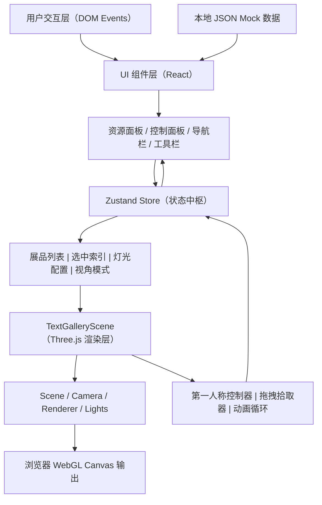

## 1. 架构设计

云端艺廊采用纯前端架构，无需后端服务器即可运行。整体分为三层：UI表现层（React组件）、状态管理层（Zustand Store）、3D渲染层（Three.js Scene），各层通过单向数据流和订阅机制通信。



## 2. 技术选型说明

| 领域 | 技术栈 | 版本要求 | 选用理由 |
|------|--------|----------|----------|
| 前端框架 | React | 18.x | 组件化开发、生态成熟、Hooks便于状态订阅 |
| 构建工具 | Vite | 5.x | 极速冷启动、ESM原生支持、依赖预构建优化 |
| 类型系统 | TypeScript | 5.x | 严格类型检查、提升可维护性、减少运行时Bug |
| 3D引擎 | Three.js | 0.160.0 | WebGL抽象层、场景图API完善、社区资源丰富 |
| 类型声明 | @types/three | 0.160.x | 与Three.js版本严格对齐的TS类型定义 |
| 状态管理 | Zustand | 4.x | 轻量无样板、极简API、支持selectors避免无效重渲染 |
| 唯一ID | uuid | 9.x | 生成展品/标签的唯一标识符 |
| 字体 | Google Fonts | - | Playfair Display（标题）+ DM Sans（正文） |
| 图标 | Lucide React | 最新 | 简洁线性风格图标，匹配北欧极简设计 |

## 3. 目录结构与模块职责

```
auto27/
├── index.html                          # 入口HTML，挂载点div#root，加载提示
├── package.json                        # 依赖声明与启动脚本
├── tsconfig.json                       # TypeScript严格模式配置
├── vite.config.js                      # Vite基础配置，依赖预构建
└── src/
    ├── App.tsx                         # 主组件：整合3D场景、UI面板、状态管理
    ├── Store.ts                        # Zustand全局状态：展品/灯光/视角/策展
    ├── TextGalleryScene.tsx            # Three.js封装：展厅/展品/灯光/漫游控制
    ├── ControlPanel.tsx                # 控制面板：灯光色轮、亮度滑块、标签编辑
    ├── styles.css                      # 全局样式：北欧风格CSS变量与动画
    └── data/
        └── presets.json                # 预置展品数据（5+种主题模型配置）
```

### 3.1 关键模块依赖关系

- `App.tsx` → 依赖 `Store.ts`（订阅状态）、`TextGalleryScene.tsx`（传入props）、`ControlPanel.tsx`（传入props）
- `TextGalleryScene.tsx` → 仅通过props接收展品列表与回调，不直接依赖Store，保持纯Three.js封装
- `ControlPanel.tsx` → 依赖 `Store.ts` 的selectors读取选中展品，dispatch修改灯光/标签
- `Store.ts` → 无内部依赖，纯Zustand状态与Action定义

## 4. 核心数据模型（Zustand Store）

### 4.1 类型定义

```typescript
type ExhibitType = 'sculpture' | 'painting';

interface LightConfig {
  color: string;
  intensity: number;
}

interface LabelConfig {
  id: string;
  text: string;
  backgroundColor: string;
  offsetX: number;
  offsetZ: number;
  visible: boolean;
}

interface Exhibit {
  id: string;
  presetId: string;
  type: ExhibitType;
  name: string;
  position: { x: number; y: number; z: number };
  rotation: number;
  scale: number;
  light: LightConfig;
  label: LabelConfig | null;
  createdAt: number;
  animating: boolean;
}

type ViewMode = 'curate' | 'wander';

interface GalleryState {
  exhibits: Exhibit[];
  selectedExhibitId: string | null;
  viewMode: ViewMode;
  isCurationMode: boolean;
  loading: boolean;
  loadingProgress: number;

  addExhibit: (presetId: string, position: { x: number; z: number }) => void;
  removeExhibit: (id: string) => void;
  selectExhibit: (id: string | null) => void;
  updateExhibitLight: (id: string, light: Partial<LightConfig>) => void;
  updateExhibitLabel: (id: string, label: Partial<LabelConfig>) => void;
  addLabelToExhibit: (exhibitId: string) => void;
  setViewMode: (mode: ViewMode) => void;
  toggleCurationMode: () => void;
  clearAll: () => void;
  generateShareLink: () => string;
  setLoading: (loading: boolean, progress?: number) => void;
}
```

## 5. Three.js场景封装设计（TextGalleryScene）

### 5.1 暴露给App的接口

```typescript
interface TextGallerySceneHandle {
  addExhibit: (exhibit: Exhibit) => void;
  removeExhibit: (exhibitId: string) => void;
  updateExhibitLight: (exhibitId: string, light: LightConfig) => void;
  updateExhibitLabel: (exhibitId: string, label: LabelConfig) => void;
  highlightExhibit: (exhibitId: string | null) => void;
  getRaycastGroundPosition: (screenX: number, screenY: number) => { x: number; z: number } | null;
}
```

### 5.2 内部核心子系统

| 子系统 | 实现方案 |
|--------|----------|
| 展厅构建 | BoxGeometry构造墙壁+程序化Canvas噪点纹理，Floor平面+GridHelper网格线 |
| 展品模型池 | 预置5种几何体：Sculpture_Sphere（抽象球体）、Sculpture_Torus（环面雕塑）、Sculpture_CubeStack（方块堆叠）、Painting_Landscape（横向画布）、Painting_Portrait（纵向画布） |
| 聚光灯系统 | SpotLight + SpotLightHelper（调试可关），阴影贴图512×512，目标target绑定展品位置 |
| 第一人称控制器 | 自定义PointerLock控制器（不使用OrbitControls），键盘WASD+鼠标拖拽，阻尼使用lerp线性插值 |
| 拖拽拾取 | Raycaster从屏幕坐标投射到地面平面，snapToGrid函数吸附到1m网格 |
| 动画系统 | 自定义Ticker（基于requestAnimationFrame+deltaTime），弹性缓动函数easeOutElastic |
| 性能监控 | 自定义FPS计数器，展品超过12个时自动降级（关闭部分阴影、降低材质精度） |

## 6. UI组件设计说明

### 6.1 资源面板展品拖拽流程

```
HTML5 draggable="true" → onDragStart携带presetId → App.tsx监听onDragOver阻止默认 →
onDrop时通过scene.getRaycastGroundPosition()获取3D坐标 → 调用Store.addExhibit()
```

### 6.2 控制面板色轮实现

- 使用原生`<canvas>`绘制HSV色轮（240×240px）
- mousedown→mousemove→mouseup拾取颜色，转换为HEX字符串
- 颜色变化通过`Store.updateExhibitLight` → Zustand订阅 → Three.js `spotLight.color.set()`
- 延迟优化：Store与Three.js直接绑定，不经过React重渲染链路，确保<50ms

### 6.3 标签牌CSS动画规范

```css
.label-fade-in {
  animation: labelFadeIn 0.3s cubic-bezier(0.22, 1, 0.36, 1) forwards;
}
@keyframes labelFadeIn {
  0%   { opacity: 0; transform: translateY(8px) scale(0.98); }
  100% { opacity: 1; transform: translateY(0) scale(1); }
}
```

## 7. 预置展品数据格式（src/data/presets.json）

```json
[
  {
    "id": "preset_sphere_001",
    "type": "sculpture",
    "name": "永恒之舞",
    "theme": "抽象雕塑",
    "geometry": "sphere",
    "color": "#E8D5C4",
    "metalness": 0.1,
    "roughness": 0.4,
    "defaultScale": 1.0,
    "thumbnail": "sphere"
  },
  {
    "id": "preset_torus_002",
    "type": "sculpture",
    "name": "时空回响",
    "theme": "现代雕塑",
    "geometry": "torus",
    "color": "#D4AF7B",
    "metalness": 0.6,
    "roughness": 0.2,
    "defaultScale": 1.2,
    "thumbnail": "torus"
  },
  {
    "id": "preset_cube_003",
    "type": "sculpture",
    "name": "秩序之塔",
    "theme": "极简雕塑",
    "geometry": "cubeStack",
    "color": "#C9B8A8",
    "metalness": 0.0,
    "roughness": 0.8,
    "defaultScale": 0.9,
    "thumbnail": "cube"
  },
  {
    "id": "preset_landscape_004",
    "type": "painting",
    "name": "山涧晨曦",
    "theme": "风景画作",
    "geometry": "paintingLandscape",
    "canvasColor": "#A8C0D4",
    "frameColor": "#3A3530",
    "defaultScale": 1.0,
    "thumbnail": "landscape"
  },
  {
    "id": "preset_portrait_005",
    "type": "painting",
    "name": "静谧时光",
    "theme": "肖像画作",
    "geometry": "paintingPortrait",
    "canvasColor": "#E8978E",
    "frameColor": "#5C4A3D",
    "defaultScale": 1.0,
    "thumbnail": "portrait"
  }
]
```

## 8. 性能与兼容性保障

- **Three.js渲染优化**：共享几何体、实例化材质、阴影贴图限制、视锥体剔除默认开启
- **React渲染优化**：Zustand selectors精确订阅，展品列表使用稳定引用，控制面板局部state
- **FPS保障机制**：循环内统计近30帧平均帧率，低于45fps时触发降级（关闭展品自阴影、降低spotLight阴影分辨率至256）
- **浏览器兼容**：检测WebGL支持，不支持时显示优雅降级提示
- **构建产物**：Vite开启依赖预构建，Three.js作为单独chunk拆分，代码压缩+tree-shaking

## 9. 启动命令与构建脚本

```json
{
  "scripts": {
    "dev": "vite",
    "build": "tsc && vite build",
    "preview": "vite preview"
  }
}
```
