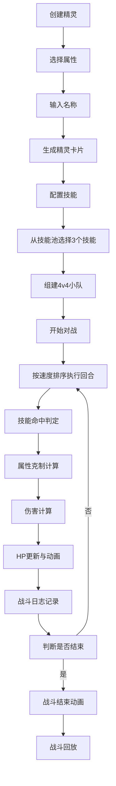

## 1. 产品概述

精灵宝可梦对战游戏生成器是一款回合制策略游戏模拟器，玩家可以自由创建不同属性的精灵、配置技能，与AI对手进行自动化对战推演，并查看详细的战斗日志和伤害计算过程。

- 主要目的：提供精灵宝可梦风格的对战体验，支持自定义精灵和技能，实现自动化战斗推演
- 目标用户：精灵宝可梦爱好者、回合制策略游戏玩家
- 产品价值：无需后端即可体验完整的精灵对战玩法，支持战斗回放和详细数据展示

## 2. 核心功能

### 2.1 功能模块

1. **精灵创建模块**：属性选择、基础属性生成、精灵卡片展示
2. **技能配置模块**：技能池浏览、技能添加/删除、技能详情展示
3. **自动对战模块**：精灵组队、回合制战斗、属性克制、命中判定
4. **战斗日志模块**：实时战斗记录、伤害计算展示、滚动动画
5. **战斗回放模块**：日志高亮回放、HP条同步、暂停/继续控制

### 2.2 页面详情

| 页面名称 | 模块名称 | 功能描述 |
|-----------|-------------|---------------------|
| 主页面 | 精灵创建区域 | 选择属性、输入名称、生成精灵卡片 |
| 主页面 | 精灵列表区域 | 展示已创建精灵、选择出战精灵、查看精灵详情 |
| 主页面 | 技能配置区域 | 技能池展示、技能添加/删除、技能卡片翻转动画 |
| 主页面 | 对战场景区域 | 双方精灵卡片展示、技能按钮、HP条动画、震动效果 |
| 主页面 | 战斗日志区域 | 滚动日志列表、淡入动画、伤害详情 |
| 主页面 | 回放控制区域 | 播放/暂停、进度控制 |

## 3. 核心流程

## 4. 用户界面设计

### 4.1 设计风格

- **主色调**：深色主题，背景使用 #1a1a2e 到 #16213e 的渐变
- **属性主题色**：
  - 火：渐变橙红 (#ff6b35 → #f72c25)
  - 水：渐变蓝紫 (#4facfe → #00f2fe)
  - 草：渐变绿黄 (#56ab2f → #a8e063)
  - 电：渐变黄白 (#f7ff00 → #dbff65)
  - 冰：渐变青蓝 (#2193b0 → #6dd5ed)
- **卡片效果**：磨砂玻璃效果（backdrop-filter: blur(10px)），边缘发光，半透明背景
- **按钮样式**：圆角按钮，点击时缩放0.95倍回弹，悬停时发光增强
- **字体**：使用 Orbitron 作为标题字体（显示字体），Roboto 作为正文字体
- **图标风格**：使用 lucide-react 图标库，配合属性主题色

### 4.2 页面设计概述

| 页面名称 | 模块名称 | UI元素 |
|-----------|-------------|-------------|
| 主页面 | 精灵创建区域 | 属性选择按钮（带颜色主题）、名称输入框、生成按钮 |
| 主页面 | 精灵卡片 | 属性渐变背景、星星粒子动画、HP条、攻击条、翻转动画 |
| 主页面 | 技能池 | 网格布局的技能卡片、翻转动画（正面名称/威力，背面命中/PP） |
| 主页面 | 对战场景 | 左右分区布局，双方精灵卡片并排，中间技能按钮区域 |
| 主页面 | 战斗日志 | 半透明面板、滚动列表、新条目从底部淡入 |
| 主页面 | 回放控制 | 播放/暂停按钮、进度条 |

### 4.3 动画效果

- 精灵卡片：星星粒子背景动画、HP条平滑过渡（transition: width 0.5s ease）、受击震动（shake 0.2s）
- 技能卡片：3D翻转动画（transform: rotateY(180deg)）
- 战斗日志：新条目淡入滑入（animation: slideIn 0.3s ease）
- 按钮：按压动画（transform: scale(0.95)）、悬停发光（box-shadow增强）
- 胜利动画：卡片旋转展开、四周绽放粒子效果

### 4.4 响应式设计

- 桌面端：左右分区布局，左侧精灵列表（35%），右侧战斗区域（65%）
- 平板端：上下分区布局，顶部战斗区域，底部精灵列表
- 移动端：纵向滚动布局，精灵卡片自适应宽度，触摸优化

## 5. 性能要求

- 帧率：保证60fps流畅运行
- 动画优化：使用 CSS transform 和 opacity 实现动画，避免重排重绘
- 粒子效果：使用 Canvas 或 requestAnimationFrame 优化粒子渲染
- 内存管理：战斗结束后及时清理定时器和动画帧
