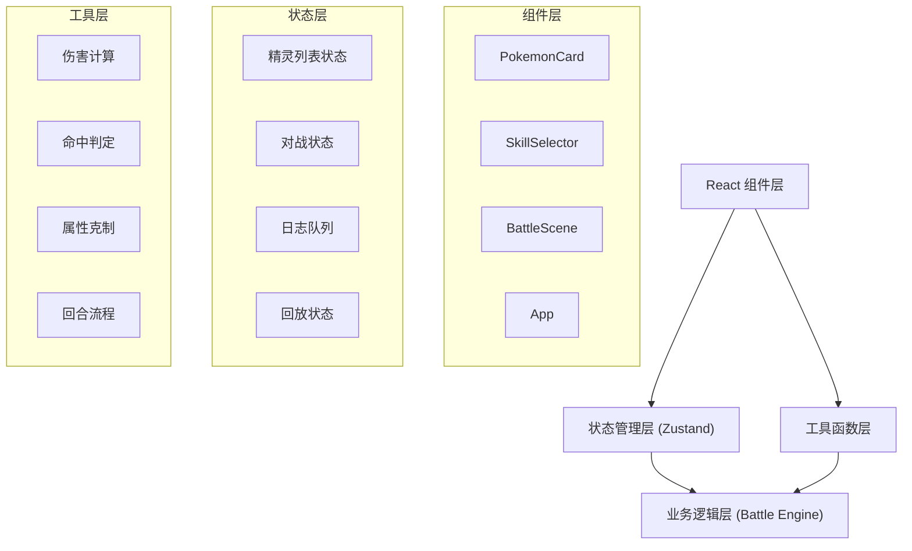
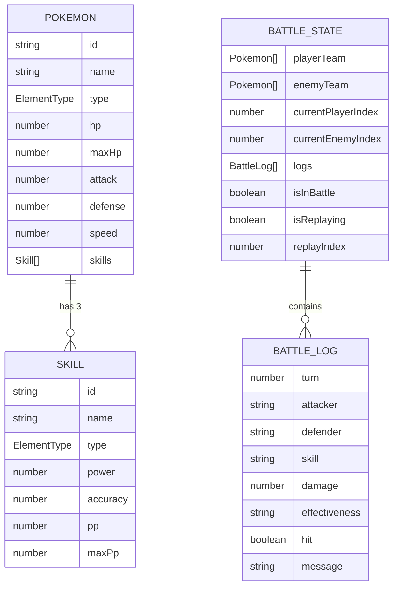

## 1. 架构设计



## 2. 技术描述

- **前端框架**：React 18 + TypeScript
- **构建工具**：Vite 5
- **状态管理**：Zustand 4
- **UI库**：Tailwind CSS 3（可选，或使用CSS Modules）
- **图标库**：lucide-react
- **唯一ID生成**：uuid
- **后端**：无（纯前端应用）
- **数据库**：无（使用浏览器内存存储）

## 3. 项目结构

```
auto34/
├── index.html                 # 入口HTML
├── package.json               # 项目依赖
├── vite.config.js             # Vite配置
├── tsconfig.json              # TypeScript配置
└── src/
    ├── types.ts               # 类型定义
    ├── store.ts               # Zustand状态管理
    ├── main.tsx               # React入口
    ├── App.tsx                # 主应用组件
    ├── components/
    │   ├── PokemonCard.tsx    # 精灵卡片组件
    │   ├── SkillSelector.tsx  # 技能选择器组件
    │   └── BattleScene.tsx    # 对战场景组件
    └── utils/
        └── battleEngine.ts    # 战斗引擎工具函数
```

## 4. 数据模型

### 4.1 类型定义



### 4.2 核心枚举

```typescript
enum ElementType {
  FIRE = 'fire',
  WATER = 'water',
  GRASS = 'grass',
  ELECTRIC = 'electric',
  ICE = 'ice'
}
```

### 4.3 属性克制矩阵

| 攻击\防御 | 火 | 水 | 草 | 电 | 冰 |
|-----------|----|----|----|----|----|
| 火 | 0.5 | 0.5 | 2 | 1 | 2 |
| 水 | 2 | 0.5 | 0.5 | 1 | 1 |
| 草 | 0.5 | 2 | 0.5 | 1 | 1 |
| 电 | 1 | 2 | 0.5 | 0.5 | 1 |
| 冰 | 0.5 | 0.5 | 2 | 1 | 0.5 |

## 5. 状态管理设计

### 5.1 Store Actions

- `createPokemon(name, type)`: 创建新精灵
- `deletePokemon(id)`: 删除精灵
- `addSkillToPokemon(pokemonId, skill)`: 为精灵添加技能
- `removeSkillFromPokemon(pokemonId, skillId)`: 移除精灵技能
- `selectForBattle(pokemonId, team)`: 选择精灵出战
- `startBattle()`: 开始对战
- `executeTurn()`: 执行单回合
- `addLog(log)`: 添加战斗日志
- `startReplay()`: 开始回放
- `pauseReplay()`: 暂停回放
- `resetBattle()`: 重置对战

## 6. 战斗引擎设计

### 6.1 核心函数

```typescript
// 属性克制计算
function calculateEffectiveness(attackerType: ElementType, defenderType: ElementType): number

// 命中判定
function checkHit(accuracy: number): boolean

// 伤害计算
function calculateDamage(
  attacker: Pokemon,
  defender: Pokemon,
  skill: Skill,
  effectiveness: number
): number

// 执行单回合
function executeBattleTurn(
  playerPokemon: Pokemon,
  enemyPokemon: Pokemon,
  playerSkill: Skill,
  enemySkill: Skill
): BattleTurnResult

// 战斗结束检测
function checkBattleEnd(playerTeam: Pokemon[], enemyTeam: Pokemon[]): 'player' | 'enemy' | null
```

### 6.2 伤害公式

```
伤害 = ((2 × 等级 + 10) / 250 × 攻击 / 防御 × 威力 + 2) × 属性克制 × 随机因子(0.85~1.0)
```

简化版：
```
伤害 = (攻击力 × 威力 × 克制系数 / 防御力) × 随机因子
```

## 7. 性能优化策略

1. **动画优化**：使用 CSS `transform` 和 `opacity` 属性实现动画，避免触发重排
2. **粒子系统**：使用 Canvas 2D 渲染粒子，使用 `requestAnimationFrame` 驱动
3. **状态更新**：Zustand 状态更新使用 immer 或浅比较，避免不必要的重渲染
4. **组件拆分**：大组件拆分为小组件，使用 `React.memo` 优化
5. **列表虚拟化**：战斗日志列表使用虚拟滚动（可选）
6. **内存管理**：战斗结束后清理定时器、动画帧和事件监听器

## 8. 构建配置

### 8.1 依赖列表

- react: ^18.2.0
- react-dom: ^18.2.0
- zustand: ^4.5.0
- uuid: ^9.0.0
- @types/uuid: ^9.0.0
- typescript: ^5.3.0
- vite: ^5.0.0
- @vitejs/plugin-react: ^4.2.0
- lucide-react: ^0.312.0（可选）

### 8.2 脚本命令

- `npm run dev`: 启动开发服务器
- `npm run build`: 生产构建
- `npm run preview`: 预览生产构建
