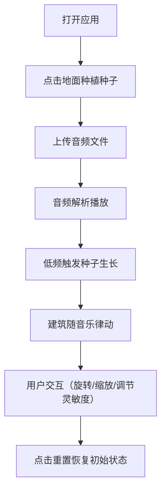

## 1. 产品概述

都市律动是一款交互式3D音乐可视化应用，让用户以指挥家的身份，通过鼠标交互在三维城市街区中种植音符种子，随着音乐节奏生成随音乐律动的城市天际线。

- 核心价值：将音乐转化为可视化的3D城市景观，提供沉浸式的音乐欣赏体验
- 目标用户：音乐爱好者、视觉艺术家、普通用户
- 市场价值：创新性的音乐可视化方式，可用于音乐欣赏、艺术创作、演出背景等场景

## 2. 核心功能

### 2.1 用户角色

| 角色 | 注册方式 | 核心权限 |
|------|----------|----------|
| 普通用户 | 无需注册 | 使用全部功能，上传音频，种植种子，调整参数 |

### 2.2 功能模块

1. **主场景页面**：3D城市街区可视化，音符种子种植，建筑生长动画
2. **音频处理模块**：音频文件上传解析，Web Audio API频谱分析
3. **城市控制模块**：建筑颜色高度随音乐变化，呼吸灯动画
4. **用户交互模块**：视角旋转缩放，节拍灵敏度调节，重置功能
5. **频谱显示模块**：右下角实时32段频率分布图

### 2.3 页面详情

| 页面名称 | 模块名称 | 功能描述 |
|----------|----------|----------|
| 主页面 | 3D场景渲染 | 展示三维城市街区，地面网格，天空背景 |
| 主页面 | 种子种植系统 | 点击地面生成半透明发光种子，波纹扩散动画 |
| 主页面 | 建筑生长系统 | 低频鼓点触发种子生长为建筑，粒子汇聚效果 |
| 主页面 | 音乐可视化 | 建筑颜色高度随音乐频率实时变化，顶部呼吸灯 |
| 主页面 | 控制面板 | 顶部控制栏（文件上传、播放/暂停），底部灵敏度滑块 |
| 主页面 | 频谱分析图 | 右下角Canvas绘制32段频率分布 |

## 3. 核心流程

用户打开应用 → 点击地面种植多个音符种子 → 上传MP3/WAV音频文件 → 音频开始播放解析 → 低频鼓点触发种子生长为建筑 → 建筑随音乐频率变化颜色和高度 → 用户可拖拽旋转视角、滚轮缩放 → 调节节拍灵敏度滑块改变响应程度 → 点击重置按钮恢复初始状态

## 4. 用户界面设计

### 4.1 设计风格
- 主色调：深蓝黑色背景（#0a0e1a），地面网格从中心淡蓝（#4da6ff）到边缘暗紫（#3d2466）
- 建筑颜色：从低音蓝色（#0066ff）渐变到高音红色（#ff3333）
- 频谱图：从绿色（#00ff88）渐变到紫色（#aa44ff）
- 按钮风格：圆角12px，毛玻璃效果（backdrop-filter: blur(10px)），半透明背景（rgba(255,255,255,0.1)）
- 字体：使用现代无衬线字体，标题20px，正文14px
- 布局：顶部居中控制栏，底部左侧滑块，右下角频谱图，所有UI固定定位
- 动效：悬停时明亮度提升10%，平滑过渡动画

### 4.2 页面设计概述

| 页面名称 | 模块名称 | UI元素 |
|----------|----------|--------|
| 主页面 | 3D场景 | 全屏Canvas，深蓝黑背景，发光网格地面，天空球 |
| 主页面 | 种子效果 | 5种预设色半透明发光小球，下沉+波纹扩散动画 |
| 主页面 | 建筑效果 | 几何体建筑，颜色渐变，顶部呼吸灯，生长/收缩动画 |
| 主页面 | 顶部控制栏 | 半透明渐变背景，文件上传按钮，播放/暂停按钮 |
| 主页面 | 底部滑块 | 节拍灵敏度滑块（0.5-2.0），数字提示 |
| 主页面 | 频谱图 | 250x80px Canvas，半透明背景，32段彩色条形 |

### 4.3 响应式
- 桌面端优先设计，支持1366x768及以上分辨率
- UI控件固定定位，自适应不同屏幕尺寸
- 3D场景全屏展示，自动适配窗口大小变化

### 4.4 3D场景指导
- 环境：深蓝黑色天空，渐变发光地面网格，营造科技感城市夜景
- 光照：环境光（0x404040，强度0.5）+ 方向光（0xffffff，强度0.8）+ 点光源（0x4da6ff，强度1.0）
- 相机：透视相机，初始位置(0, 30, 50)，看向原点，视野限制20-100单位
- 交互：鼠标左键拖拽旋转视角，滚轮缩放
- 动画：种子下沉波纹，建筑生长粒子效果，颜色高度平滑过渡（≤100ms），呼吸灯，重置收缩动画（0.8秒ease-out）
- 性能：最多100栋建筑，每栋≤200面，帧率≥30FPS，音频延迟≤50ms
