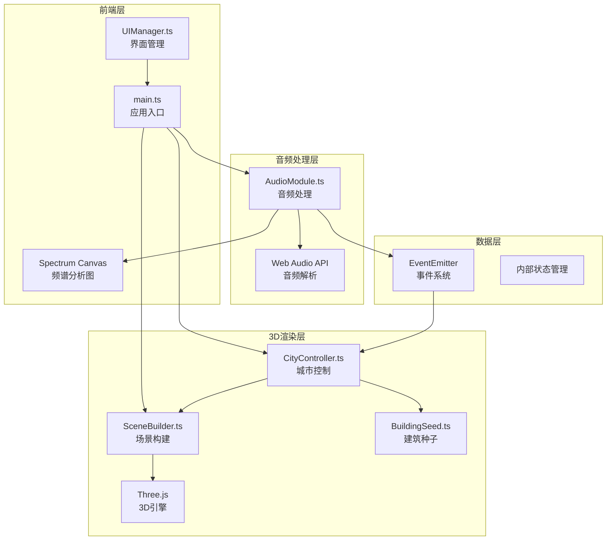

## 1. 架构设计



## 2. 技术描述

- 前端框架：TypeScript + Three.js @0.160.0
- 构建工具：Vite
- 音频处理：Web Audio API + Tone.js
- 状态管理：内部事件发射器（EventEmitter）
- UI渲染：原生HTML/CSS + Canvas 2D

### 核心依赖
- three@0.160.0 - 3D渲染引擎
- @types/three - Three.js类型定义
- typescript - 类型系统
- vite - 构建工具
- tone - 音频处理库
- @types/tone - Tone.js类型定义

## 3. 目录结构

```
e:\solo\VersionFastPro\tasks\auto37/
├── package.json
├── vite.config.js
├── tsconfig.json
├── index.html
└── src/
    ├── main.ts              # 应用入口
    ├── audio/
    │   └── AudioModule.ts   # 音频处理模块
    ├── scene/
    │   ├── SceneBuilder.ts  # 场景构建模块
    │   ├── CityController.ts # 城市控制器
    │   └── BuildingSeed.ts  # 建筑种子类
    └── ui/
        └── UIManager.ts     # UI管理模块
```

## 4. 核心模块定义

### 4.1 AudioModule 接口

```typescript
// 频率数据类型
interface FrequencyData {
  lowFrequency: number;      // 低频能量 (0-1)
  midFrequency: number;      // 中频能量 (0-1)
  highFrequency: number;     // 高频能量 (0-1)
  totalVolume: number;       // 总音量 (0-1)
  spectrum: Float32Array;    // 32段频谱数据
  isBeat: boolean;           // 是否检测到节拍
}

// AudioModule 公共方法
interface IAudioModule {
  loadAudioFile(file: File): Promise<void>;
  play(): void;
  pause(): void;
  stop(): void;
  getFrequencyData(): FrequencyData;
  isPlaying(): boolean;
  on(event: 'frequency', callback: (data: FrequencyData) => void): void;
  off(event: 'frequency', callback: Function): void;
}
```

### 4.2 SceneBuilder 接口

```typescript
interface ISceneBuilder {
  scene: THREE.Scene;
  camera: THREE.PerspectiveCamera;
  renderer: THREE.WebGLRenderer;
  ground: THREE.Mesh;
  
  init(container: HTMLElement): void;
  addBuilding(mesh: THREE.Object3D): void;
  removeBuilding(mesh: THREE.Object3D): void;
  addSeed(seed: BuildingSeed): void;
  removeSeed(seed: BuildingSeed): void;
  updateCameraRotation(deltaX: number, deltaY: number): void;
  updateCameraZoom(delta: number): void;
  render(): void;
  resize(): void;
}
```

### 4.3 CityController 接口

```typescript
interface ICityController {
  buildings: IBuilding[];
  seeds: BuildingSeed[];
  sensitivity: number;
  
  plantSeed(position: THREE.Vector3): void;
  growBuildingFromSeed(seed: BuildingSeed): void;
  updateBuildings(frequencyData: FrequencyData): void;
  setSensitivity(value: number): void;
  reset(): Promise<void>;
  getSeedCount(): number;
  getBuildingCount(): number;
}

interface IBuilding {
  mesh: THREE.Group;
  baseHeight: number;
  currentHeight: number;
  targetHeight: number;
  baseColor: THREE.Color;
  currentColor: THREE.Color;
  targetColor: THREE.Color;
  breathLight: THREE.PointLight;
  update(frequencyData: FrequencyData, sensitivity: number): void;
  shrink(): Promise<void>;
}
```

### 4.4 BuildingSeed 接口

```typescript
interface IBuildingSeed {
  position: THREE.Vector3;
  color: THREE.Color;
  mesh: THREE.Group;
  isGrowing: boolean;
  isGrown: boolean;
  
  startSinkingAnimation(): void;
  startGrowingAnimation(): Promise<THREE.Group>;
  update(deltaTime: number): void;
  reset(): void;
}
```

### 4.5 UIManager 接口

```typescript
interface IUIManager {
  init(
    audioModule: IAudioModule,
    cityController: ICityController
  ): void;
  onFileUpload(callback: (file: File) => void): void;
  onPlayPause(callback: (isPlaying: boolean) => void): void;
  onSensitivityChange(callback: (value: number) => void): void;
  onReset(callback: () => void): void;
  updateSpectrum(frequencyData: FrequencyData): void;
}
```

## 5. 数据流向

1. 用户点击地面 → main.ts 捕获点击 → CityController.plantSeed() → 创建 BuildingSeed
2. 用户上传音频 → UIManager → AudioModule.loadAudioFile() → 音频解析
3. 音频播放 → AudioModule 每帧分析 → 触发 'frequency' 事件
4. CityController 监听事件 → updateBuildings() → 更新所有建筑的高度和颜色
5. 每帧渲染循环 → SceneBuilder.render() → 渲染3D场景
6. 频谱数据 → UIManager.updateSpectrum() → Canvas 2D 绘制频谱图

## 6. 性能优化策略

### 6.1 3D渲染优化
- 建筑几何体复用：使用 BufferGeometry 实例化
- 材质共享：相同类型建筑共享材质实例
- 面数控制：每栋建筑使用 BoxGeometry（12面），总面数≤100×12=1200
- 视锥体剔除：Three.js 自动进行
- 帧率控制：使用 requestAnimationFrame，目标60FPS，最低30FPS

### 6.2 音频处理优化
- 使用 AnalyserNode 的 fftSize = 64，获取32段频谱数据
- 音频帧与渲染帧同步，避免过度计算
- 节拍检测使用简单的低频能量阈值比较

### 6.3 内存管理
- 重置时正确 dispose 几何体和材质
- 移除事件监听器防止内存泄漏
- 建筑数量限制在100以内

## 7. 关键实现要点

### 7.1 颜色渐变算法
```typescript
// 从蓝色到红色的HSL渐变
function getColorFromFrequency(freq: number): THREE.Color {
  // freq: 0 (低音) -> 1 (高音)
  const hue = (1 - freq) * 0.66; // 0.66是蓝色，0是红色
  return new THREE.Color().setHSL(hue, 1, 0.5);
}
```

### 7.2 平滑过渡动画
```typescript
// 使用 lerp 实现100ms内平滑过渡
function lerp(current: number, target: number, alpha: number): number {
  return current + (target - current) * alpha;
}
// 每帧调用，alpha = deltaTime / 0.1 (100ms过渡时间)
```

### 7.3 节拍检测
```typescript
// 低频能量超过阈值且高于历史平均值时判定为节拍
function detectBeat(lowFreq: number, history: number[]): boolean {
  const avg = history.reduce((a, b) => a + b, 0) / history.length;
  const threshold = avg * 1.5;
  return lowFreq > threshold && lowFreq > 0.3;
}
```

### 7.4 缓动函数
```typescript
// ease-out 用于重置收缩动画
function easeOutCubic(t: number): number {
  return 1 - Math.pow(1 - t, 3);
}
```
