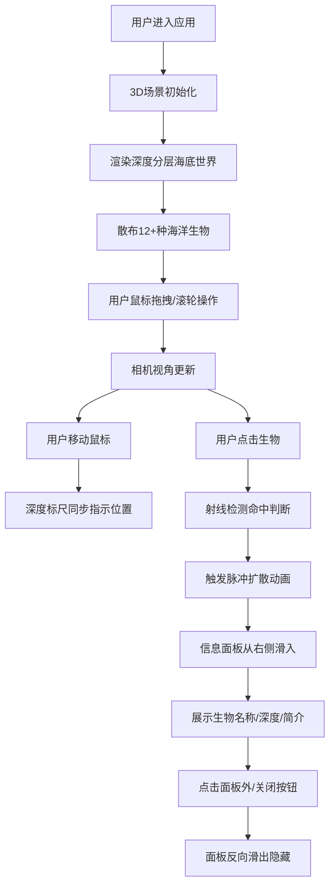

## 1. 产品概述

面向青少年的海洋知识科普3D互动应用，观众可像潜水员一样在虚拟海域中自由探索不同深度的海洋生物，学习海洋生态知识。

- 核心目的：通过沉浸式3D交互体验提升青少年对海洋生物的认知兴趣
- 目标用户：8-18岁青少年及科普展览参观者
- 市场价值：填补科普教育领域高质量3D互动海洋内容的空白

## 2. 核心特性

### 2.1 功能模块
1. **主场景页面**：3D海底世界渲染、深度分层水体效果、浮游粒子系统
2. **生物探索模块**：12+种3D海洋生物、按深度自然分布、生物自主游动动画
3. **信息面板模块**：点击生物弹出详情、毛玻璃半透明UI、深度范围可视化
4. **辅助导航模块**：左侧深度标尺、当前深度指示、操作提示

### 2.2 页面详情
| 页面名称 | 模块名称 | 功能描述 |
|---------|---------|---------|
| 主场景 | 3D海底渲染 | 浅蓝→深蓝→墨黑渐变水体，随深度环境光衰减 |
| 主场景 | 浮游粒子系统 | 三层密度递增的悬浮粒子效果 |
| 主场景 | 深度标尺 | 左侧0-500m标尺，三色分界标记，实时深度指示圆点 |
| 主场景 | 操作提示 | 右上角半透明悬停提示（拖拽旋转、滚轮缩放） |
| 生物交互 | 点击检测 | 射线检测精准识别点击对象 |
| 生物交互 | 脉冲动画 | 0.8秒半透明圆环向外扩散效果 |
| 生物交互 | 信息面板 | 0.3秒右向左滑入，含名称/深度条/简介，毛玻璃效果 |
| 性能优化 | 实例化渲染 | 使用InstancedMesh减少Draw Call |
| 响应式 | 移动端适配 | <768px时UI自动缩小为垂直窄条 |

## 3. 核心流程

## 4. 用户界面设计

### 4.1 设计风格
- **主题色调**：深海蓝色系（#0a1628 径向渐变至 #000000）
- **主色调**：深靛蓝 #0f2744，海洋蓝 #1e6fbd
- **强调色**：生物脉冲环 #00ffff，深度标记青/黄/橙
- **字体方案**：无衬线现代字体，标题粗体白色，正文浅灰色
- **UI质感**：毛玻璃半透明（backdrop-filter: blur），柔和阴影
- **面板风格**：圆角8px，白色边框1px，背景rgba(15, 39, 68, 0.7)

### 4.2 页面设计概览
| 页面名称 | 模块名称 | UI元素 |
|---------|---------|--------|
| 主场景 | 3D视口 | 全屏WebGL Canvas，全屏渲染 |
| 主场景 | 深度标尺 | 左侧宽48px，纵向渐变刻度条，0/50/200/500标记线，发光指示点 |
| 主场景 | 操作提示 | 右上角固定，14px白色50%透明文字，悬停100% |
| 交互 | 信息面板 | 右侧宽360px，translateX动画，毛玻璃背景 |
| 交互 | 深度进度条 | 蓝色线性渐变进度条，标记深度范围区间 |

### 4.3 响应式设计
- **桌面端（≥768px）**：标尺宽48px，信息面板宽360px
- **移动端（<768px）**：标尺缩至24px窄条，信息面板宽度90%，底部弹出替代右侧滑入

### 4.4 3D场景指导
- **环境氛围**：三层雾效叠加（浅海无雾→中层薄雾→深海浓黑）
- **光照设置**：HemisphereLight随深度指数衰减（0.8→0.2）+ 点光源模拟生物荧光
- **相机设置**：PerspectiveCamera（fov 60），OrbitControls拖拽旋转、滚轮缩放（z范围 0 ~ -500）
- **生物构成**：使用基础几何体组合（Sphere/Cone/Cylinder/Torus），12种差异化配色
- **性能策略**：同类生物InstancedMesh渲染（≤20只同时显示），材质LOD策略
