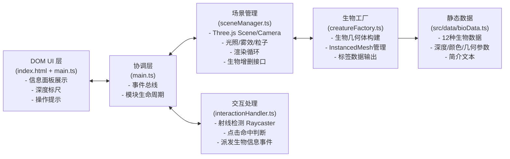

## 1. 架构设计



**数据流向说明：**
1. `main.ts` 启动时 → 调用 `sceneManager.init()` 初始化3D场景
2. `main.ts` → 调用 `creatureFactory.spawnAll()` 遍历 `bioData.ts` 生成生物实例
3. `creatureFactory` → 通过 `sceneManager.addCreature()` 注入生物Mesh到场景
4. 用户点击 → DOM `click` → `interactionHandler` 射线检测 → 派发 `creature-clicked` CustomEvent
5. `main.ts` 监听事件 → 更新DOM信息面板，同时通知`sceneManager`播放脉冲动画
6. 渲染循环 → `sceneManager.update()` 每帧更新生物游动和粒子

## 2. 技术选型说明
- **前端框架**：原生 TypeScript + Three.js（无需React，减少运行时开销，3D性能优先）
- **构建工具**：Vite 5.x（ESM原生开发服务器，依赖预构建优化启动速度）
- **3D引擎**：three@0.160.0（稳定版本，OrbitControls内置）
- **类型系统**：@types/three + TypeScript 严格模式
- **CSS策略**：原生CSS（使用backdrop-filter、CSS变量、transition），避免额外UI库
- **渲染优化**：THREE.InstancedMesh 同类生物合并绘制，共享几何体/材质

## 3. 项目文件结构
```
auto39/
├── package.json            # 依赖声明 + dev启动脚本
├── vite.config.js          # Vite基础配置 + 预构建three
├── tsconfig.json           # 严格模式 / ESNext / DOM类型
├── index.html              # Canvas容器 + 信息面板DOM
├── .trae/documents/        # PRD和架构文档
└── src/
    ├── main.ts             # 入口、模块协调、DOM更新
    ├── sceneManager.ts     # Three.js场景、相机、光照、渲染、动画
    ├── creatureFactory.ts  # 生物构建器、InstancedMesh、脉冲动画
    ├── interactionHandler.ts # 鼠标坐标、射线检测、事件派发
    └── data/
        └── bioData.ts      # 12+种海洋生物静态数据
```

## 4. 模块调用关系

| 调用方 | 被调用方 | 调用方式 | 数据/事件 |
|--------|---------|---------|----------|
| main.ts | sceneManager | `import` 实例方法 | `init(container)`、`addCreature(mesh, data)`、`onDepthChange(callback)`、`pulse(object)` |
| main.ts | creatureFactory | `import` 静态方法 | `spawnAll(sceneManager) → CreatureRef[]` |
| main.ts | interactionHandler | `new Handler(renderer, camera, meshes)` | `on('creature-clicked', callback)` |
| creatureFactory | bioData | `import CREATURES` | 生物配置数组（名称/深度/颜色/几何） |
| interactionHandler | sceneManager | 间接（传camera/renderer） | 每帧获取最新相机矩阵 |

## 5. 关键数据模型

### 5.1 海洋生物数据结构
```typescript
interface CreatureConfig {
  id: string;
  name: string;
  depthRange: [number, number]; // [minDepth, maxDepth]
  intro: string; // 50-100字简介
  color: string; // 主色
  accentColor?: string;
  geometryType: 'sphere' | 'cone' | 'cylinder' | 'torus' | 'composite';
  params: {
    size?: number;
    segments?: number;
    radiusTop?: number;
    radiusBottom?: number;
    composite?: Array<{shape: string; pos: [number,number,number]; scale?: [number,number,number]; color?: string}>;
  };
  layer: 'shallow' | 'middle' | 'deep';
}
```

### 5.2 交互事件载荷
```typescript
interface CreatureClickedEvent {
  creatureId: string;
  name: string;
  depthRange: [number, number];
  intro: string;
  worldPosition: THREE.Vector3;
}
```

## 6. 性能策略

### 6.1 渲染性能
| 策略 | 实现方式 | 预期收益 |
|-----|---------|---------|
| InstancedMesh | 同种类生物使用同一Geometry/Material的实例化网格 | Draw Call从N×M降至12 |
| 生物上限 | 总实例数≤20，三层内均匀分布 | 顶点总量控制在20万以内 |
| 分段数优化 | 基础几何体segments=16（球）/ 8（柱） | 单生物顶点数<2000 |
| Frustum Culling | Three.js内置视锥剔除 + 深度外生物强制隐藏 | 远离相机的对象不绘制 |

### 6.2 交互性能
| 策略 | 实现方式 | 预期收益 |
|-----|---------|---------|
| 射线优化 | `raycaster.objects = interactables`，仅检测可交互对象 | 检测耗时<1ms |
| 事件节流 | `pointermove`使用`requestAnimationFrame`节流标尺更新 | 60fps稳定输入 |
| 面板动画 | CSS `transform: translateX` + `will-change` | GPU合成，0.3s平滑 |

### 6.3 帧率监控
```typescript
// sceneManager内集成简单FPS监控
// 连续3帧<55fps时自动降级粒子数（80%→50%→30%）
```
