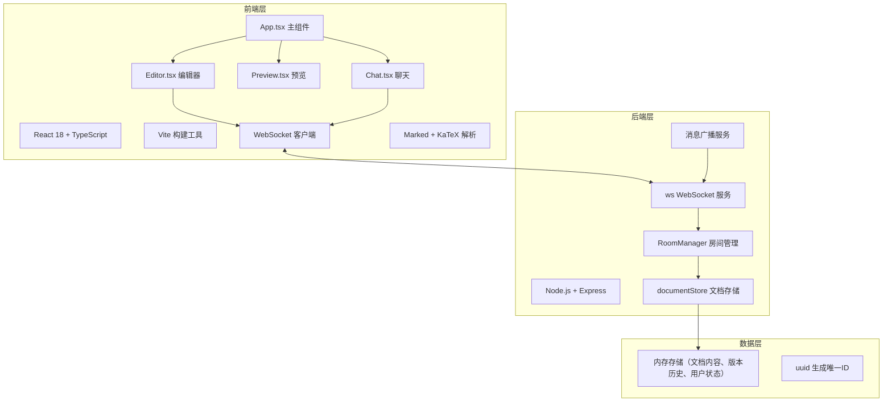
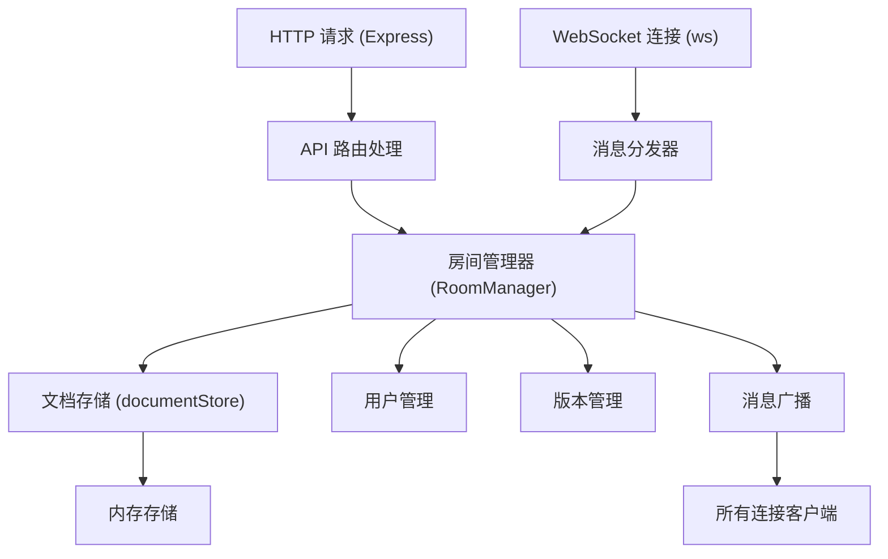

## 1. 架构设计



## 2. 技术描述

- **前端**：React 18 + TypeScript + Vite
- **构建工具**：Vite 5.x（端口5173，代理后端请求到3001端口）
- **后端**：Node.js + Express 4.x + ws（WebSocket库）
- **Markdown解析**：marked（Markdown转HTML）+ katex（LaTeX数学公式）
- **状态管理**：React useState/useEffect（轻量级，无需额外状态管理库）
- **工具库**：uuid（唯一ID生成）、cors（跨域处理）
- **数据存储**：内存存储（文档内容、版本历史、在线用户）

## 3. 项目文件结构

```
├── package.json
├── vite.config.js
├── tsconfig.json
├── index.html
└── src/
    ├── client/
    │   ├── App.tsx          # 主应用组件，房间管理、视图切换
    │   ├── Editor.tsx       # 编辑器组件，输入处理、光标同步
    │   ├── Preview.tsx      # Markdown预览组件
    │   └── Chat.tsx         # 聊天侧边栏组件
    └── server/
        ├── index.ts         # Express + WebSocket 主服务
        └── documentStore.ts # 文档存储及版本管理模块
```

## 4. API 定义

### 4.1 WebSocket 消息协议

所有消息采用JSON格式，type字段标识消息类型：

```typescript
// 基础消息类型
interface WSMessage {
  type: string;
  roomId: string;
  userId: string;
  payload: any;
}

// 用户加入房间
interface JoinMessage extends WSMessage {
  type: 'join';
  payload: {
    nickname: string;
  };
}

// 文档内容更新
interface ContentUpdateMessage extends WSMessage {
  type: 'content-update';
  payload: {
    content: string;
    version: number;
  };
}

// 光标位置更新
interface CursorUpdateMessage extends WSMessage {
  type: 'cursor-update';
  payload: {
    position: number;
    selectionStart: number;
    selectionEnd: number;
    color: string;
  };
}

// 聊天消息
interface ChatMessage extends WSMessage {
  type: 'chat';
  payload: {
    messageId: string;
    content: string;
    timestamp: number;
    nickname: string;
    avatarColor: string;
  };
}

// 保存版本
interface SaveVersionMessage extends WSMessage {
  type: 'save-version';
  payload: {
    note: string;
  };
}

// 恢复版本
interface RevertVersionMessage extends WSMessage {
  type: 'revert-version';
  payload: {
    versionId: string;
  };
}

// 版本列表响应
interface VersionListResponse extends WSMessage {
  type: 'version-list';
  payload: {
    versions: DocumentVersion[];
  };
}

// 用户列表更新
interface UserListUpdateMessage extends WSMessage {
  type: 'user-list';
  payload: {
    users: User[];
  };
}
```

### 4.2 数据类型定义

```typescript
interface User {
  id: string;
  nickname: string;
  color: string;
  cursorPosition: number;
  selectionStart: number;
  selectionEnd: number;
  joinedAt: number;
}

interface DocumentVersion {
  id: string;
  content: string;
  note: string;
  createdAt: number;
  createdBy: string;
  versionNumber: number;
}

interface Room {
  id: string;
  content: string;
  version: number;
  users: Map<string, User>;
  versions: DocumentVersion[];
  createdAt: number;
}

interface ChatMessageItem {
  id: string;
  userId: string;
  nickname: string;
  content: string;
  timestamp: number;
  avatarColor: string;
}
```

### 4.3 HTTP 接口

| 方法 | 路径 | 描述 | 请求参数 | 响应 |
|------|------|------|----------|------|
| GET | /api/room/:roomId/exists | 检查房间是否存在 | roomId (path) | `{ exists: boolean }` |
| POST | /api/room | 创建新房间 | `{ nickname: string }` | `{ roomId: string, userId: string }` |
| GET | /api/room/:roomId/versions | 获取版本列表 | roomId (path) | `{ versions: DocumentVersion[] }` |

## 5. 服务器架构图



## 6. 核心模块职责

### 6.1 前端模块

- **App.tsx**：管理房间状态、WebSocket连接、用户信息、组件布局
- **Editor.tsx**：textarea编辑器，处理用户输入，发送光标/内容更新，渲染其他用户光标
- **Preview.tsx**：Markdown解析渲染，支持LaTeX公式，更新淡入动画
- **Chat.tsx**：聊天消息列表、输入框、消息动画、自动滚动

### 6.2 后端模块

- **index.ts**：Express服务（3001端口）、WebSocket服务升级、静态文件服务
- **documentStore.ts**：文档CRUD、版本保存/回溯、内存数据结构管理

## 7. 性能优化策略

1. **内容同步防抖**：编辑器输入防抖300ms后发送同步消息，避免频繁网络请求
2. **光标即时同步**：光标/选区变化即时发送，保证协作体验
3. **预览渲染防抖**：内容变化后300ms内完成渲染，使用requestAnimationFrame优化
4. **WebSocket消息合并**：高频消息合并发送，减少网络开销
5. **虚拟滚动**：聊天消息过长时启用虚拟滚动，保持渲染性能
6. **内存清理**：房间24小时无活动自动清理，避免内存泄漏
