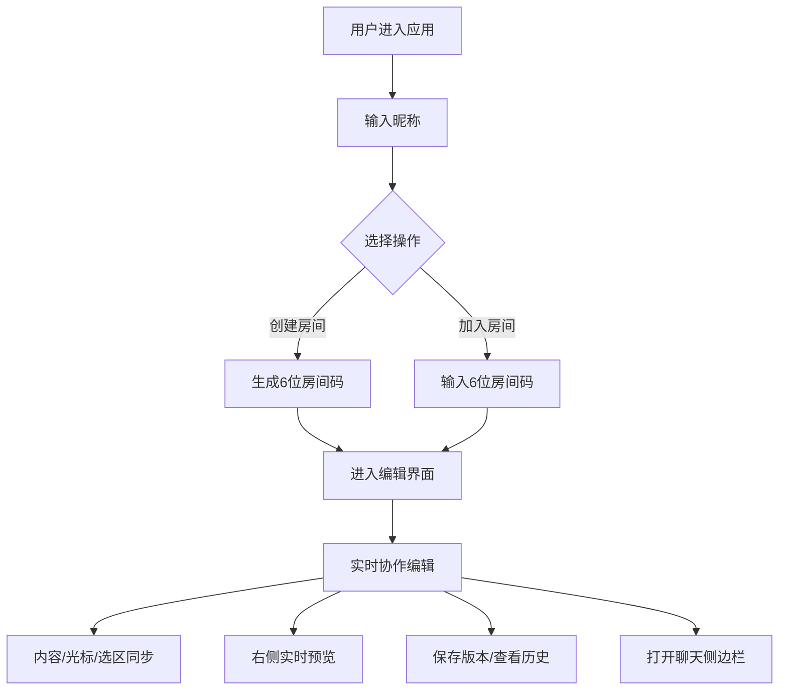

## 1. 产品概述

Markdown在线协作编辑器是一款面向技术团队的实时协作文档工具，解决多人撰写技术文档、项目提案时无法同时编辑并即时预览的痛点。支持多人同时编辑、光标同步、实时Markdown渲染、版本回溯和房间内聊天，让团队协作更加高效流畅。

- 核心目标：提供低延迟、高可靠性的Markdown实时协作编辑体验
- 目标用户：开发团队、产品经理、技术写作者
- 市场价值：填补本地编辑器无法多人协作、在线协作文档缺乏专业Markdown支持的空白

## 2. 核心功能

### 2.1 用户角色

| 角色 | 注册方式 | 核心权限 |
|------|----------|----------|
| 普通用户 | 无需注册，输入昵称即可使用 | 创建/加入房间、编辑文档、查看历史版本、发送聊天消息 |

### 2.2 功能模块

1. **房间管理模块**：创建房间、加入房间（6位房间码）、房间内用户列表
2. **协作编辑模块**：多用户同时编辑、光标位置同步、选中文本高亮、内容实时同步
3. **Markdown预览模块**：实时渲染Markdown、支持LaTeX数学公式、300ms内更新
4. **版本管理模块**：手动保存版本、添加版本备注、回溯任意历史版本
5. **聊天模块**：房间内文本聊天、首字母头像、消息动画、自动滚动

### 2.3 页面详情

| 页面名称 | 模块名称 | 功能描述 |
|----------|----------|----------|
| 主编辑页 | 顶部导航栏 | 显示房间码、用户列表按钮、历史版本按钮、聊天展开按钮 |
| 主编辑页 | 编辑器区域 | 70%宽度，#FAFAFA背景，textarea模拟Monaco风格，支持多光标显示 |
| 主编辑页 | 预览区域 | 30%宽度，#FFFFFF背景，实时渲染Markdown和LaTeX，淡入过渡动画 |
| 主编辑页 | 聊天侧边栏 | 默认收起，点击展开滑出，消息气泡带头像和时间戳 |
| 主编辑页 | 历史版本面板 | 右侧滑出，半透明遮罩，版本列表可切换回溯 |
| 房间入口页 | 创建/加入房间 | 输入昵称，选择创建或加入房间（6位码） |

## 3. 核心流程

用户进入应用 → 输入昵称 → 创建新房间/输入6位房间码加入 → 进入编辑界面 → 实时协作编辑（内容/光标/选区同步）→ 右侧实时预览Markdown → 可保存版本/查看历史/回溯 → 可打开聊天侧边栏交流

## 4. 用户界面设计

### 4.1 设计风格

- **极简主义风格**：干净清爽，专注内容创作
- **主色调**：深蓝色 #1E3A5F（顶部导航栏）
- **背景色**：编辑区 #FAFAFA，预览区 #FFFFFF
- **文字色**：导航栏文字白色，正文深灰色
- **按钮样式**：圆角4px，hover状态轻微放大，点击缩放动画（0.95→1.0，200ms）
- **字体**：系统默认无衬线字体（-apple-system, BlinkMacSystemFont, "Segoe UI", Roboto, sans-serif）
- **间距**：统一使用8px倍数（8/16/24/32px）
- **动画**：所有过渡使用ease-out缓动函数，面板滑出使用弹性缓出

### 4.2 页面设计概述

| 页面名称 | 模块名称 | UI元素 |
|----------|----------|--------|
| 主编辑页 | 顶部导航栏 | 深蓝色背景，左侧显示房间码（可复制），右侧用户头像列表、历史按钮、聊天按钮 |
| 主编辑页 | 编辑器区域 | 浅灰色背景，textarea带行号区域模拟，多用户光标用不同颜色竖线+标签显示，选区用半透明颜色高亮 |
| 主编辑页 | 预览区域 | 白色背景，Markdown渲染内容，更新时淡入动画（opacity 0→1，300ms） |
| 主编辑页 | 聊天侧边栏 | 从右侧滑出（transform: translateX 0→100%，400ms），消息气泡左侧头像（彩色圆形+首字母），右侧消息内容+时间戳，新消息从底部滑入 |
| 主编辑页 | 历史版本面板 | 右侧滑出（translateX 100%→0，300ms弹性动画），半透明黑色遮罩，版本列表带时间、备注、恢复按钮 |

### 4.3 响应式

- **桌面优先**：1024px以上屏幕正常显示双栏布局
- **1024px以下**：预览面板自动隐藏，提供切换按钮以浮窗形式显示预览
- **触摸优化**：按钮最小高度44px，触摸区域充足

### 4.4 性能指标

- 编辑区输入响应延迟 ≤ 100ms
- 预览更新延迟 ≤ 300ms
- 历史版本加载 ≤ 1000ms
- 用户状态同步延迟 ≤ 500ms
- WebSocket消息延迟 ≤ 500ms
