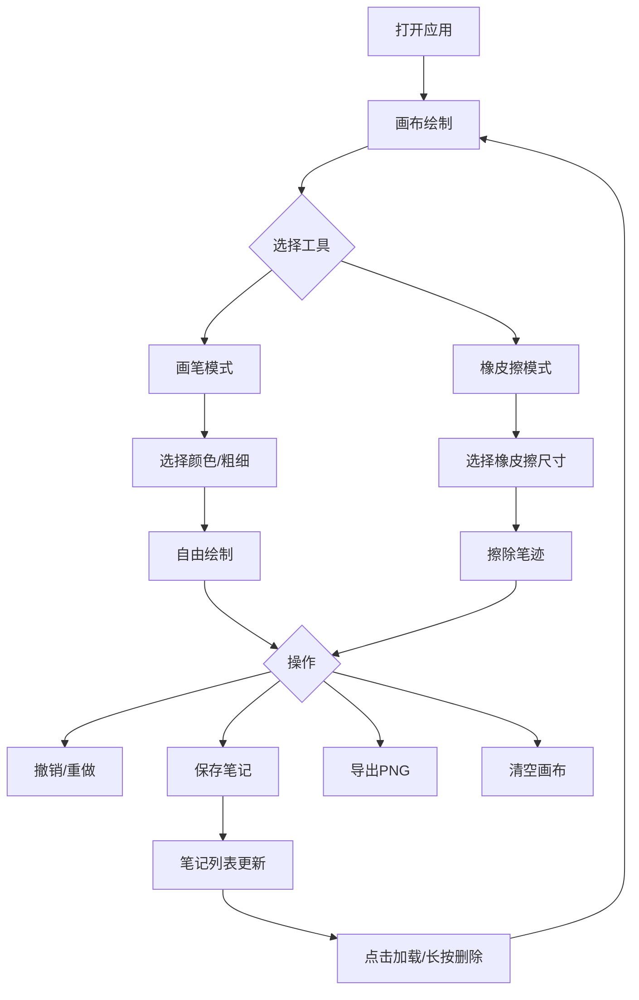

## 1. 产品概述

智慧笔迹是一款在线手写笔记应用，支持用户通过触摸或鼠标在画布上自由书写和绘制草图，提供多种笔触、颜色切换、橡皮擦、撤销/重做、笔记保存与导出等功能。
- 目标用户：需要快速手写记录、绘制草图的学生、设计师和职场人士
- 核心价值：零门槛手写输入体验，流畅的贝塞尔曲线绘制，便捷的笔记管理和导出

## 2. 核心功能

### 2.1 用户角色
| 角色 | 注册方式 | 核心权限 |
|------|----------|----------|
| 普通用户 | 无需注册 | 使用全部绘制和笔记管理功能 |

### 2.2 功能模块
1. **主画布页面**：自由绘制、工具栏、笔记列表侧边栏
2. **笔记管理面板**：缩略图网格、加载/删除笔记

### 2.3 页面详情
| 页面名称 | 模块名称 | 功能描述 |
|----------|----------|----------|
| 主画布页面 | 画布区域 | 支持鼠标/触摸自由绘制，贝塞尔曲线平滑渲染，米白色背景 |
| 主画布页面 | 工具栏 | 悬浮右上角，提供笔触颜色选择（12色）、粗细切换（4档）、橡皮擦（3种尺寸）、撤销/重做、清空、保存、导出 |
| 主画布页面 | 笔记列表侧边栏 | 左侧220px宽，展示已保存笔记缩略图网格（每行3个），支持点击加载和长按删除 |

## 3. 核心流程

用户打开应用 → 在画布上使用画笔/橡皮擦自由书写 → 切换颜色和笔触粗细 → 需要修改时使用撤销/重做 → 完成后保存笔记（命名）→ 笔记出现在左侧列表 → 可导出为高清PNG下载

## 4. 用户界面设计

### 4.1 设计风格
- 主色调：米白色画布（#FDF5E6）+ 深灰文字（#2C3E50）
- 辅助色：12色预设调色板
- 按钮风格：圆角卡片，毛玻璃效果，选中状态底部边框高亮
- 字体：标题使用Caveat手写风格字体（24px），正文使用系统字体
- 布局风格：左侧窄边栏 + 右侧主画布区
- 图标风格：使用lucide-react线性图标

### 4.2 页面设计概览
| 页面名称 | 模块名称 | UI元素 |
|----------|----------|--------|
| 主画布页面 | 侧边栏 | 白色背景、220px宽、Caveat字体标题"智慧笔迹"、缩略图网格（3列）、淡入动画 |
| 主画布页面 | 画布区域 | 1280x800px、米白色背景、10px浅灰边框、贝塞尔曲线绘制 |
| 主画布页面 | 工具栏 | 悬浮右上角、毛玻璃半透明背景、圆角卡片、shadow阴影、选中高亮动画 |
| 主画布页面 | 保存/导出按钮 | 绿色/蓝色渐变背景、hover放大1.05倍 |

### 4.3 响应式设计
- 桌面优先设计（≥768px）：左侧边栏 + 右侧画布
- 移动端适配（<768px）：侧边栏隐藏，变为顶部水平工具栏（60px高），画布自适应窗口宽高
- 触摸优化：支持触摸绘制，采样率不低于10点/秒

### 4.4 性能要求
- 绘制延迟 ≤ 50ms（输入到显示）
- 撤销/重做响应 ≤ 200ms
- 保存缩略图生成 ≤ 500ms
- 撤销/重做历史 ≥ 50步
