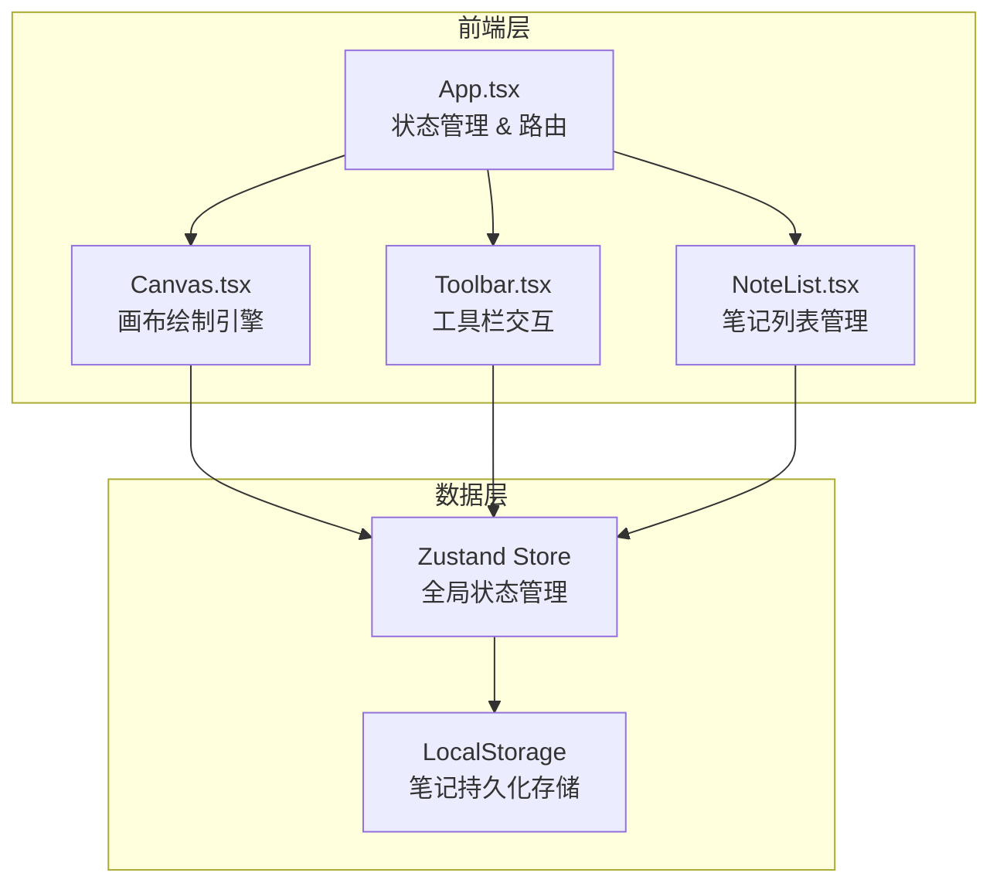
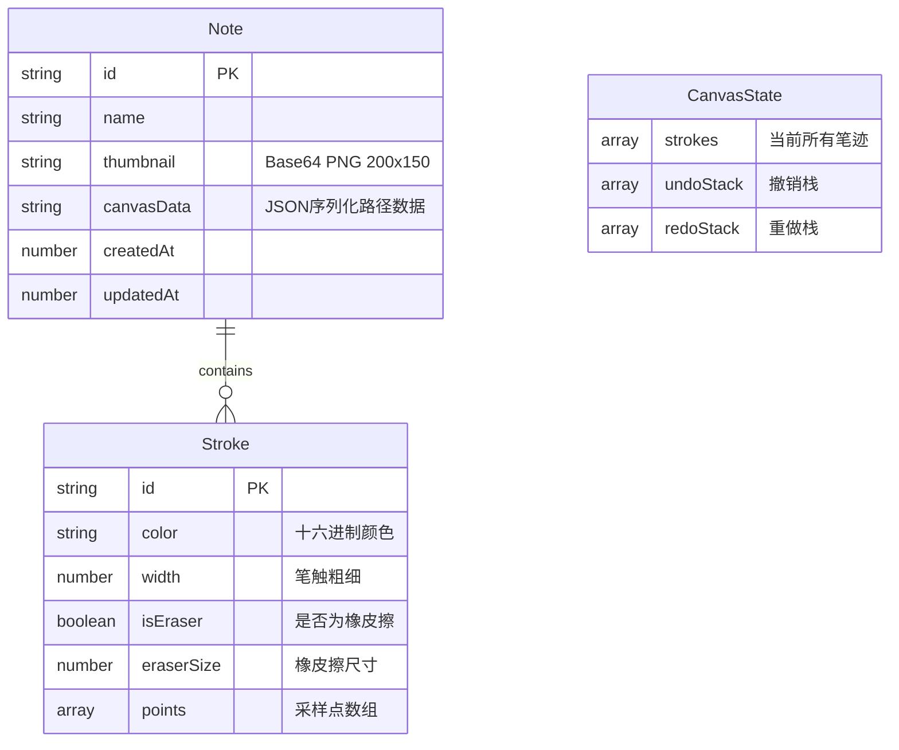

## 1. 架构设计



## 2. 技术说明
- 前端框架：React 18 + TypeScript
- 构建工具：Vite
- 状态管理：Zustand
- 样式方案：Tailwind CSS
- 图标库：lucide-react
- 字体：Google Fonts Caveat（手写风格）
- 持久化：LocalStorage（笔记数据 + 缩略图Base64）
- 初始化工具：vite-init（react-ts模板）

## 3. 路由定义
| 路由 | 用途 |
|------|------|
| / | 主画布页面，包含画布、工具栏和笔记列表 |

## 4. 数据模型

### 4.1 数据模型定义



### 4.2 核心类型定义

```typescript
interface Point {
  x: number;
  y: number;
  timestamp: number;
}

interface Stroke {
  id: string;
  color: string;
  width: number;
  isEraser: boolean;
  eraserSize?: number;
  points: Point[];
}

interface Note {
  id: string;
  name: string;
  thumbnail: string;
  canvasData: Stroke[];
  createdAt: number;
  updatedAt: number;
}

interface CanvasState {
  strokes: Stroke[];
  undoStack: Stroke[][];
  redoStack: Stroke[][];
}
```

### 4.3 Zustand Store设计

```typescript
interface AppStore {
  strokes: Stroke[];
  undoStack: Stroke[][];
  redoStack: Stroke[][];
  currentColor: string;
  currentWidth: number;
  isEraser: boolean;
  eraserSize: number;
  notes: Note[];
  activeNoteId: string | null;

  addStroke: (stroke: Stroke) => void;
  undo: () => void;
  redo: () => void;
  clearCanvas: () => void;
  setColor: (color: string) => void;
  setWidth: (width: number) => void;
  setEraser: (isEraser: boolean) => void;
  setEraserSize: (size: number) => void;
  saveNote: (name: string, thumbnail: string) => void;
  loadNote: (id: string) => void;
  deleteNote: (id: string) => void;
}
```
