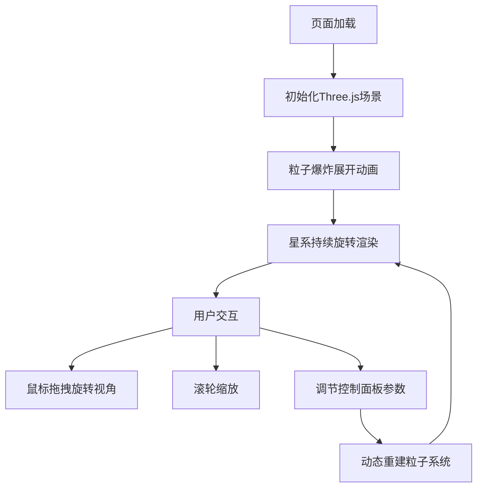

## 1. 产品概述

三维粒子星系交互可视化应用，解决浏览器中高效渲染大量动态粒子并支持用户操控视角的问题。面向对3D可视化、数据可视化感兴趣的开发者和用户，展示WebGL高性能渲染能力。

- 核心价值：在浏览器中实现流畅的10000+粒子3D渲染，提供沉浸式星系探索体验
- 技术亮点：Three.js + BufferGeometry 高性能粒子系统，实时参数调节，流畅的阻尼交互

## 2. 核心特性

### 2.2 功能模块
1. **主场景页面**：3D粒子星系渲染、视角交互控制、性能监控
2. **控制面板**：粒子数量调节、旋转速度控制、颜色主题切换

### 2.3 页面详情
| 页面名称 | 模块名称 | 功能描述 |
|-----------|-------------|---------------------|
| 主场景页面 | 3D粒子星系 | 5000+粒子螺旋星系结构，粒子随时间旋转流动，支持爆炸展开入场动画 |
| 主场景页面 | 视角交互 | 鼠标拖拽旋转视角，滚轮缩放，阻尼系数0.9的平滑过渡效果 |
| 控制面板 | 参数调节 | 粒子数量滑块(1000-10000)、旋转速度滑块(0-5倍)、3种主题配色切换 |
| 控制面板 | 响应式布局 | 桌面端左侧悬浮，移动端底部抽屉式折叠 |

## 3. 核心流程

用户进入页面后，粒子从中心爆炸扩散展开（2秒动画），随后星系持续旋转流动。用户可通过鼠标拖拽改变视角，滚轮缩放观察细节。通过左侧控制面板调节粒子参数，实时预览效果变化。

## 4. 用户界面设计

### 4.1 设计风格
- **主色调**：深色科技感主题，背景色 #0a0a1a
- **配色方案**：
  - 星云紫：#8b5cf6 → #a78bfa → #c4b5fd
  - 极光绿：#10b981 → #34d399 → #6ee7b7
  - 熔岩橙：#f97316 → #fb923c → #fdba74
- **面板样式**：半透明毛玻璃效果 backdrop-filter: blur(10px)，圆角 8px
- **交互元素**：滑块和按钮悬停高亮过渡动画 0.3s ease
- **字体**：现代无衬线字体，数字使用等宽字体增强科技感

### 4.2 页面设计概述
| 页面名称 | 模块名称 | UI 元素 |
|-----------|-------------|-------------|
| 主场景页面 | 3D渲染区域 | 全屏Canvas，深色背景，发光粒子，动态模糊效果 |
| 主场景页面 | 控制面板 | 左侧悬浮，半透明毛玻璃，垂直布局，图标+文字标签 |
| 主场景页面 | 性能信息 | 右上角FPS计数器，半透明显示 |

### 4.3 响应式设计
- **桌面端**：控制面板固定在左侧，宽度280px，边距16px
- **移动端**：控制面板自动折叠为底部抽屉，点击展开，支持上滑/下滑手势
- **触摸优化**：支持双指缩放、单指旋转，增加触摸热区

### 4.4 3D场景指导
- **环境**：纯深色背景 #0a0a1a，无雾效，突出粒子发光效果
- **光照**：无场景光源，粒子使用自发光材质，颜色通过顶点着色器控制
- **相机**：PerspectiveCamera，fov 75°，初始位置 z 轴 100 单位
- **构图**：星系中心在屏幕中央，粒子形成螺旋臂向外延伸
- **动画**：
  - 入场：粒子从(0,0,0)爆炸扩散到目标位置，2秒完成
  - 循环：粒子沿螺旋轨迹缓慢运动，整体绕Y轴旋转
  - 交互：视角变换带阻尼效果，粒子位置保持不变
- **后期处理**：轻微 Bloom 发光效果增强粒子辉光感
- **性能预算**：粒子10000时FPS ≥ 45，渲染延迟 < 50ms
