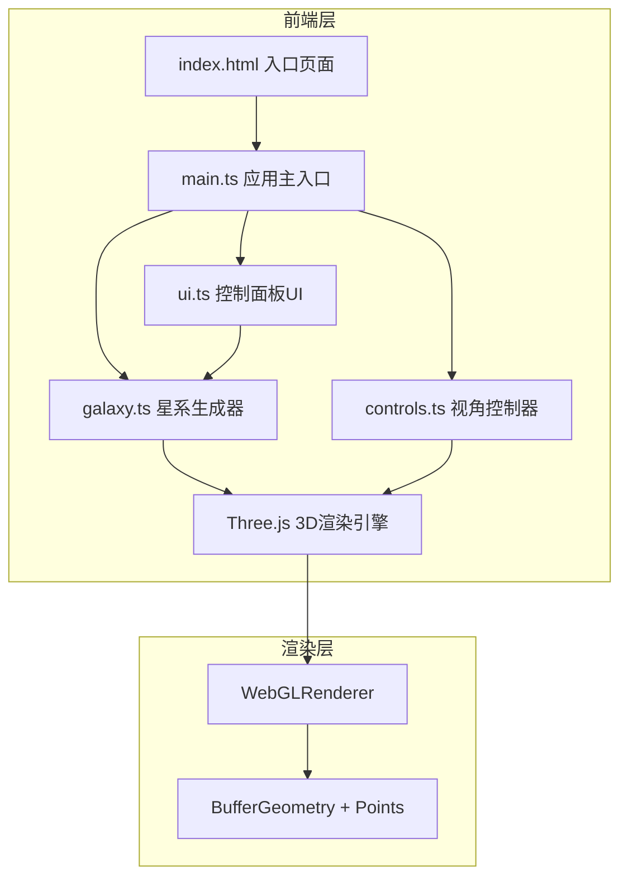
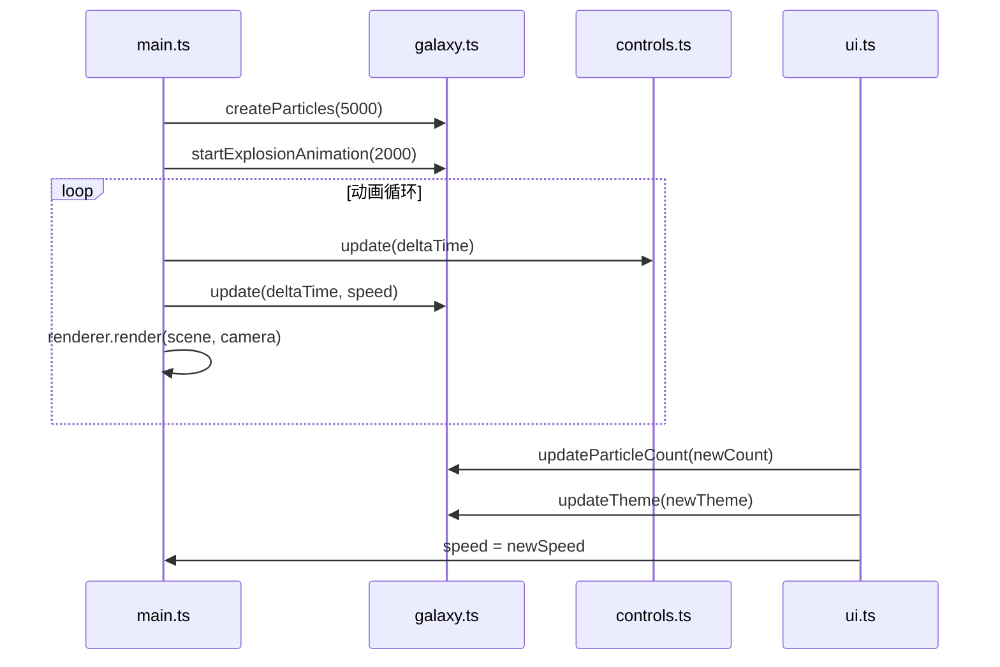

## 1. 架构设计



## 2. 技术描述

- **前端框架**: 原生 TypeScript + Three.js r152+
- **构建工具**: Vite 5.x
- **3D库**: three@^0.152.0, @types/three@^0.152.0
- **类型系统**: TypeScript 5.x (strict模式)
- **无后端服务**: 纯前端应用，所有逻辑在浏览器端执行
- **状态管理**: 模块内部状态，通过回调函数通信

## 3. 文件结构

```
e:\solo\VersionFastPro\tasks\auto1\
├── package.json          # 项目依赖配置
├── index.html           # HTML入口
├── vite.config.js       # Vite构建配置
├── tsconfig.json       # TypeScript配置
└── src/
    ├── main.ts         # 应用入口：场景/相机/渲染器初始化，动画循环
    ├── galaxy.ts       # 星系粒子系统：几何体生成、材质、动画逻辑
    ├── controls.ts     # 视角控制：鼠标拖拽、滚轮缩放、阻尼效果
    └── ui.ts           # UI控制面板：DOM生成、事件绑定
```

## 4. 模块职责定义

### 4.1 galaxy.ts - Galaxy 类
```typescript
class Galaxy {
  constructor(scene: THREE.Scene, theme: ColorTheme)
  createParticles(count: number): void
  update(deltaTime: number, speedMultiplier: number): void
  updateTheme(theme: ColorTheme): void
  updateParticleCount(count: number): void
  startExplosionAnimation(duration: number): void
  dispose(): void
}
```
- 生成螺旋星系结构的粒子数据（位置、颜色、大小、透明度）
- 使用 BufferGeometry 和 PointsMaterial 高性能渲染
- 实现粒子旋转动画和螺旋轨迹运动
- 支持粒子数量动态重建和主题切换
- 入场爆炸展开动画

### 4.2 controls.ts - GalaxyControls 类
```typescript
class GalaxyControls {
  constructor(camera: THREE.PerspectiveCamera, domElement: HTMLElement)
  update(deltaTime: number): void
  setDampingFactor(factor: number): void
}
```
- 基于 OrbitControls 封装
- 鼠标拖拽旋转视角
- 滚轮缩放
- 阻尼平滑效果（阻尼系数0.9）
- 支持触摸交互

### 4.3 ui.ts - ControlPanel 类
```typescript
class ControlPanel {
  constructor(
    onParticleCountChange: (count: number) => void,
    onSpeedChange: (speed: number) => void,
    onThemeChange: (theme: ColorTheme) => void
  )
  show(): void
  hide(): void
}
```
- 生成控制面板DOM结构
- 粒子数量滑块 (1000-10000)
- 旋转速度滑块 (0-5倍)
- 主题切换按钮（星云紫、极光绿、熔岩橙）
- 响应式布局：桌面端左侧悬浮，移动端底部抽屉

### 4.4 main.ts - 主入口
- 初始化 THREE.Scene, PerspectiveCamera, WebGLRenderer
- 创建 Galaxy, GalaxyControls, ControlPanel 实例
- 启动 requestAnimationFrame 动画循环
- 绑定窗口 resize 事件
- FPS 性能监控

## 5. 核心数据结构

### 5.1 颜色主题
```typescript
type ColorTheme = 'nebula-purple' | 'aurora-green' | 'lava-orange'

interface ThemeConfig {
  name: string
  colors: string[]
}

const THEMES: Record<ColorTheme, ThemeConfig> = {
  'nebula-purple': {
    name: '星云紫',
    colors: ['#8b5cf6', '#a78bfa', '#c4b5fd']
  },
  'aurora-green': {
    name: '极光绿',
    colors: ['#10b981', '#34d399', '#6ee7b7']
  },
  'lava-orange': {
    name: '熔岩橙',
    colors: ['#f97316', '#fb923c', '#fdba74']
  }
}
```

### 5.2 粒子属性缓冲区
- positions: Float32Array (x, y, z)
- colors: Float32Array (r, g, b)
- sizes: Float32Array
- alphas: Float32Array
- originalPositions: Float32Array (用于爆炸动画)

## 6. 性能优化策略

1. **几何体优化**:
   - 使用 BufferGeometry 而非 Geometry
   - 单 Draw Call 渲染所有粒子
   - 共享顶点数据，减少内存占用

2. **材质优化**:
   - 使用 PointsMaterial 而非 ShaderMaterial（简化实现）
   - 启用 transparent 和 depthWrite: false
   - 使用 AdditiveBlending 增强发光效果

3. **动态重建优化**:
   - 粒子数量变化时，dispose 旧几何体，创建新几何体
   - 使用 requestAnimationFrame 分批重建，避免主线程阻塞

4. **渲染优化**:
   - 限制最大粒子数 10000
   - 使用 WebGLRenderer 开启 antialias: false（性能优先）
   - 自适应像素比 Math.min(window.devicePixelRatio, 2)

## 7. 动画流程


