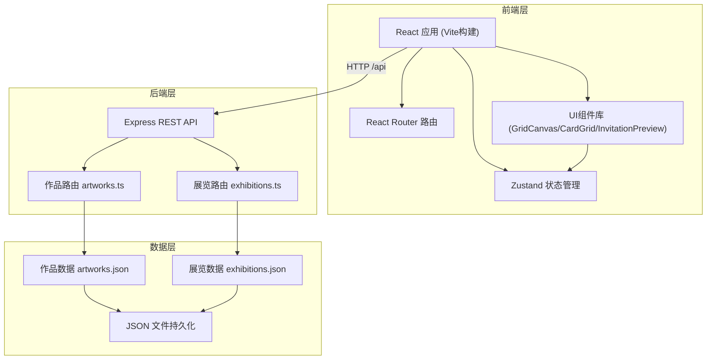
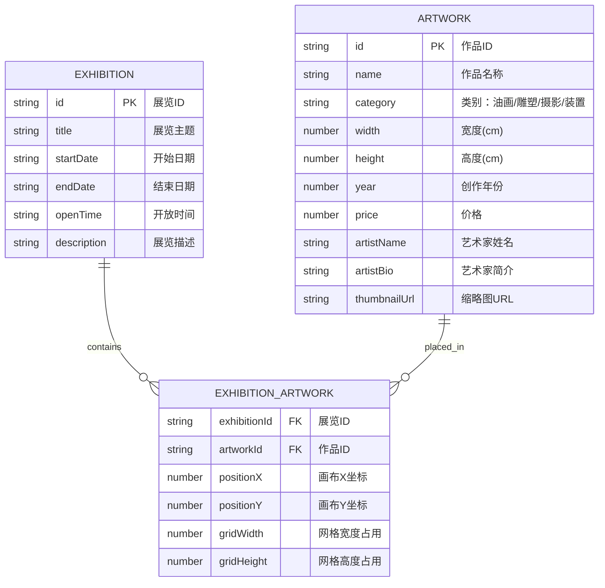

## 1. 架构设计



## 2. 技术描述

- **前端框架**：React 18 + TypeScript
- **构建工具**：Vite 5
- **状态管理**：Zustand 4
- **路由管理**：React Router DOM 6
- **HTTP客户端**：Axios
- **UI库**：原生CSS + CSS Modules（无第三方UI库，保证轻量和独特设计）
- **后端框架**：Express 4
- **数据持久化**：JSON文件（server/data目录）
- **第三方工具**：
  - uuid：生成唯一ID
  - html2canvas：邀请函截图生成
  - jspdf：PDF导出
  - cors：跨域支持

## 3. 项目结构

```
.
├── package.json              # 项目依赖和脚本
├── index.html                # HTML入口
├── vite.config.js            # Vite配置
├── tsconfig.json             # TypeScript配置
├── server/
│   ├── index.ts              # Express后端入口
│   ├── routes/
│   │   ├── artworks.ts       # 作品和艺术家API
│   │   └── exhibitions.ts    # 展览计划和日程API
│   └── data/                 # JSON数据持久化目录
│       ├── artworks.json
│       └── exhibitions.json
└── src/
    ├── main.tsx              # React应用入口
    ├── App.tsx               # 主应用组件
    ├── store/
    │   ├── artworkStore.ts   # 作品和艺术家状态管理
    │   └── exhibitionStore.ts # 展览状态管理
    ├── components/
    │   ├── GridCanvas.tsx    # 2D展览空间画布
    │   ├── CardGrid.tsx      # 作品卡片网格
    │   └── InvitationPreview.tsx # 邀请函预览
    └── pages/
        ├── ArtworksPage.tsx  # 作品列表页
        ├── ArtworkDetailPage.tsx # 作品详情页
        ├── ExhibitionsPage.tsx # 展览列表页
        └── ExhibitionPage.tsx  # 展览详情页
```

## 4. 路由定义

### 前端路由

| 路由路径 | 页面组件 | 用途 |
|----------|----------|------|
| / | ArtworksPage | 作品列表首页 |
| /artworks | ArtworksPage | 作品列表页 |
| /artworks/:id | ArtworkDetailPage | 作品详情页 |
| /exhibitions | ExhibitionsPage | 展览列表页 |
| /exhibitions/:id | ExhibitionPage | 展览详情/规划页 |

### 后端API路由

| 方法 | 路径 | 用途 |
|------|------|------|
| GET | /api/artworks | 获取所有作品列表 |
| GET | /api/artworks/:id | 获取单个作品详情 |
| POST | /api/artworks | 创建新作品 |
| PUT | /api/artworks/:id | 更新作品信息 |
| DELETE | /api/artworks/:id | 删除作品 |
| GET | /api/exhibitions | 获取所有展览列表 |
| GET | /api/exhibitions/:id | 获取单个展览详情 |
| POST | /api/exhibitions | 创建新展览 |
| PUT | /api/exhibitions/:id | 更新展览信息 |
| DELETE | /api/exhibitions/:id | 删除展览 |
| GET | /api/exhibitions/:id/conflicts | 检查展览排期冲突 |

## 5. 数据模型

### 5.1 数据模型定义



### 5.2 TypeScript类型定义

```typescript
// 作品类别
type ArtworkCategory = 'oil' | 'sculpture' | 'photography' | 'installation';

// 作品
interface Artwork {
  id: string;
  name: string;
  category: ArtworkCategory;
  width: number;
  height: number;
  year: number;
  price: number;
  artistName: string;
  artistBio: string;
  thumbnailUrl?: string;
}

// 展览中作品的位置信息
interface ExhibitionArtwork {
  artworkId: string;
  positionX: number;
  positionY: number;
  gridWidth: number;
  gridHeight: number;
}

// 展览
interface Exhibition {
  id: string;
  title: string;
  startDate: string;
  endDate: string;
  openTime: string;
  description?: string;
  artworks: ExhibitionArtwork[];
}

// 画布状态
interface CanvasState {
  zoom: number;
  offsetX: number;
  offsetY: number;
  gridSize: number;
  canvasWidth: number;
  canvasHeight: number;
}
```

### 5.3 JSON数据文件格式

**artworks.json:**
```json
{
  "artworks": [
    {
      "id": "uuid-1",
      "name": "作品名称",
      "category": "oil",
      "width": 100,
      "height": 80,
      "year": 2023,
      "price": 15000,
      "artistName": "艺术家姓名",
      "artistBio": "艺术家简介...",
      "thumbnailUrl": ""
    }
  ]
}
```

**exhibitions.json:**
```json
{
  "exhibitions": [
    {
      "id": "uuid-1",
      "title": "展览主题",
      "startDate": "2024-01-01",
      "endDate": "2024-02-01",
      "openTime": "10:00-18:00",
      "description": "展览描述",
      "artworks": [
        {
          "artworkId": "artwork-uuid-1",
          "positionX": 0,
          "positionY": 0,
          "gridWidth": 2,
          "gridHeight": 2
        }
      ]
    }
  ]
}
```

## 6. 状态管理设计

### 6.1 artworkStore (作品状态)

- **state**: 
  - artworks: 作品列表
  - loading: 加载状态
  - error: 错误信息
  - filterCategory: 筛选类别

- **actions**:
  - fetchArtworks(): 获取所有作品
  - fetchArtwork(id): 获取单个作品
  - addArtwork(artwork): 添加作品
  - updateArtwork(id, artwork): 更新作品
  - deleteArtwork(id): 删除作品
  - setFilterCategory(category): 设置筛选类别

### 6.2 exhibitionStore (展览状态)

- **state**:
  - exhibitions: 展览列表
  - currentExhibition: 当前展览
  - loading: 加载状态
  - error: 错误信息

- **actions**:
  - fetchExhibitions(): 获取所有展览
  - fetchExhibition(id): 获取单个展览
  - addExhibition(exhibition): 创建展览
  - updateExhibition(id, exhibition): 更新展览
  - deleteExhibition(id): 删除展览
  - addArtworkToExhibition(exhibitionId, artwork, position): 添加作品到展览
  - removeArtworkFromExhibition(exhibitionId, artworkId): 从展览移除作品
  - updateArtworkPosition(exhibitionId, artworkId, position): 更新作品位置
  - checkConflicts(exhibitionId): 检查排期冲突

## 7. 核心组件设计

### 7.1 GridCanvas (2D画布组件)

- **功能**：
  - 渲染灰色虚线网格
  - 作品缩略图拖拽放置
  - 半透明预览色块跟随鼠标
  - 缩放（50%-200%）和平移
  - 计算总面积和剩余面积

- **Props**:
  - exhibitionId: 展览ID
  - artworks: 展览中的作品列表
  - onArtworkMove: 作品移动回调

- **内部状态**:
  - isDragging: 是否正在拖拽
  - dragArtworkId: 正在拖拽的作品ID
  - mousePosition: 鼠标位置（画布坐标系）
  - zoom: 缩放比例
  - offset: 平移偏移

### 7.2 CardGrid (作品卡片网格)

- **功能**：
  - 响应式卡片网格布局
  - 作品卡片展示（缩略图、名称、艺术家、年份）
  - 点击进入详情页
  - 加载状态和空状态

- **Props**:
  - artworks: 作品列表
  - onCardClick: 卡片点击回调

### 7.3 InvitationPreview (邀请函预览)

- **功能**：
  - 展览概要展示
  - 作品列表
  - 开放时间
  - 二维码展示
  - 打印/导出功能

- **Props**:
  - exhibition: 展览数据
  - artworks: 作品列表
