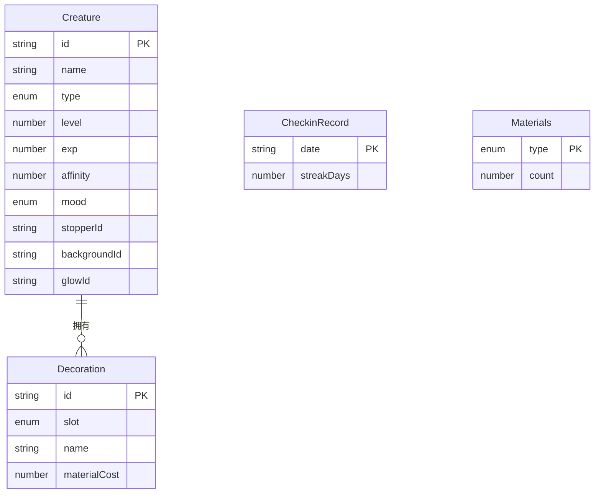

## 1. 架构设计

```mermaid
flowchart TB
    subgraph "前端层"
        "React 18" --> "Zustand Store"
        "Zustand Store" --> "creatureStore"
        "Zustand Store" --> "uiStore"
        "React 18" --> "页面组件"
        "页面组件" --> "精灵交互页"
        "页面组件" --> "收藏图鉴页"
        "页面组件" --> "装饰管理弹窗"
        "页面组件" --> "签到面板"
    end
    subgraph "数据层"
        "localStorage" --> "精灵数据"
        "localStorage" --> "签到记录"
        "localStorage" --> "材料库存"
        "localStorage" --> "装饰配置"
    end
    "Zustand Store" --> "localStorage"
    "localStorage" --> "Zustand Store"
```

## 2. 技术说明

- 前端框架：React 18 + TypeScript
- 构建工具：Vite
- 状态管理：Zustand（轻量级，支持localStorage持久化）
- 动画：CSS关键帧 + Framer Motion
- 样式：Tailwind CSS + 自定义CSS变量主题
- 图标：Lucide React
- 唯一标识：uuid
- 数据持久化：localStorage
- 后端：无（纯前端应用）
- 数据库：无（使用localStorage模拟持久化）

## 3. 路由定义

| 路由 | 用途 |
|------|------|
| / | 默认进入精灵交互页（第一只精灵） |
| /creature/:id | 特定精灵的交互页面 |
| /collection | 收藏图鉴页 |
| /checkin | 每日签到面板 |

## 4. API定义

无后端API，所有数据通过Zustand Store + localStorage管理。

### Store接口定义

```typescript
interface CreatureStore {
  creatures: Creature[];
  currentCreatureId: string | null;
  materials: Record<MaterialType, number>;
  selectCreature: (id: string) => void;
  feedCreature: (foodType: FoodType) => void;
  playMusic: (musicType: MusicType) => void;
  cleanBottle: () => void;
  tickMoodDecay: () => void;
  addCreature: (creature: Creature) => void;
  applyDecoration: (creatureId: string, slot: DecorationSlot, decorationId: string) => void;
  checkin: () => void;
  checkinRecords: CheckinRecord[];
}

interface UIStore {
  currentPage: string;
  showDecorationModal: boolean;
  showCheckinPanel: boolean;
  setPage: (page: string) => void;
  toggleDecorationModal: () => void;
  toggleCheckinPanel: () => void;
}
```

## 5. 数据模型

### 5.1 数据模型定义



### 5.2 核心类型定义

```typescript
type CreatureType = 'fire' | 'water' | 'wind' | 'rock' | 'shadow'
type Mood = 'happy' | 'calm' | 'irritated' | 'tired'
type FoodType = 'sweetBerry' | 'magicMushroom' | 'starlightDew'
type MusicType = 'gentle' | 'lively' | 'mysterious'
type DecorationSlot = 'stopper' | 'background' | 'glow'
type MaterialType = 'stardust' | 'crystalShard' | 'mossSpore' | 'shellFragment'

interface Creature {
  id: string
  name: string
  type: CreatureType
  level: number
  exp: number
  affinity: number
  mood: Mood
  lastInteractionAt: number
  decorations: {
    stopper: string | null
    background: string | null
    glow: string | null
  }
}
```

## 6. 文件结构

```
├── index.html
├── package.json
├── vite.config.js
├── tsconfig.json
├── src/
│   ├── App.tsx
│   ├── types.ts
│   ├── main.tsx
│   ├── store/
│   │   ├── creatureStore.ts
│   │   └── uiStore.ts
│   ├── components/
│   │   ├── CreatureBottle.tsx
│   │   ├── CreatureCard.tsx
│   │   ├── ControlPanel.tsx
│   │   ├── DecorationManager.tsx
│   │   ├── NavBar.tsx
│   │   └── CheckinPanel.tsx
│   ├── data/
│   │   └── creatures.ts
│   ├── styles/
│   │   └── theme.css
│   └── utils/
│       └── helpers.ts
```
