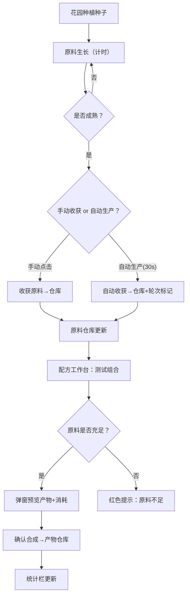

## 1. 产品概述

炼金配方模拟与花园种植循环应用——一款像素风格的炼金术士工作台模拟器，玩家可在配方工作台中创建和测试炼金配方，在花园中种植原料，系统自动收获并产出原料至仓库，形成"种植→收获→调配→产出"的完整循环。

- 目标用户：独立游戏开发者、游戏设计爱好者，用于快速验证资源管理游戏的配方组合与性价比
- 核心价值：零代码测试配方机制，实时可视化种植与生产循环，提供产物统计与库存价值分析

## 2. 核心功能

### 2.1 用户角色

| 角色 | 注册方式 | 核心权限 |
|------|----------|----------|
| 炼金术士（唯一玩家） | 无需注册 | 全部操作权限 |

### 2.2 功能模块

1. **配方工作台**：配方创建、编辑、组合测试、产物预览
2. **花园视图**：4×4地块种植、生长进度、手动/自动收获
3. **原料仓库**：原料库存展示、分类筛选、SVG像素图标
4. **产物仓库**：产物展示、合成时间、配方溯源、统计面板

### 2.3 页面详情

| 页面名称 | 模块名称 | 功能描述 |
|----------|----------|----------|
| 主页面 | 配方工作台（左栏） | 创建配方（名称≤12字、选原料1-3份、自定义产物），卡片展示，点击编辑，测试组合检测原料是否充足，充足则弹窗预览产物与消耗，不足则红色提示 |
| 主页面 | 原料仓库（中栏） | 网格展示原料（16×16像素SVG图标+名称+存量），按植物/矿石/水晶筛选，可折叠（折叠时仅显示总数标签） |
| 主页面 | 花园视图（右栏） | 4×4网格地块（80×80px），空地为黄色泥土，点击种植选择种子，生长进度条（植物120s/矿石180s/水晶240s），成熟后呼吸闪烁动画，点击收获入仓库，自动生产每30s触发 |
| 主页面 | 产物仓库（底部） | 产物卡片（名称+数量+首次合成时间），背景色按类型（药水紫/宝石金/魔法材料蓝），悬停显示配方来源与合成次数，统计栏显示总合成次数/原料消耗/库存总价值 |

## 3. 核心流程

**主循环**：用户在花园种植原料种子 → 原料生长成熟 → 手动或自动收获至仓库 → 在工作台选择配方测试组合 → 若原料充足则合成产物 → 产物进入产物仓库 → 统计更新

## 4. 用户界面设计

### 4.1 设计风格

- **主色调**：深绿色（#2d3a2d）为主背景，米黄色（#f5e6c8）为内容区底色
- **像素字体**：'Press Start 2P'（Google Fonts加载）
- **按钮风格**：像素边框按钮，悬停背景变亮（#5a7a5a），点击压下效果（translateY(2px)+阴影缩小）
- **布局风格**：三栏卡片式布局，左配方面板280px、中原料仓库（可折叠）、右花园4×4网格
- **图标风格**：16×16内联SVG像素图标，风格统一

### 4.2 页面设计概览

| 页面名称 | 模块名称 | UI元素 |
|----------|----------|--------|
| 主页面 | 配方工作台 | 像素边框面板，卡片式配方列表，编辑表单，测试组合按钮，产物预览弹窗 |
| 主页面 | 原料仓库 | 可折叠区域，网格卡片（SVG图标+名称+数量），分类筛选标签 |
| 主页面 | 花园视图 | 4×4网格，80×80px地块，2px像素虚线间隔，6px渐变进度条，呼吸闪烁动画 |
| 主页面 | 产物仓库 | 彩色背景卡片，悬停tooltip，底部统计栏 |

### 4.3 响应式设计

- 桌面优先（≥768px）：左中右三栏布局
- 移动端（<768px）：上下布局，工作台在上→仓库居中→花园在下
- 进度条和按钮在移动端适当放大以支持触摸操作

### 4.4 动画与交互

- 地块成熟：CSS keyframes呼吸闪烁（opacity 0.6↔1.0，1.5s循环）
- 进度条：CSS transition渐变填充
- 按钮悬停：背景色变亮 + translateY(0)
- 按钮点击：translateY(2px) + box-shadow缩小
- 配方卡片编辑：平滑过渡展开
