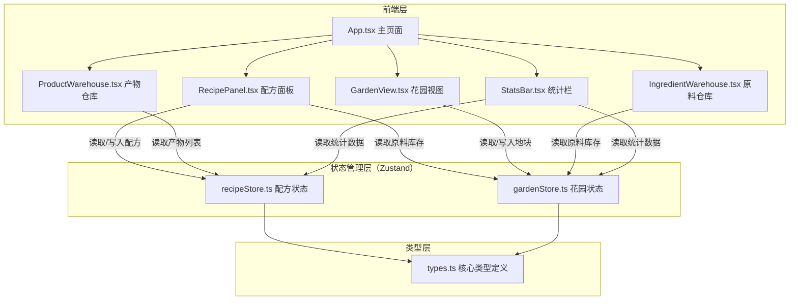
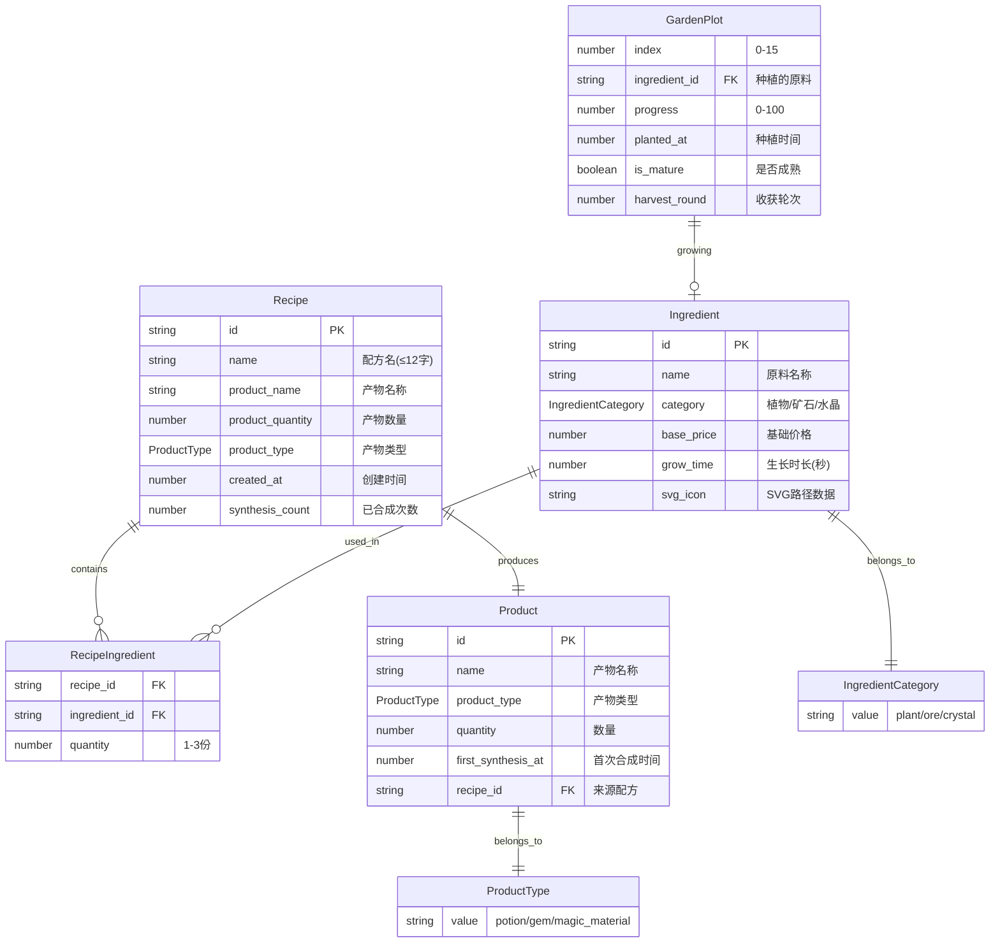

## 1. 架构设计



## 2. 技术说明

- **前端框架**：React 18 + TypeScript（严格模式）
- **构建工具**：Vite（支持React与TypeScript）
- **状态管理**：Zustand（轻量级，配方状态与花园状态分离）
- **样式方案**：CSS模块 + 全局像素风格变量，不使用Tailwind（像素风需要精细控制边框和动画）
- **字体**：'Press Start 2P'（Google Fonts CDN加载）
- **工具库**：uuid（生成唯一ID）、date-fns（时间格式化）
- **无后端**：纯前端应用，所有状态保存在Zustand store中（内存态）

## 3. 路由定义

| 路由 | 用途 |
|------|------|
| / | 主页面，包含配方工作台、原料仓库、花园视图、产物仓库 |

> 单页应用，所有功能在同一页面三栏布局中展示

## 4. 数据模型

### 4.1 数据模型定义



### 4.2 内置原料数据（10种）

| ID | 名称 | 分类 | 生长时长(秒) | 基础价格 | SVG颜色 |
|----|------|------|-------------|---------|---------|
| ing_01 | 薰衣草 | 植物 | 120 | 5 | #9b59b6 |
| ing_02 | 月光花 | 植物 | 120 | 8 | #f1c40f |
| ing_03 | 铁矿石 | 矿石 | 180 | 10 | #7f8c8d |
| ing_04 | 铜矿石 | 矿石 | 180 | 8 | #e67e22 |
| ing_05 | 紫水晶 | 水晶 | 240 | 20 | #8e44ad |
| ing_06 | 蓝宝石 | 水晶 | 240 | 25 | #2980b9 |
| ing_07 | 薄荷叶 | 植物 | 120 | 3 | #27ae60 |
| ing_08 | 金矿石 | 矿石 | 180 | 30 | #f39c12 |
| ing_09 | 红宝石 | 水晶 | 240 | 30 | #c0392b |
| ing_10 | 曼德拉草 | 植物 | 120 | 12 | #2ecc71 |

## 5. 文件结构

```
auto111/
├── package.json
├── vite.config.ts
├── tsconfig.json
├── index.html
├── src/
│   ├── types.ts              # 核心类型定义
│   ├── constants.ts           # 内置原料、价格等常量
│   ├── recipeStore.ts         # 配方管理Zustand状态
│   ├── gardenStore.ts         # 花园模拟Zustand状态
│   ├── App.tsx                # 主页面（三栏布局）
│   ├── App.css                # 全局像素风样式
│   ├── index.tsx              # React入口
│   └── components/
│       ├── RecipePanel.tsx    # 配方编辑与组合测试
│       ├── GardenView.tsx     # 花园4×4网格视图
│       ├── IngredientWarehouse.tsx  # 原料仓库
│       ├── ProductWarehouse.tsx     # 产物仓库
│       └── StatsBar.tsx       # 底部统计栏
```

## 6. 数据流向

### 6.1 配方工作台数据流

```
用户输入配方 → recipeStore.addRecipe()
  → 检测原料匹配（遍历recipe.ingredients与gardenStore.ingredientInventory）
  → 返回匹配结果（充足/不足）
  → 充足时：弹窗预览产物+消耗
  → 用户确认合成 → recipeStore.synthesize()
    → 扣减gardenStore.ingredientInventory
    → 增加recipeStore.products
    → 更新统计
```

### 6.2 花园种植数据流

```
用户点击空地块 → 弹出种子选择 → gardenStore.plant(plotIndex, ingredientId)
  → 地块状态更新（planted_at、ingredient_id、progress=0）
  → setInterval每秒更新progress（基于grow_time计算百分比）
  → progress=100 → is_mature=true → CSS动画触发

用户点击成熟地块 → gardenStore.harvest(plotIndex)
  → ingredientInventory[ingredientId] += 1
  → 地块重置（清空ingredient_id、progress=0、planted_at=null）

自动生产（每30s）→ gardenStore.autoHarvest()
  → 遍历所有is_mature地块
  → 每个成熟地块：harvest + 自动重新种植 + harvest_round++
  → 文字反馈："已自动收获+轮次标记"
```

### 6.3 组件间调用关系

| 组件 | 读取的Store | 触发的Store动作 |
|------|------------|----------------|
| RecipePanel | recipeStore.recipes, gardenStore.ingredientInventory | recipeStore.addRecipe, updateRecipe, deleteRecipe, synthesize |
| GardenView | gardenStore.plots, gardenStore.ingredientInventory | gardenStore.plant, harvest |
| IngredientWarehouse | gardenStore.ingredientInventory | 无（只读展示） |
| ProductWarehouse | recipeStore.products | 无（只读展示） |
| StatsBar | recipeStore.products, gardenStore.ingredientInventory, constants.prices | 无（只读计算） |

## 7. 性能约束保障

- **配方组合检测 < 50ms**：原料种类固定10种，配方原料≤5项，遍历检测为O(n)简单比较，Zustand直接内存读取
- **进度条FPS ≥ 45**：使用requestAnimationFrame而非setInterval驱动进度条，CSS transform代替重排属性
- **自动生产优化**：每30s单次遍历16个地块，极低计算量
