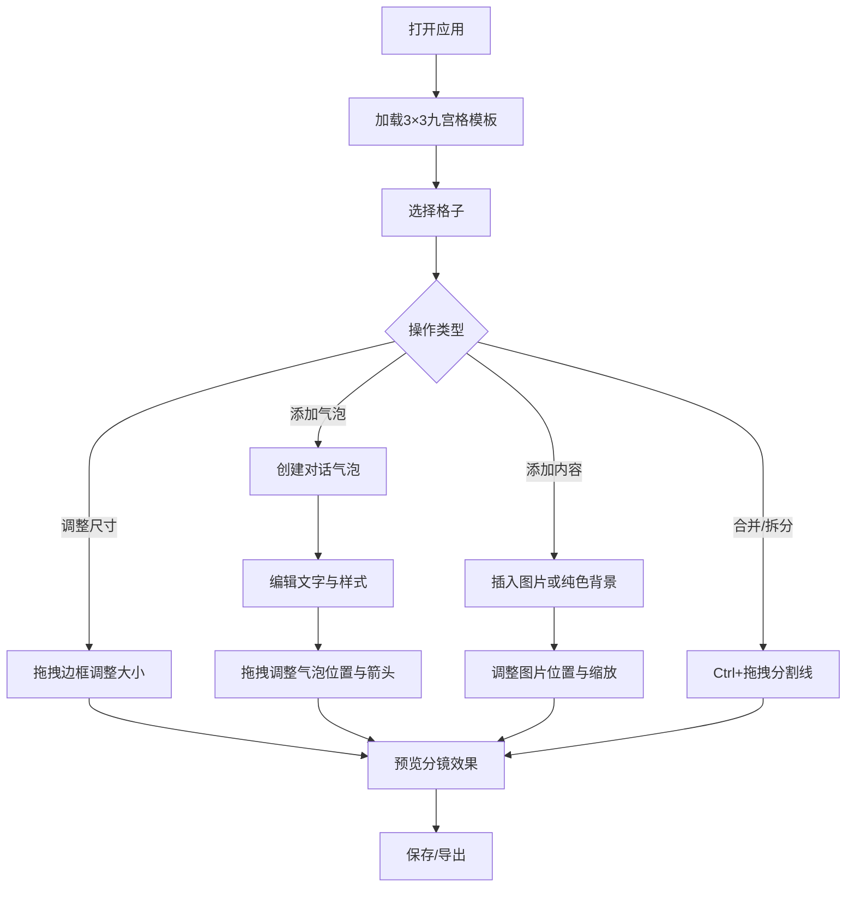

## 1. 产品概述

在线互动式漫画分镜生成器——让漫画创作者在浏览器中快速构建漫画页面、编排分镜头并添加对话气泡和文字，通过键盘快捷键和鼠标拖拽交互提升创作效率，无需专业绘图软件即可获得可浏览的分镜草稿。
- 目标用户：独立漫画创作者、分镜师、漫画爱好者
- 核心价值：零门槛、轻量级、即时预览的分镜创作工具

## 2. 核心功能

### 2.1 用户角色
| 角色 | 注册方式 | 核心权限 |
|------|----------|----------|
| 创作者 | 无需注册 | 创建、编辑、导出分镜草稿 |

### 2.2 功能模块
1. **画布页面**：无限滚动画布、格子管理、气泡编辑、图片插入、拖拽交互、缩放平移

### 2.3 页面详情
| 页面名称 | 模块名称 | 功能描述 |
|----------|----------|----------|
| 画布页面 | 画布与分镜管理 | 无限滚动画布上创建漫画格子，初始3×3九宫格模板，格子尺寸可拖动边框调整并显示实时像素尺寸，格子间灰色虚线分割线，Ctrl+拖拽连接线合并/拆分格子，悬停蓝色描边+快速工具栏（删除、复制、插入气泡） |
| 画布页面 | 对话气泡与文字编辑 | 选中格子后添加白色圆角矩形气泡，三角形箭头可拖拽调整指向，多行文字输入，字体大小12-36px、颜色和对齐方式设置，多气泡自由拖拽，重叠时后添加气泡半透明+橙色虚线边框，Delete键删除选中气泡 |
| 画布页面 | 图片插入 | 格子内插入纯色背景或上传图片，支持在格子内拖拽移动和缩放 |
| 画布页面 | 画布交互 | 鼠标滚轮缩放0.5x-3x，右键拖拽平移，0.2秒过渡动画 |
| 画布页面 | 导航栏 | 顶部固定导航栏，显示项目名称和保存按钮 |
| 画布页面 | 工具栏 | 左侧固定工具栏，包含选择、添加格子、添加气泡、插入图片、撤销/重做五个图标按钮，带tooltip |
| 画布页面 | 属性面板 | 右侧动态属性面板，选中格子时显示尺寸、背景色、图片上传；选中气泡时显示文字样式设置 |
| 画布页面 | 状态栏 | 底部状态栏，显示当前缩放比例和格子数量 |

## 3. 核心流程

用户打开应用→看到3×3九宫格模板→点击格子选中→可通过拖拽边框调整尺寸→可悬停查看快速工具栏→点击添加气泡→编辑气泡文字和样式→上传图片到格子→调整图片位置和缩放→Ctrl+拖拽分割线合并/拆分格子→滚轮缩放画布→右键平移画布→点击保存/导出

## 4. 用户界面设计

### 4.1 设计风格
- 主色：#4A90D9（明快蓝色），辅助色：白色，背景色：#F5F7FA（浅灰色）
- 按钮风格：圆角扁平按钮，主色填充，悬停时加深
- 字体：正文14px，标题18px，等宽字体用于尺寸数值显示
- 布局风格：顶部固定导航栏+左侧固定工具栏+中央画布+右侧属性面板+底部状态栏
- 图标风格：线性图标，2px描边，与主色一致

### 4.2 页面设计概览
| 页面名称 | 模块名称 | UI元素 |
|----------|----------|--------|
| 画布页面 | 导航栏 | 白色背景，左侧项目名称文字，右侧保存按钮（蓝色圆角），高度56px，底部1px阴影 |
| 画布页面 | 工具栏 | 40px宽，浅灰色背景，垂直排列5个图标按钮，每个按钮32×32px，间距8px，悬停显示tooltip |
| 画布页面 | 画布区域 | 浅灰色背景，格子白色背景+灰色虚线分割线，选中格子蓝色描边2px，悬停时蓝色描边1px+工具栏弹出 |
| 画布页面 | 属性面板 | 240px宽，白色背景，标题16px加粗，表单控件12px，折叠/展开过渡动画 |
| 画布页面 | 状态栏 | 28px高，浅灰色背景，左侧显示缩放比例，右侧显示格子数量，字体12px灰色 |
| 画布页面 | 对话气泡 | 白色圆角矩形，8px圆角，三角形箭头可拖拽，文字编辑区域，重叠时橙色虚线边框 |

### 4.3 响应式设计
- 桌面端优先（≥1024px）：完整布局，左工具栏+中央画布+右属性面板
- 平板端（768-1023px）：属性面板折叠为抽屉，画布区域扩展
- 移动端（<768px）：单列布局，工具栏变为底部浮动栏，属性面板变为底部抽屉

### 4.4 3D场景指导
- 不适用
