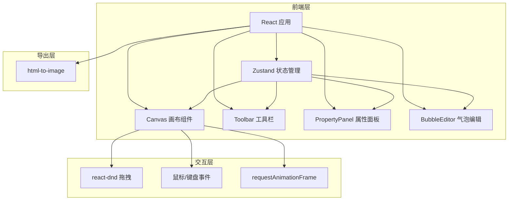
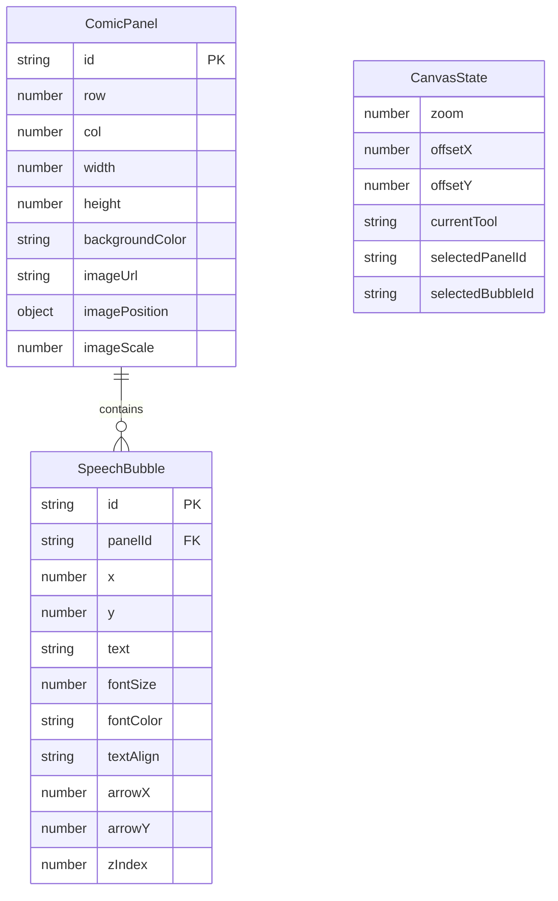

## 1. 架构设计



## 2. 技术说明
- 前端：React@18 + TypeScript + Vite
- 初始化工具：Vite
- 状态管理：Zustand（轻量级，支持撤销/重做中间件）
- 拖拽交互：react-dnd + react-dnd-html5-backend
- 图片导出：html-to-image
- 样式：CSS Modules（避免全局污染）
- 后端：无（纯前端应用）
- 数据库：无（使用 localStorage 持久化）

## 3. 路由定义
| 路由 | 用途 |
|------|------|
| / | 画布主页面，包含所有分镜编辑功能 |

## 4. API定义
- 无后端API，所有数据在客户端管理
- localStorage 用于项目持久化保存

## 5. 服务器架构图
- 不适用（纯前端应用）

## 6. 数据模型

### 6.1 数据模型定义



### 6.2 数据定义

**ComicPanel 类型**：
- `id`: string (uuid) - 格子唯一标识
- `row`: number - 行位置
- `col`: number - 列位置
- `rowSpan`: number - 跨行数（合并格子用）
- `colSpan`: number - 跨列数（合并格子用）
- `width`: number - 宽度(px)
- `height`: number - 高度(px)
- `backgroundColor`: string - 背景颜色
- `imageUrl`: string | null - 图片URL
- `imagePosition`: {x: number, y: number} - 图片位置
- `imageScale`: number - 图片缩放比例

**SpeechBubble 类型**：
- `id`: string (uuid) - 气泡唯一标识
- `panelId`: string - 所属格子ID
- `x`: number - 气泡X位置
- `y`: number - 气泡Y位置
- `text`: string - 文字内容
- `fontSize`: number - 字体大小(12-36px)
- `fontColor`: string - 字体颜色
- `textAlign`: 'left' | 'center' | 'right' - 对齐方式
- `arrowX`: number - 箭头指向X
- `arrowY`: number - 箭头指向Y
- `zIndex`: number - 层级

**CanvasState 类型**：
- `zoom`: number - 缩放比例(0.5-3)
- `offsetX`: number - 画布X偏移
- `offsetY`: number - 画布Y偏移
- `currentTool`: 'select' | 'addPanel' | 'addBubble' | 'insertImage' - 当前工具
- `selectedPanelId`: string | null - 选中格子ID
- `selectedBubbleId`: string | null - 选中气泡ID

### 6.3 文件结构
```
├── package.json
├── index.html
├── vite.config.js
├── tsconfig.json
├── src/
│   ├── types.ts
│   ├── main.tsx
│   ├── App.tsx
│   ├── App.css
│   ├── store/
│   │   └── useComicStore.ts
│   └── components/
│       ├── Canvas.tsx
│       ├── Canvas.css
│       ├── Toolbar.tsx
│       ├── Toolbar.css
│       ├── PropertyPanel.tsx
│       ├── PropertyPanel.css
│       ├── BubbleEditor.tsx
│       └── BubbleEditor.css
```
