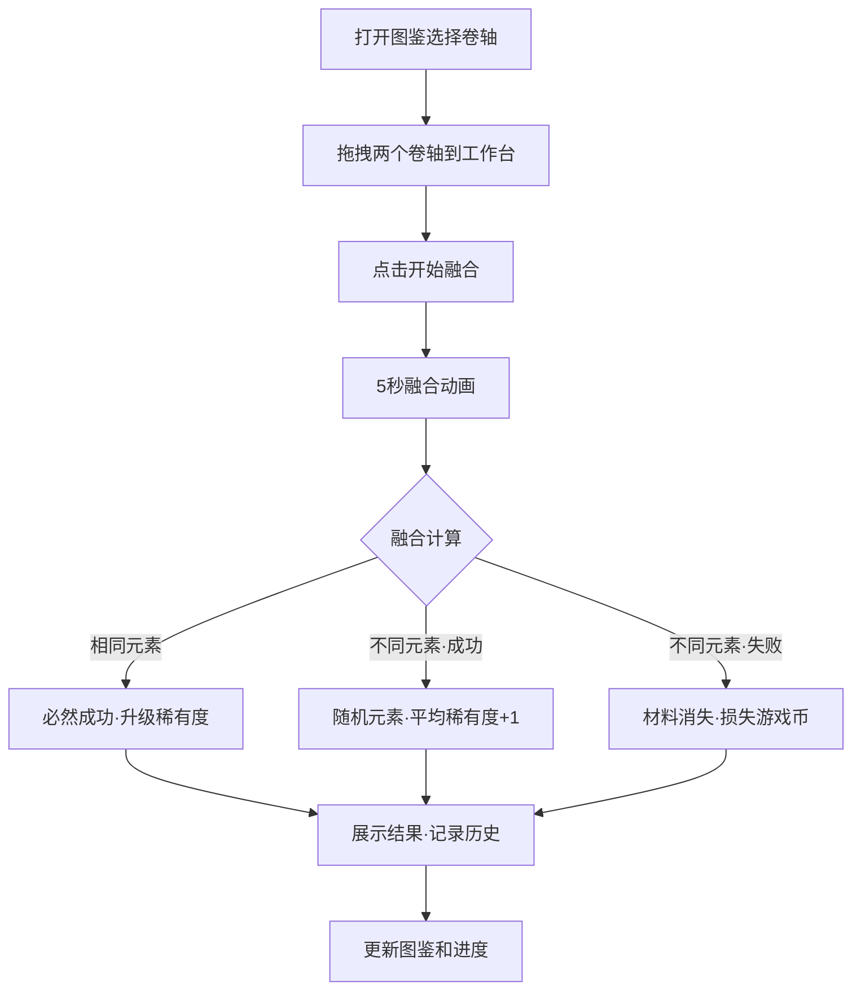

## 1. 产品概述

魔法卷轴融合工坊是一款奇幻世界设定的模拟应用，面向喜爱魔法元素的玩家。玩家可以收集不同效能的魔法卷轴，通过融合实验产生随机效果，管理卷轴图鉴、记录融合历史并追踪收集进度。
- 解决玩家手工计算融合结果和效果强度的繁琐问题，提供可视化、交互式的融合模拟体验
- 目标用户为奇幻RPG爱好者，核心价值在于融合策略的探索乐趣与图鉴收集的成就感

## 2. 核心功能

### 2.1 用户角色
| 角色 | 注册方式 | 核心权限 |
|------|----------|----------|
| 玩家 | 无需注册 | 管理卷轴图鉴、进行融合实验、查看历史记录 |

### 2.2 功能模块
1. **主页面**：融合工作台（中央）、卷轴图鉴（左侧）、融合历史（右侧）、收集进度（右上角）
2. **卷轴图鉴管理**：预设20种卷轴，按元素和稀有度分类展示，未获得卷轴灰色遮罩
3. **融合工作台**：拖拽两个卷轴进行融合，5秒动画展示融合过程
4. **融合历史**：时间线形式展示历史记录，支持筛选和展开详情
5. **收集进度统计**：金色描边圆弧进度条，悬停显示详细统计

### 2.3 页面详情
| 页面名称 | 模块名称 | 功能描述 |
|----------|----------|----------|
| 主页面 | 融合工作台 | 拖拽两个卷轴到工作台，点击融合按钮触发5秒动画，展示融合结果或失败提示 |
| 主页面 | 卷轴图鉴 | 网格卡片布局展示20种卷轴，按元素和稀有度分组，支持拖拽选择 |
| 主页面 | 卷轴详情面板 | 展示选中卷轴全部属性及可作为融合材料的提示列表 |
| 主页面 | 融合历史 | 时间线展示融合记录，支持成功/失败/变异筛选，点击展开详情 |
| 主页面 | 收集进度 | 右上角金色圆弧进度条，悬停弹出各元素收集完成度面板 |

## 3. 核心流程

**融合实验流程**：
1. 玩家从图鉴中拖拽两个已获得的卷轴到融合工作台
2. 工作台显示两个卷轴信息，点击"开始融合"按钮
3. 触发5秒融合动画（卷轴旋转靠近→碰撞光效→重组/破碎）
4. 根据融合规则计算结果：
   - 相同元素：必然成功，合成同元素高一级稀有度卷轴（传说级变异为随机元素传说）
   - 不同元素：成功概率=50%+（稀有度差×10%），失败时材料消失并损失游戏币
   - 成功时：产生随机元素新卷轴，稀有度=两者平均值+1
5. 结果展示：成功时全屏金色光晕+缩放动画，失败时屏幕边缘红色裂纹
6. 自动记录到融合历史

## 4. 用户界面设计

### 4.1 设计风格
- 主色调：深紫色（#1a0b2e）到黑色（#0d0d1a）径向渐变背景
- 装饰色：金色（#d4af37）作为主要装饰色和文字高亮色
- 卷轴卡片：羊皮纸底色（#f5e6c8）配暗褐色边框（#8b7355）
- 稀有度光晕：普通无光晕、优秀浅绿、稀有蓝紫、史诗橙红、传说金色脉冲
- 按钮：金色描边、暗紫底色、悬停时金色填充
- 字体：标题使用衬线体风格，正文使用清晰的无衬线体
- 布局：桌面端三栏布局（图鉴-工作台-历史），平板端上下结构，手机端单列滚动
- 图标风格：Unicode符号作为卷轴图标，符文风格边框装饰

### 4.2 页面设计概览
| 页面名称 | 模块名称 | UI元素 |
|----------|----------|--------|
| 主页面 | 融合工作台 | 中央发光魔法阵背景（CSS旋转渐变），两个卷轴卡槽，融合按钮，5秒动画区域 |
| 主页面 | 卷轴图鉴 | 网格卡片布局，元素分组标签，稀有度光晕，灰色问号遮罩，拖拽拖影效果 |
| 主页面 | 卷轴详情 | 右侧浮动面板，卷轴图标放大展示，属性列表，融合材料提示 |
| 主页面 | 融合历史 | 垂直时间线，圆形状态图标（绿光/红碎），筛选标签，可展开详情卡片 |
| 主页面 | 收集进度 | 金色描边圆弧进度条，元素色渐变填充，悬停弹出统计面板 |

### 4.3 响应式适配
- 桌面端：工作台占70%宽度居中，图鉴和历史左右两列
- 平板端：图鉴和历史变为上下结构，卷轴卡片尺寸缩小至80%
- 手机端：所有内容单列滚动，工作台顶部固定，图鉴和历史通过选项卡切换

### 4.4 动画设计
- 拖拽：卷轴尾随半透明金色轨迹拖影效果
- 融合动画：requestAnimationFrame驱动，卷轴旋转靠近→碰撞光效→重组/破碎
- 成功：全屏金色光晕闪烁+缩放动画
- 失败：屏幕边缘红色裂纹CSS关键帧动画
- 悬浮粒子：全局背景粒子动画
- 稀有度：传说级金色脉冲光晕动画
- 性能：所有CSS动画使用transform和opacity，避免重排，确保30fps以上
