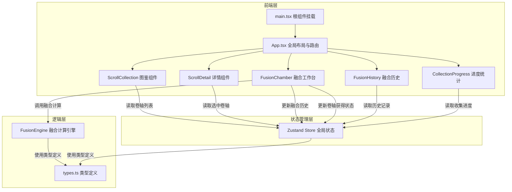
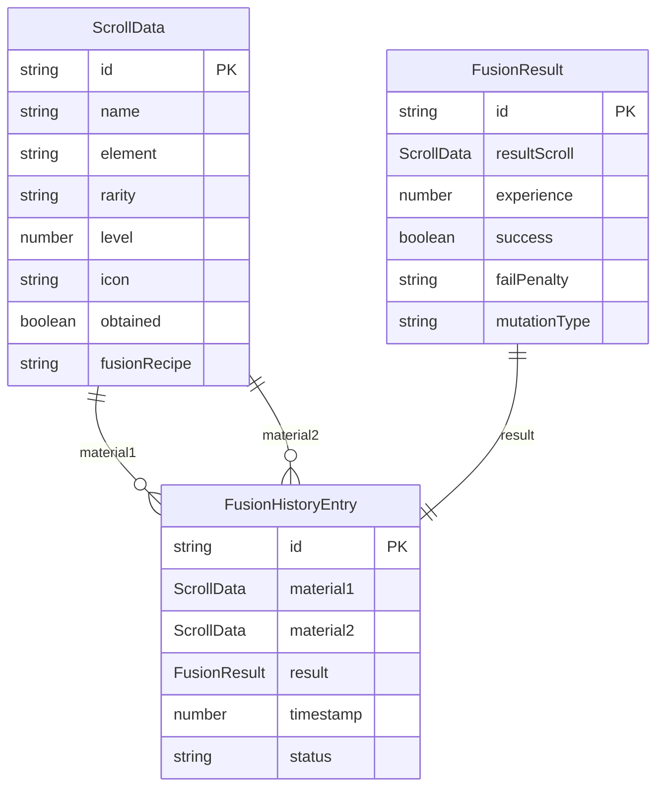

## 1. 架构设计



## 2. 技术说明
- 前端框架：React@18 + TypeScript
- 构建工具：Vite
- 状态管理：Zustand
- 样式方案：CSS Modules + CSS变量（魔法主题）
- 唯一标识：uuid
- 初始化工具：vite-init（react-ts模板）
- 后端：无
- 数据库：无（纯前端状态，localStorage持久化）

## 3. 路由定义
| 路由 | 用途 |
|------|------|
| / | 主页面，包含所有功能模块（图鉴、工作台、历史、进度） |

## 4. API定义
无后端API，所有数据存储在前端Zustand store中。

## 5. 数据模型

### 5.1 数据模型定义



### 5.2 数据定义

**元素枚举**：Fire（火焰🔥）、Frost（冰霜❄️）、Thunder（雷电⚡）、Shadow（暗影🌑）

**稀有度枚举**：Common（普通）、Fine（优秀）、Rare（稀有）、Epic（史诗）、Legendary（传说）

**稀有度数值映射**：Common=1, Fine=2, Rare=3, Epic=4, Legendary=5

**预设卷轴数据**（20种）：
- 火焰×5：火焰弹（普通）、烈焰盾（优秀）、炎爆术（稀有）、凤凰之焰（史诗）、末日审判（传说）
- 冰霜×5：寒冰箭（普通）、霜冻护甲（优秀）、暴风雪（稀有）、绝对零度（史诗）、冰封王座（传说）
- 雷电×5：静电冲击（普通）、闪电链（优秀）、雷神之锤（稀有）、万雷轰顶（史诗）、天罚（传说）
- 暗影×5：暗影箭（普通）、暗夜斗篷（优秀）、灵魂汲取（稀有）、虚空裂隙（史诗）、湮灭（传说）

## 6. 文件结构与调用关系

```
├── package.json
├── vite.config.js
├── tsconfig.json
├── index.html
├── src/
│   ├── main.tsx                    ← React根组件挂载点
│   ├── App.tsx                     ← 全局布局组件
│   ├── scroll/                     ← 卷轴管理模块
│   │   ├── types.ts                ← ScrollData, FusionResult类型定义
│   │   ├── ScrollCollection.tsx    ← 卷轴图鉴组件（store → 组件 → 用户交互 → store）
│   │   └── ScrollDetail.tsx        ← 卷轴详情面板（props: selectedScrollId → store读取）
│   ├── fusion/                     ← 融合引擎模块
│   │   ├── FusionEngine.ts         ← 纯逻辑：calculateFusion（被FusionChamber调用）
│   │   ├── FusionChamber.tsx       ← 融合工作台（用户选择 → FusionEngine → store → 显示结果）
│   │   └── FusionHistory.tsx       ← 融合历史（store → 组件显示）
│   ├── store/
│   │   └── useAppStore.ts          ← Zustand全局状态（卷轴列表、融合历史、收集进度）
│   └── styles/
│       ├── global.css              ← 全局魔法主题样式
│       └── animations.css          ← 动画关键帧定义
```

**数据流向**：
1. **图鉴浏览**：useAppStore.scrolls → ScrollCollection（分组展示）→ 用户点击 → useAppStore.selectScroll → ScrollDetail
2. **融合操作**：用户拖拽卷轴 → FusionChamber（更新slot状态）→ 点击融合 → FusionEngine.calculateFusion → FusionChamber（展示动画+结果）→ useAppStore（更新scrolls和history）
3. **历史查看**：useAppStore.history → FusionHistory（时间线展示+筛选）
4. **进度统计**：useAppStore.scrolls → CollectionProgress（计算完成度）
