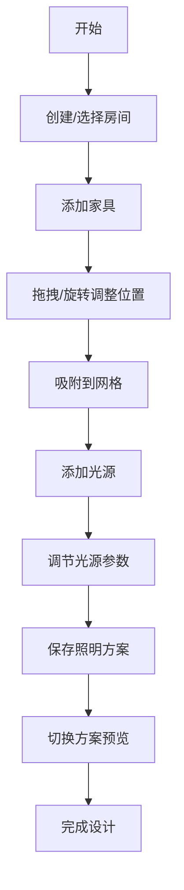

## 1. 产品概述

室内设计3D预览应用是一款帮助室内设计师在三维空间中预览不同照明方案和家具布局效果的专业工具。主要解决设计阶段无法直观感受光线变化对材质和空间氛围的影响，以及家具摆放位置与光照阴影的冲突难以快速模拟的问题。

- **目标用户**：室内设计师、空间规划师、软装设计师
- **核心价值**：提供沉浸式的3D预览体验，加速设计决策过程，减少实物样板成本

## 2. 核心功能

### 2.1 功能模块

1. **空间与家具管理模块**：房间创建与管理、家具添加与拖拽摆放、家具属性编辑
2. **照明方案与光源编辑器**：多类型光源管理、色温与强度调节、照明方案保存与切换
3. **材质与反射效果模拟**：Phong光照模型、材质质感表现、色温偏移效果

### 2.2 功能详情

| 模块名称 | 功能点 | 功能描述 |
|---------|--------|----------|
| 空间与家具管理 | 房间管理 | 创建多个房间，设置名称、尺寸、墙面颜色 |
| 空间与家具管理 | 家具添加 | 添加沙发/桌子/椅子/床/柜子，每类2-3种预设颜色和材质 |
| 空间与家具管理 | 家具交互 | 拖拽移动（x/z平面）、y轴旋转、坐标轴辅助线、角度数值显示 |
| 空间与家具管理 | 家具列表 | 侧边栏卡片展示，点击高亮3D模型并显示属性面板 |
| 照明方案与光源编辑 | 光源类型 | 环境光、聚光灯、点光源 |
| 照明方案与光源编辑 | 光源参数 | 色温滑块（2700K-6500K）、强度、位置、角度、光束角 |
| 照明方案与光源编辑 | 光源可视化 | 半透明小球体表示，颜色匹配色温，强度影响半径 |
| 照明方案与光源编辑 | 方案管理 | 保存/加载/删除多套照明方案，1秒渐变过渡动画 |
| 材质与反射效果 | 材质表现 | 木纹（柔和高光）、布艺（粗糙无高光）、皮革（清晰镜面反射） |
| 材质与反射效果 | 动态效果 | 视角旋转时高光随视角移动，光源颜色变化时色温偏移 |

## 3. 核心流程

### 3.1 家具布局流程

用户创建房间 → 从侧边栏添加家具 → 拖拽调整家具位置 → 旋转调整朝向 → 吸附到5cm网格 → 完成布局

### 3.2 照明方案设计流程

用户进入照明面板 → 添加光源（环境光/聚光灯/点光源） → 调整色温、强度、位置等参数 → 保存为照明方案 → 切换不同方案预览效果 → 渐变过渡动画

## 4. 用户界面设计

### 4.1 设计风格

- **整体风格**：极简主义，专业工具感
- **主背景色**：深灰色 #2D2D2D
- **左侧面板**：320px宽度，半透明毛玻璃效果，微弱白色边框
- **按钮样式**：圆角设计，hover时背景色由透明变为白色半透明
- **字体**：现代无衬线字体，清晰的层级结构

### 4.2 页面布局

| 区域 | 位置 | 功能 |
|-----|------|------|
| 顶部工具栏 | 顶部全宽 | 场景名称（居中）、保存方案、加载方案、重置视角按钮 |
| 左侧工具面板 | 左侧320px | 家具管理和照明管理两个标签页 |
| 3D渲染区域 | 右侧剩余空间 | Three.js 3D场景渲染 |
| 底部状态栏 | 左下角 | 当前光源总数、场景FPS（12px字体） |

### 4.3 交互细节

- 家具拖拽时光标变为移动图标
- 松开时播放轻微吸附动画（位置修正到最近的5cm网格）
- 滑块拖拽时有渐变尾迹动画
- 左侧面板拖拽时有阴影浮动效果
- 照明方案切换时1秒渐变过渡

### 4.4 响应式设计

- 桌面优先设计，支持1920x1080和1440x900分辨率
- 左侧面板宽度固定320px，不随分辨率变化
- 3D渲染区域自适应填充剩余空间

### 4.5 3D场景设计

- **环境**：室内空间，地面网格辅助线
- **光照**：支持环境光、聚光灯、点光源，色温可调
- **摄像机**：默认俯视角度，支持轨道控制旋转缩放
- **材质**：Phong光照模型，木纹/布艺/皮革三种质感
- **性能**：4光源+10家具场景稳定60fps，初始加载<2秒
