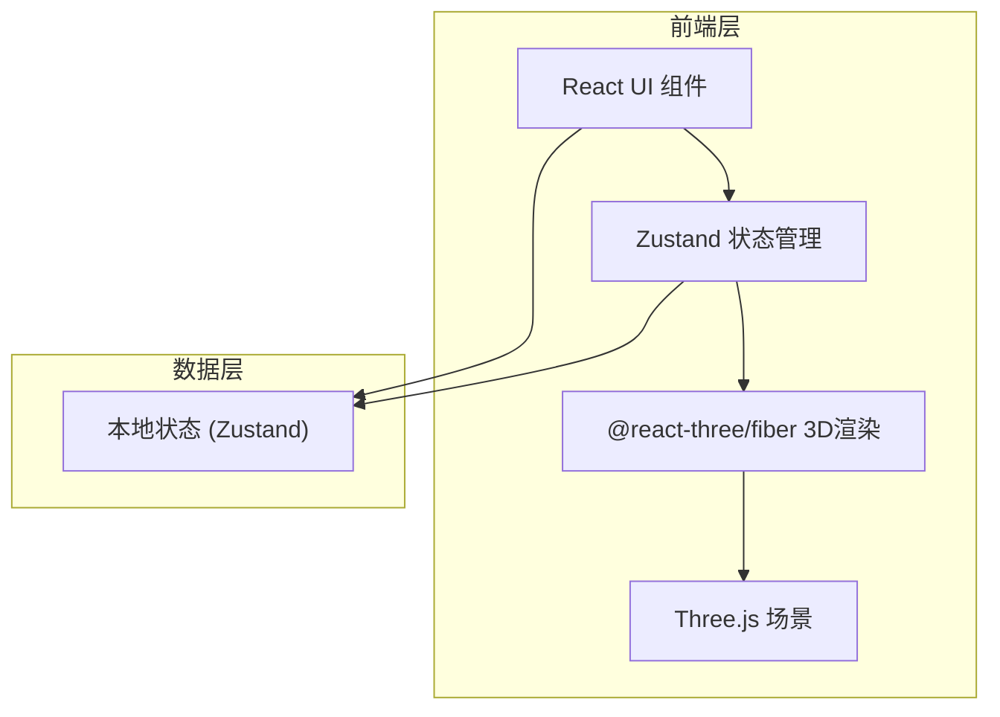

## 1. 架构设计



## 2. 技术栈说明

- **前端框架**：React 18 + TypeScript
- **构建工具**：Vite
- **3D渲染**：Three.js + @react-three/fiber + @react-three/drei
- **状态管理**：Zustand
- **UI样式**：Tailwind CSS
- **工具库**：uuid（唯一ID生成）

## 3. 项目结构

```
src/
├── types.ts              # 类型定义
├── main.tsx              # 应用入口
├── store/
│   └── sceneStore.ts     # Zustand状态管理
├── components/
│   ├── RoomCanvas.tsx    # 3D场景画布
│   └── ui/
│       ├── FurniturePanel.tsx   # 家具管理面板
│       └── LightingPanel.tsx    # 照明管理面板
└── utils/                # 工具函数
```

## 4. 数据模型

### 4.1 核心类型定义

```typescript
// 房间
interface Room {
  id: string;
  name: string;
  size: { x: number; y: number; z: number };
  wallColor: string;
}

// 家具
interface Furniture {
  id: string;
  type: 'sofa' | 'table' | 'chair' | 'bed' | 'cabinet';
  color: string;
  material: 'wood' | 'fabric' | 'leather';
  position: { x: number; y: number; z: number };
  rotation: { x: number; y: number; z: number };
}

// 光源
interface LightSource {
  id: string;
  type: 'ambient' | 'spot' | 'point';
  colorTemp: number; // 2700K - 6500K
  intensity: number;
  position: { x: number; y: number; z: number };
  angle?: number;    // 聚光灯角度
  beamAngle?: number; // 聚光灯光束角
}

// 照明方案
interface LightingScheme {
  id: string;
  name: string;
  lights: LightSource[];
}
```

### 4.2 状态管理结构

```typescript
interface SceneState {
  rooms: Room[];
  currentRoomId: string | null;
  furniture: Furniture[];
  lights: LightSource[];
  schemes: LightingScheme[];
  selectedFurnitureId: string | null;
  selectedLightId: string | null;
  activeSchemeId: string | null;
  
  // 操作方法
  addRoom: (room: Omit<Room, 'id'>) => void;
  addFurniture: (furniture: Omit<Furniture, 'id'>) => void;
  updateFurniturePosition: (id: string, position: Furniture['position']) => void;
  updateFurnitureRotation: (id: string, rotation: Furniture['rotation']) => void;
  deleteFurniture: (id: string) => void;
  addLight: (light: Omit<LightSource, 'id'>) => void;
  updateLightParams: (id: string, params: Partial<LightSource>) => void;
  deleteLight: (id: string) => void;
  saveScheme: (name: string) => void;
  loadScheme: (schemeId: string) => void;
  deleteScheme: (schemeId: string) => void;
  setActiveScheme: (schemeId: string | null) => void;
  selectFurniture: (id: string | null) => void;
  selectLight: (id: string | null) => void;
  resetCamera: () => void;
}
```

## 5. 核心技术实现

### 5.1 3D渲染

- 使用 `@react-three/fiber` 的 Canvas 组件创建3D场景
- 使用 `@react-three/drei` 的 OrbitControls 实现摄像机控制
- 家具模型使用 Three.js 基础几何体组合实现（低面数，保证性能）
- 使用 MeshPhongMaterial 实现 Phong 光照模型

### 5.2 家具拖拽

- 使用 Raycaster 检测鼠标与家具的碰撞
- 拖拽时在 x/z 平面移动，y 轴旋转
- 拖拽结束后吸附到 5cm 网格
- 拖拽时显示坐标轴辅助线

### 5.3 光照系统

- 环境光：AmbientLight，控制整体亮度
- 聚光灯：SpotLight，可调整位置、角度、光束角、色温
- 点光源：PointLight，可调整位置、强度、色温
- 色温转RGB函数实现 2700K-6500K 的颜色映射
- 方案切换时使用 requestAnimationFrame 实现 1 秒渐变过渡

### 5.4 材质系统

- 木纹材质：MeshPhongMaterial，适中的 shininess，柔和高光
- 布艺材质：MeshLambertMaterial 或低 shininess 的 Phong，无明显高光
- 皮革材质：高 shininess 的 MeshPhongMaterial，清晰高光边缘

### 5.5 性能优化

- 家具模型使用几何体组合，总面数控制在 5 万以内
- 使用 InstancedMesh 优化重复物体渲染
- 状态更新使用 Zustand 的 selector 避免不必要重渲染
- 初始加载使用懒加载方式加载家具模型

## 6. UI组件架构

```
App
├── TopToolbar (顶部工具栏)
├── LeftPanel (左侧面板容器)
│   ├── TabSwitcher (家具/照明标签切换)
│   ├── FurniturePanel
│   │   ├── RoomList
│   │   ├── FurnitureList
│   │   └── AddFurnitureModal
│   └── LightingPanel
│       ├── SchemeSelector
│       ├── LightList
│       └── LightEditor
├── RoomCanvas (3D画布)
└── StatusBar (底部状态栏)
```
