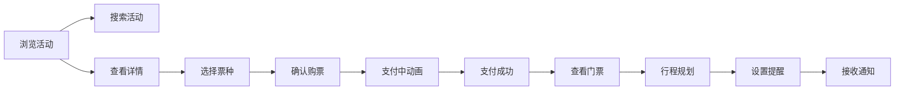

## 1. 产品概述

虚拟音乐节票务与行程规划系统，为用户提供音乐节活动浏览、在线购票、个人行程规划和实时活动动态等一站式服务。目标用户为音乐爱好者，解决音乐节购票和行程安排的痛点。

## 2. 核心功能

### 2.1 功能模块

1. **活动列表页**：活动卡片网格展示、实时搜索、筛选功能
2. **活动详情页**：活动横幅、艺人阵容横向滚动、票价方案、动态流
3. **我的门票页**：已购门票列表、二维码展示、导出功能
4. **我的行程页**：日历面板、拖拽规划、提醒设置、通知推送

### 2.2 页面详情

| 页面名称 | 模块名称 | 功能描述 |
|-----------|-------------|---------------------|
| 活动列表页 | 活动卡片网格 | 10个音乐节卡片，毛玻璃效果，悬停动画，点击进入详情 |
| 活动列表页 | 搜索功能 | 顶部搜索框，实时按名称/地点模糊匹配，下拉面板展示结果 |
| 活动详情页 | 活动横幅 | 大横幅展示活动海报，活动名称和日期叠加 |
| 活动详情页 | 艺人阵容 | 横向滚动艺人卡片，圆形头像、姓名、所属乐队 |
| 活动详情页 | 票价方案 | 普通票/VIP票/双日通票，价格、库存、购买按钮，售罄状态 |
| 活动详情页 | 动态流 | 用户评论时间线、活动状态更新，30秒轮询新内容 |
| 购票弹窗 | 购票确认 | 票种选择、数量选择器(1-5)、总价实时计算、确认按钮 |
| 购票弹窗 | 支付动画 | 3秒倒数动画，按钮旋转加载点，支付成功跳转 |
| 我的门票页 | 门票卡片 | 活动信息、座位区域、随机二维码、下载导出按钮 |
| 我的行程页 | 日历面板 | 周视图日历，彩色活动标签，最多3个，超出+数字 |
| 我的行程页 | 拖拽规划 | 门票拖拽到日期格完成规划，数据同步后端 |
| 我的行程页 | 提醒功能 | 活动前X小时提醒，浏览器Notification API通知 |

## 3. 核心流程

用户浏览活动列表 → 搜索/筛选活动 → 点击进入详情页 → 选择票种购买 → 确认订单 → 模拟支付 → 生成门票 → 进入我的行程 → 拖拽规划日程 → 设置提醒 → 接收通知

## 4. 用户界面设计

### 4.1 设计风格
- **主题**：深色模式，霓虹紫(#8B5CF6)和青色(#06B6D4)渐变主色
- **背景**：冷灰色背景，半透明毛玻璃面板
- **圆角**：统一12px圆角，微弱阴影
- **动画**：300ms ease-in-out过渡，悬停缩放和颜色加深
- **字体**：使用Space Grotesk作为展示字体，Inter作为正文字体

### 4.2 页面设计概述

| 页面名称 | 模块名称 | UI元素 |
|-----------|-------------|-------------|
| 活动列表页 | 卡片网格 | 毛玻璃背景、悬停上移动画、渐变边框 |
| 活动详情页 | 艺人滚动 | 横向滚动容器、圆形头像、平滑滚动 |
| 活动详情页 | 动态流 | 时间线布局、相对时间、渐入动画 |
| 我的行程页 | 日历面板 | 周视图、彩色胶囊标签、翻页动画 |
| 通用 | 按钮 | 12px圆角、悬停缩放、点击颜色加深 |

### 4.3 响应式
- **桌面端**：三栏布局（左侧导航+中间内容+右侧动态面板）
- **平板端**：导航折叠为侧边菜单图标
- **移动端**：单栏全宽布局，卡片网格单列

### 4.4 性能要求
- 首页TTFB < 300ms
- 艺人滚动帧率 ≥ 50fps
- 日历翻页帧率 ≥ 55fps
- FCP < 1.2秒
- API响应时间 < 500ms
