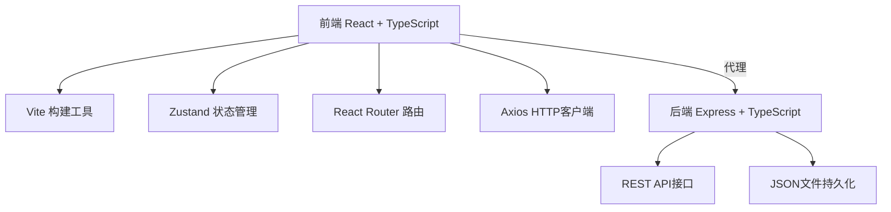
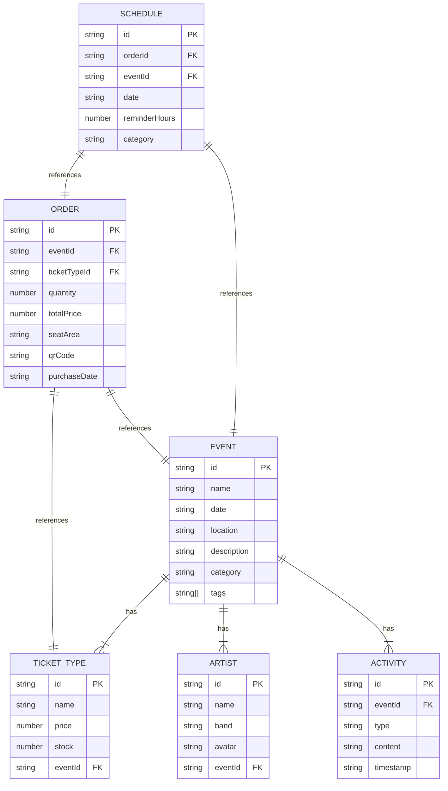
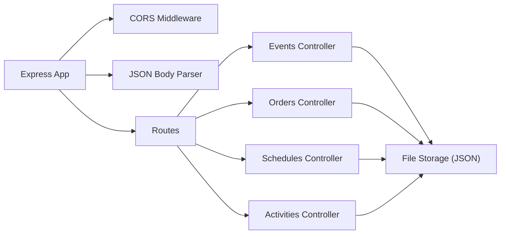

## 1. 架构设计



## 2. 技术描述

- **前端**：React 18 + TypeScript + Vite
- **状态管理**：Zustand
- **路由**：React Router DOM v6
- **HTTP客户端**：Axios
- **后端**：Express 4 + TypeScript
- **数据持久化**：JSON文件存储
- **开发工具**：Vite + ts-node + concurrently

## 3. 项目结构

```
.
├── package.json
├── index.html
├── vite.config.js
├── tsconfig.json
├── server/
│   ├── index.ts
│   ├── data/
│   │   ├── events.json
│   │   ├── orders.json
│   │   └── schedules.json
│   └── types.ts
├── src/
│   ├── App.tsx
│   ├── main.tsx
│   ├── store/
│   │   └── index.ts
│   ├── pages/
│   │   ├── EventList.tsx
│   │   ├── EventDetail.tsx
│   │   ├── MyTickets.tsx
│   │   └── MySchedule.tsx
│   ├── components/
│   │   ├── Navbar.tsx
│   │   ├── EventCard.tsx
│   │   ├── ArtistCard.tsx
│   │   ├── TicketCard.tsx
│   │   ├── TicketModal.tsx
│   │   ├── Calendar.tsx
│   │   ├── ActivityFeed.tsx
│   │   └── SearchBar.tsx
│   ├── hooks/
│   │   ├── usePolling.ts
│   │   └── useNotification.ts
│   ├── utils/
│   │   ├── qrcode.ts
│   │   └── api.ts
│   ├── types/
│   │   └── index.ts
│   └── styles/
│       └── globals.css
```

## 4. 路由定义

| 路由 | 页面 | 说明 |
|-------|---------|------|
| / | EventList | 活动列表首页 |
| /events/:id | EventDetail | 活动详情页 |
| /tickets | MyTickets | 我的门票页 |
| /schedule | MySchedule | 我的行程页 |

## 5. API 定义

### 5.1 类型定义

```typescript
interface Event {
  id: string;
  name: string;
  date: string;
  location: string;
  image: string;
  description: string;
  tags: string[];
  priceRange: { min: number; max: number };
  artists: Artist[];
  ticketTypes: TicketType[];
  category: 'music' | 'variety' | 'art';
}

interface Artist {
  id: string;
  name: string;
  band: string;
  avatar: string;
}

interface TicketType {
  id: string;
  name: string;
  price: number;
  stock: number;
}

interface Order {
  id: string;
  eventId: string;
  eventName: string;
  ticketTypeId: string;
  ticketTypeName: string;
  quantity: number;
  totalPrice: number;
  purchaseDate: string;
  seatArea: string;
  qrCode: string;
}

interface ScheduleItem {
  id: string;
  orderId: string;
  eventId: string;
  eventName: string;
  date: string;
  reminderHours?: number;
  category: 'music' | 'variety' | 'art';
}

interface Activity {
  id: string;
  eventId: string;
  type: 'comment' | 'status';
  user?: { avatar: string; nickname: string };
  content: string;
  timestamp: string;
}
```

### 5.2 接口列表

| 方法 | 路径 | 说明 |
|------|------|------|
| GET | /api/events | 获取活动列表 |
| GET | /api/events/:id | 获取活动详情 |
| GET | /api/events/search?q=xxx | 搜索活动 |
| GET | /api/orders | 获取订单列表 |
| POST | /api/orders | 创建订单 |
| GET | /api/schedules | 获取行程列表 |
| POST | /api/schedules | 创建行程 |
| PUT | /api/schedules/:id | 更新行程提醒 |
| DELETE | /api/schedules/:id | 删除行程 |
| GET | /api/events/:id/activities | 获取活动动态 |

## 6. 数据模型



## 7. 服务器架构


