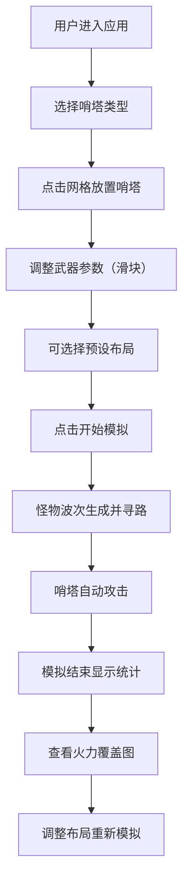
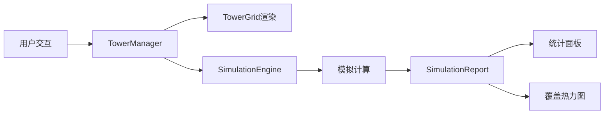

## 1. 产品概述

地精哨塔防御网络生成与模拟应用，为奇幻世界中的地精工程师提供自动化的哨塔防御布局工具，解决手工配置复杂、火力覆盖重叠或遗漏的问题。通过可视化网格地图、实时模拟和智能分析，帮助用户优化防御布局。

### 1.1 产品核心价值
- **简化配置**：可视化拖拽放置哨塔，实时调整武器参数
- **智能模拟**：BFS寻路算法模拟怪物进攻路径，精确计算火力覆盖
- **数据驱动**：详细的击杀统计和伤害分析，指导布局优化
- **预设方案**：内置线性阵、口袋阵等经典防御布局

### 1.2 目标用户
- 策略游戏玩家
- 防御布局设计者
- 塔防类游戏爱好者

---

## 2. 核心功能

### 2.1 用户角色
| 角色 | 注册方式 | 核心权限 |
|------|----------|----------|
| 普通用户 | 无需注册 | 放置哨塔、配置参数、运行模拟、查看统计 |

### 2.2 功能模块

1. **哨塔管理模块**：哨塔放置、删除、拖拽移动、武器参数配置
2. **模拟引擎模块**：怪物波次生成、BFS寻路、攻击检测、伤害计算
3. **网格地图模块**：10x10网格渲染、地形区分、攻击范围可视化
4. **统计报告模块**：击杀数统计、伤害分析、火力覆盖热力图
5. **布局预设模块**：线性阵、口袋阵一键加载
6. **交互动效模块**：放置动画、脉冲光圈、爆炸粒子、平滑过渡

### 2.3 页面详情

| 页面名称 | 模块名称 | 功能描述 |
|---------|---------|----------|
| 主界面 | 网格地图 | 10x10可交互网格，支持哨塔放置、拖拽、删除 |
| 主界面 | 配置面板 | 武器参数滑块调节（攻击力、射速、射程） |
| 主界面 | 模拟控制 | 开始模拟、重置布局、显示覆盖、预设方案按钮 |
| 主界面 | 统计面板 | 哨塔击杀数和伤害量表格、火力覆盖分析 |

---

## 3. 核心流程

### 3.1 主要用户流程

### 3.2 数据流向

---

## 4. 用户界面设计

### 4.1 设计风格

**地精工业主题**
- **主色调**：深棕色 `#3E2723`、岩石灰 `#757575`
- **辅助色**：铁锈橙 `#8D6E63` → `#5D4037` 渐变
- **背景色**：暗色 `#424242`
- **文字色**：浅灰 `#E0E0E0`
- **地形容器**：草地浅绿、岩石灰、魔法地砖淡紫

**按钮风格**
- 铁锈纹理渐变背景（`#8D6E63` 到 `#5D4037`）
- 金属质感边框（box-shadow叠加内阴影）
- 按下时按钮下沉动画
- 圆角4px，粗犷工业感

**字体**
- 标题：粗体工业风字体
- 正文：清晰易读的无衬线字体
- 数值：等宽字体展示统计数据

**布局风格**
- 左右两栏结构（桌面端）：左侧70%地图，右侧30%面板
- 上下结构（移动端）：上方60%地图，下方40%面板
- 卡片式面板，hover时上浮4px增加阴影

**动画风格**
- 放置动画：1→1.15→1倍缩放，200ms
- 脉冲光圈：1.5秒循环径向渐变扩散
- 网格重置：右上角到左下角逐格50ms延迟收缩
- 所有过渡：300ms ease-in-out

### 4.2 页面设计概述

| 页面名称 | 模块名称 | UI元素 |
|---------|---------|--------|
| 主界面 | 网格地图 | 10x10彩色格子、地形区分、哨塔图标（箭塔绿箭头/炮塔褐圆点/魔法塔蓝星形）、攻击范围圈、脉冲选中效果、覆盖热力图（红/蓝半透明） |
| 主界面 | 配置面板 | 三个滑块（攻击力/射速/射程）、实时参数数值显示、武器属性悬浮卡片 |
| 主界面 | 操作按钮 | 开始模拟、重置布局、显示覆盖、线性阵、口袋阵 |
| 主界面 | 统计面板 | 击杀/伤害表格（hover缩放）、覆盖率指标、点击行地图高亮闪烁 |

### 4.3 响应式设计

**桌面端（≥768px）**
- 左右两栏布局
- 左侧地图区域：70%宽度
- 右侧面板区域：30%宽度

**移动端（<768px）**
- 上下堆叠布局
- 上方地图区域：60%高度
- 下方面板区域：40%高度
- 触摸优化：增大点击区域，按钮尺寸≥44px

### 4.4 视觉动效

**哨塔放置**
- 格子上浮并放大回弹动画
- 哨塔图标淡入

**哨塔选中**
- 脉冲光圈循环动画
- 攻击范围圈半透明径向渐变显示

**拖拽移动**
- 原位置淡出，新位置淡入
- 目标格子金色高亮闪烁

**怪物爆炸**
- 小兵：橙色火花粒子
- 重甲兵：灰色碎片粒子
- 飞行兵：蓝色闪光粒子

**网格重置**
- 从右上到左下逐格收缩消失
- 每格延迟50ms形成波浪效果

---

## 5. 性能约束

| 指标 | 目标值 |
|------|--------|
| 模拟帧率 | ≥45FPS（30塔+20敌人同时在场） |
| 覆盖重叠计算 | ≤1秒完成 |
| BFS寻路耗时 | ≤5ms/帧 |
| 动画流畅度 | 所有过渡300ms无卡顿 |
