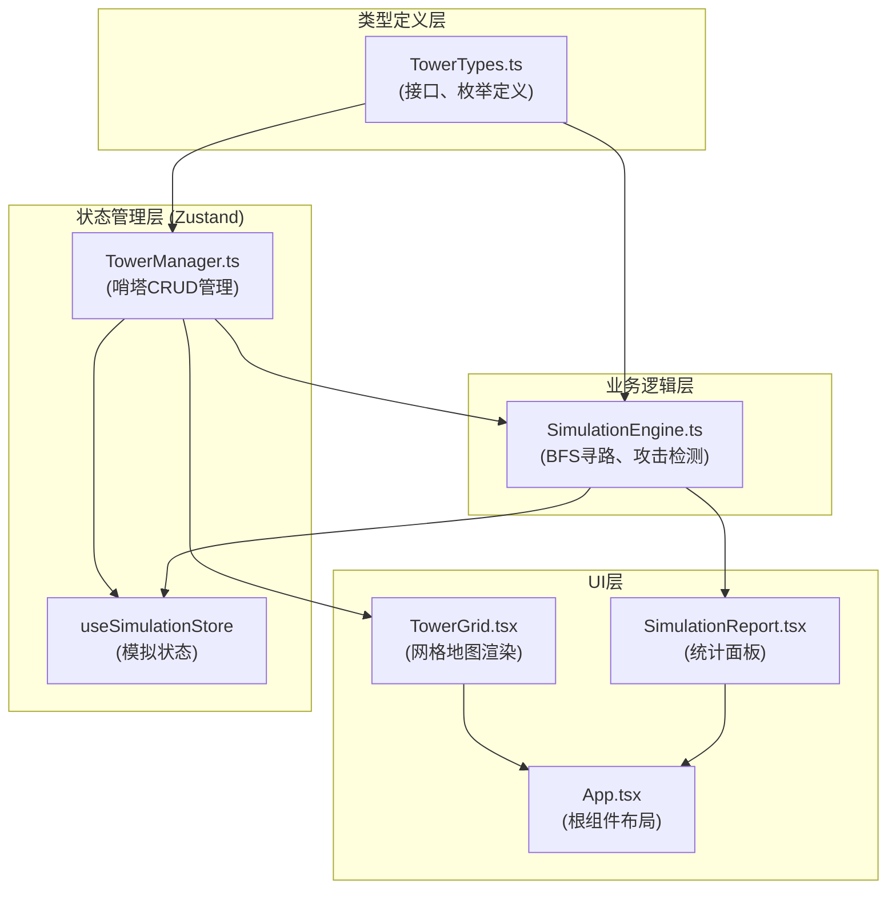
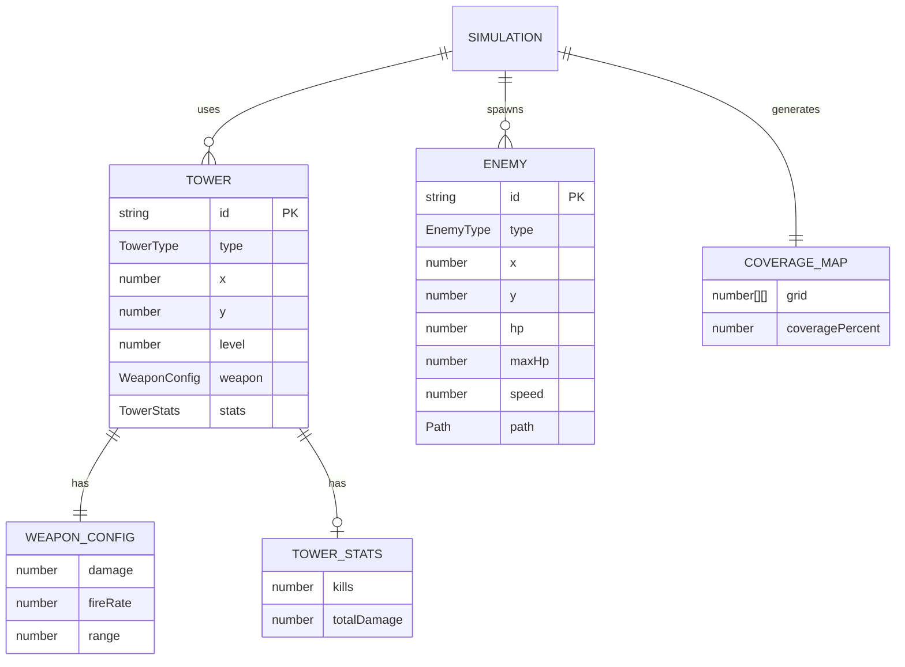

## 1. 架构设计

### 1.1 整体架构图



### 1.2 模块职责与调用关系

| 模块 | 职责 | 输入 | 输出 | 被谁调用 | 调用谁 |
|------|------|------|------|----------|--------|
| TowerTypes.ts | 定义所有类型接口和枚举 | 无 | Tower类型、WeaponConfig、Enemy类型等 | TowerManager、SimulationEngine、TowerGrid | 无 |
| TowerManager.ts | 哨塔CRUD、范围计算、武器切换 | 用户交互事件（放置/删除/配置） | 哨塔列表、地图标记数据 | App.tsx、TowerGrid | TowerTypes |
| SimulationEngine.ts | 怪物生成、BFS寻路、攻击检测、伤害计算 | 哨塔列表、模拟开始信号 | 怪物状态、击杀统计、伤害数据、覆盖率 | App.tsx | TowerTypes |
| TowerGrid.tsx | 10x10网格渲染、哨塔交互 | 哨塔列表、覆盖数据 | 放置/删除/选中事件 | App.tsx | TowerTypes |
| SimulationReport.tsx | 统计面板、覆盖热力图 | 击杀统计、伤害数据、覆盖信息 | 选中高亮事件 | App.tsx | TowerTypes |
| App.tsx | 布局整合、状态协调 | 用户按钮操作 | 统一数据流 | 无 | 所有子模块 |

### 1.3 数据流向

```
用户交互 → TowerManager (更新哨塔状态) → TowerGrid (重新渲染)
            ↓
开始模拟 → SimulationEngine (每帧计算) → 怪物位置/攻击效果 → TowerGrid (实时更新)
            ↓
模拟结束 → 统计数据 → SimulationReport (展示结果)
```

---

## 2. 技术描述

### 2.1 技术栈

| 类别 | 技术选型 | 版本 | 用途 |
|------|----------|------|------|
| 前端框架 | React | ^18.2.0 | UI构建 |
| 语言 | TypeScript | ^5.0.0 | 类型安全 |
| 构建工具 | Vite | ^5.0.0 | 构建与开发 |
| 状态管理 | Zustand | ^4.4.0 | 全局状态管理 |
| 唯一ID | uuid | ^9.0.0 | 实体唯一标识 |
| 样式 | CSS3 + CSS Variables | - | 地精工业主题样式 |

### 2.2 项目初始化

使用 Vite React TypeScript 模板：
```bash
npm init vite-init@latest -y . "--" --template react-ts --force
```

### 2.3 性能优化策略

| 优化点 | 方案 | 目标 |
|--------|------|------|
| BFS寻路 | 每帧缓存寻路结果，仅当地图变化时重算 | ≤5ms/帧 |
| 覆盖计算 | 使用网格采样替代逐像素计算，缓存结果 | ≤1秒完成 |
| 模拟帧率 | requestAnimationFrame + 时间差补偿 | ≥45FPS |
| React渲染 | useMemo/useCallback 优化重渲染 | 30塔+20敌人无卡顿 |
| 动画 | CSS transform 替代 top/left，开启GPU加速 | 60fps流畅动画 |

---

## 3. 文件结构

```
auto132/
├── .trae/documents/
│   ├── PRD.md                          # 产品需求文档
│   └── TechnicalArchitecture.md        # 技术架构文档
├── index.html                          # 入口页面
├── vite.config.js                      # Vite构建配置
├── tsconfig.json                       # TypeScript配置
├── package.json                        # 依赖与脚本
└── src/
    ├── main.tsx                        # React入口
    ├── App.tsx                         # 根组件（布局整合）
    ├── index.css                       # 全局样式（地精主题）
    ├── tower/
    │   ├── TowerTypes.ts               # 类型定义（接口、枚举）
    │   ├── TowerManager.ts             # 哨塔管理逻辑
    │   ├── TowerGrid.tsx               # 网格地图组件
    │   └── useTowerStore.ts            # 哨塔状态管理
    └── simulation/
        ├── SimulationEngine.ts         # 模拟引擎核心逻辑
        ├── SimulationReport.tsx        # 统计报告组件
        └── useSimulationStore.ts       # 模拟状态管理
```

---

## 4. 数据模型

### 4.1 数据模型ER图



### 4.2 核心类型定义（TowerTypes.ts）

```typescript
// 哨塔类型枚举
export enum TowerType {
  ARROW = 'arrow',      // 箭塔
  CANNON = 'cannon',    // 炮塔
  MAGIC = 'magic',      // 魔法塔
}

// 敌人类型枚举
export enum EnemyType {
  SOLDIER = 'soldier',    // 小兵
  HEAVY = 'heavy',        // 重甲兵
  FLYING = 'flying',      // 飞行兵
}

// 地形类型
export enum TerrainType {
  GRASS = 'grass',      // 草地
  ROCK = 'rock',        // 岩石
  MAGIC = 'magic',      // 魔法地砖
}

// 武器配置
export interface WeaponConfig {
  damage: number;       // 攻击力
  fireRate: number;     // 射速（发/秒）
  range: number;        // 射程（格子数）
}

// 哨塔统计
export interface TowerStats {
  kills: number;
  totalDamage: number;
}

// 哨塔实体
export interface Tower {
  id: string;
  type: TowerType;
  x: number;
  y: number;
  level: number;
  weapon: WeaponConfig;
  stats: TowerStats;
}

// 敌人实体
export interface Enemy {
  id: string;
  type: EnemyType;
  x: number;
  y: number;
  hp: number;
  maxHp: number;
  speed: number;
  path: { x: number; y: number }[];
  pathIndex: number;
}

// 网格单元
export interface GridCell {
  x: number;
  y: number;
  terrain: TerrainType;
  towerId: string | null;
}

// 覆盖地图
export interface CoverageMap {
  grid: number[][];  // 每个格子被覆盖的塔数量
  coveragePercent: number;
}

// 预设布局
export enum PresetLayout {
  LINEAR = 'linear',    // 线性阵
  POCKET = 'pocket',    // 口袋阵
}
```

### 4.3 状态管理模型

**useTowerStore (Zustand)**
```typescript
{
  towers: Tower[];
  selectedTowerId: string | null;
  grid: GridCell[][];
  coverageMap: CoverageMap | null;
  
  // Actions
  placeTower: (type: TowerType, x: number, y: number) => void;
  removeTower: (id: string) => void;
  updateTowerWeapon: (id: string, config: Partial<WeaponConfig>) => void;
  selectTower: (id: string | null) => void;
  calculateCoverage: () => CoverageMap;
  loadPreset: (preset: PresetLayout) => void;
  resetAll: () => void;
}
```

**useSimulationStore (Zustand)**
```typescript
{
  isRunning: boolean;
  enemies: Enemy[];
  towers: Tower[];  // 模拟期间的塔状态副本
  explosions: Explosion[];
  
  // Actions
  startSimulation: () => void;
  stopSimulation: () => void;
  resetSimulation: () => void;
}
```

---

## 5. 核心算法

### 5.1 BFS寻路算法

```
输入：起点(x1,y1)，终点(x2,y2)，障碍物集合
输出：最短路径数组

算法：
1. 初始化队列，起点入队
2. 初始化visited矩阵和parent矩阵
3. while队列非空：
   a. 出队当前节点
   b. 若为终点，回溯parent构造路径返回
   c. 遍历四个方向邻居
   d. 若邻居合法且未访问且非障碍物，标记visited和parent，入队
4. 无路径返回空数组
```

**性能优化**：
- 缓存寻路结果，障碍物不变时复用
- 使用整数坐标计算，避免浮点数运算
- 提前终止：找到终点立即返回

### 5.2 攻击检测算法

```
每帧执行：
对于每个哨塔：
   若冷却时间未到，跳过
   遍历所有敌人：
      计算欧氏距离
      若距离 ≤ 射程且敌人存活：
         选择最近的敌人
         扣减敌人HP
         累加哨塔伤害
         若敌人HP ≤ 0：
            标记敌人死亡
            累加哨塔击杀数
            生成爆炸效果
         更新哨塔冷却时间
         break（单目标攻击）
```

### 5.3 覆盖计算算法

```
输入：哨塔列表，网格尺寸10x10
输出：CoverageMap

1. 初始化10x10的零矩阵
2. 对于每个哨塔：
   遍历以塔为中心、射程为半径的圆形区域内的所有格子
   对应格子计数+1
3. 统计覆盖率 = 计数>0的格子数 / 总格子数
4. 返回覆盖地图
```

**性能优化**：
- 使用预计算的环形坐标偏移量
- 边界检查避免越界
- 结果缓存，哨塔变化时才重算

---

## 6. 性能约束实现方案

| 约束 | 实现方案 |
|------|----------|
| 模拟帧率≥45FPS | 使用requestAnimationFrame，每帧deltaTime控制逻辑更新，避免与渲染耦合 |
| BFS≤5ms/帧 | 10x10网格最大搜索空间仅100节点，加上缓存，实际<1ms |
| 覆盖计算≤1秒 | 10x10网格仅需遍历100个点，实际<10ms |
| 30塔+20敌人流畅 | 攻击检测O(N*M)，30*20=600次距离计算，每帧<2ms |

---

## 7. 预设布局配置

### 7.1 线性阵（Linear Formation）
在第5列纵向排列5座哨塔，形成防线。

### 7.2 口袋阵（Pocket Formation）
在地图中央形成U形包围圈，诱敌深入后三面攻击。

---

## 8. 动画实现方案

| 动画 | 实现方式 | 时长 |
|------|----------|------|
| 放置动画 | CSS @keyframes scale 1→1.15→1 | 200ms |
| 脉冲光圈 | CSS animation radial-gradient | 1500ms loop |
| 拖拽高亮 | CSS class toggle golden background | 300ms |
| 重置动画 | stagger animation-delay 50ms | 100*50ms = 5s |
| 爆炸粒子 | Canvas 2D or CSS particles | 500ms |
| 平滑过渡 | CSS transition all 300ms ease-in-out | 300ms |
