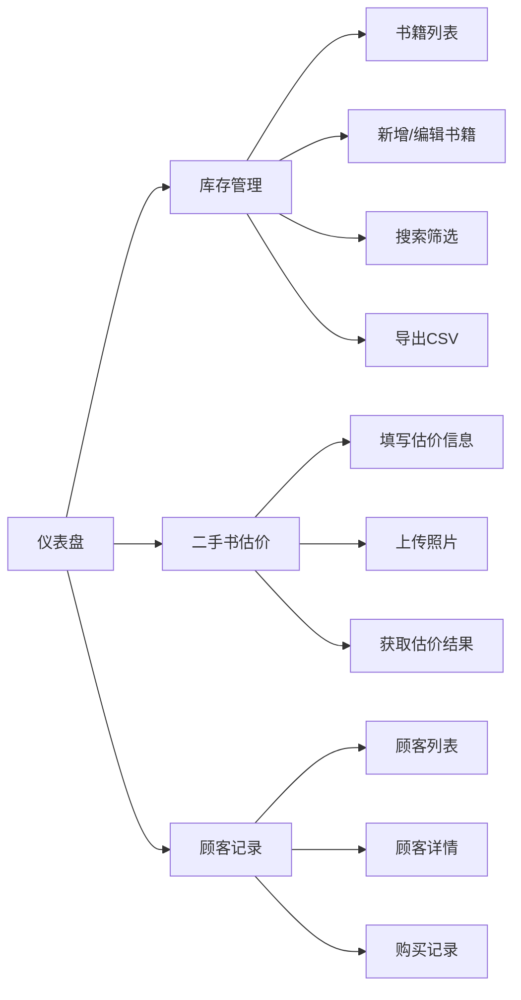

## 1. 产品概述

独立书店库存与二手书收购估价系统，旨在解决独立书店库存更新缓慢、顾客查询不及时、二手书定价缺乏依据等痛点问题，为书店经营者提供一体化的库存管理、顾客服务和二手书估价解决方案。

- **核心目标**：提升书店运营效率，实现库存实时管理、顾客到店追踪、二手书智能估价
- **目标用户**：独立书店经营者、店员
- **市场价值**：降低人工管理成本，提升顾客满意度，优化二手书收购定价策略

## 2. 核心功能

### 2.1 用户角色

| 角色 | 注册方式 | 核心权限 |
|------|----------|----------|
| 书店管理员 | 系统内置 | 全部功能：库存管理、估价、顾客记录、数据统计 |

### 2.2 功能模块

1. **仪表盘首页**：数据统计看板，展示核心指标和趋势图
2. **库存管理页面**：书籍 CRUD、搜索筛选、分页、导出 CSV、拖拽排序
3. **二手书估价页面**：书籍信息录入、照片上传裁剪、智能估价、结果展示
4. **顾客到店记录页面**：顾客信息管理、浏览书籍关联、购买记录追踪

### 2.3 页面详情

| 页面名称 | 模块名称 | 功能描述 |
|-----------|-------------|---------------------|
| 仪表盘首页 | 统计卡片 | 总库存量、今日新增、本月估价、本月顾客四大指标，圆形进度条动画 |
| 仪表盘首页 | 趋势图表 | 近7天到店顾客迷你折线图 |
| 库存管理页 | 书籍表格 | 封面缩略图、标题、作者、ISBN、库存、价格、状态标签，行hover显示操作按钮 |
| 库存管理页 | 搜索筛选 | 标题/作者模糊搜索，类别/库存状态筛选，分页显示（每页10条） |
| 库存管理页 | 书籍CRUD | 新增、编辑、删除书籍，包含封面图URL、类别、数量、定价 |
| 库存管理页 | 拖拽排序 | react-beautiful-dnd 实现拖拽调整库存顺序 |
| 库存管理页 | CSV导出 | 导出库存列表为CSV文件 |
| 二手书估价页 | 估价表单 | 书名、作者、ISBN、品相等级滑动条（1-5）、稀有度下拉选择 |
| 二手书估价页 | 照片上传 | 最多3张照片，支持浏览器内旋转和裁剪 |
| 二手书估价页 | 估价结果 | 建议收购价、市场参考价范围、品相调整说明、稀有度加分理由，浮动卡片展示 |
| 顾客记录页 | 顾客列表 | 卡片式布局，头像首字母圆形图标、姓名、到店时间、购买状态标签 |
| 顾客记录页 | 搜索功能 | 按日期范围或顾客姓名搜索记录 |
| 顾客记录页 | 顾客详情 | 浏览书籍列表、购买简报（书名、价格、时间） |
| 顾客记录页 | 实时查询 | 输入书名/作者实时查询库存，卡片网格展示，点击弹出详情模态框 |

## 3. 核心流程

### 3.1 库存管理流程
管理员登录系统 → 进入库存管理页面 → 搜索/筛选书籍 → 新增/编辑/删除书籍 → 拖拽调整顺序 → 导出CSV

### 3.2 二手书估价流程
用户进入估价页面 → 填写书籍信息 → 上传书籍照片 → 点击估价 → 系统计算建议收购价 → 展示估价结果卡片

### 3.3 顾客到店记录流程
顾客到店 → 录入顾客信息 → 勾选浏览书籍 → 标记是否购买 → 生成购买记录 → 查看顾客详情

## 4. 用户界面设计

### 4.1 设计风格

- **主色调**：深棕色 #5C3A21（温暖、书卷气）
- **背景色**：奶油白 #FDF5E6（柔和、护眼）
- **辅助色-有货**：橄榄绿 #7B9F43（生机、积极）
- **辅助色-售罄**：砖红 #B85C38（警示、醒目）
- **卡片风格**：轻微圆角 + 柔和阴影，hover时阴影加深并略微上移
- **字体风格**：温暖的衬线字体搭配清晰的无衬线字体，营造书店氛围
- **动效风格**：淡入上浮入场动画、平滑过渡、视差滚动效果
- **布局风格**：左侧固定导航栏 + 右侧内容区域自适应

### 4.2 页面设计概览

| 页面名称 | 模块名称 | UI元素 |
|-----------|-------------|-------------|
| 仪表盘首页 | 统计卡片 | 圆形进度条动画、数字递增动画、暖色调渐变背景 |
| 库存管理页 | 书籍表格 | 斑马纹行、hover背景渐变、操作按钮组、状态标签 |
| 二手书估价页 | 表单区域 | 滑动条实时反馈、聚焦边框颜色过渡、照片预览网格 |
| 二手书估价页 | 结果卡片 | 浮动卡片、背景色渐变（低红中黄高绿）、淡入上浮动画 |
| 顾客记录页 | 顾客卡片 | 圆形首字母头像、绿色闪烁购买提示、视差入场动画 |
| 全局 | 导航栏 | 图标+文字标签、hover背景渐变、移动端汉堡菜单 |

### 4.3 响应式设计

- **设计策略**：桌面端优先，移动端自适应
- **断点**：768px
- **移动端适配**：
  - 导航栏变为顶部收缩式汉堡菜单
  - 书籍表格变为卡片列表
  - 搜索框和筛选控件堆叠排列
  - 触摸优化：增大点击区域

### 4.4 性能指标

- 库存搜索响应时间 ≤ 200ms
- 列表分页切换帧率 ≥ 30fps
- 图片上传裁剪处理 ≤ 300ms
