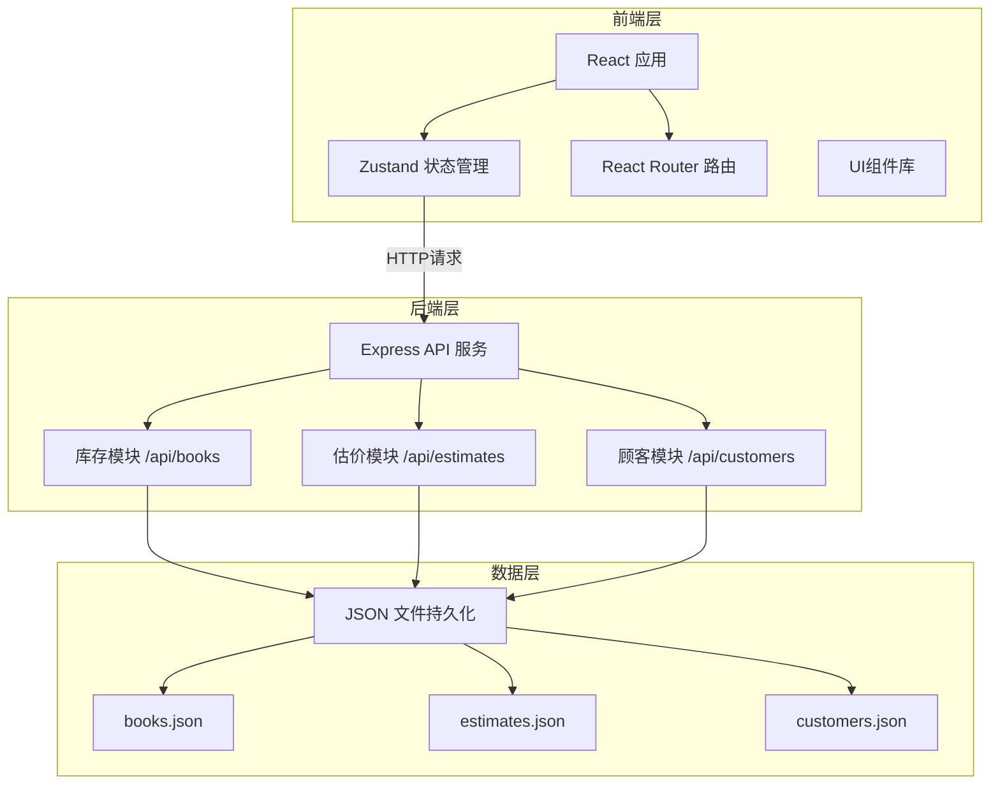
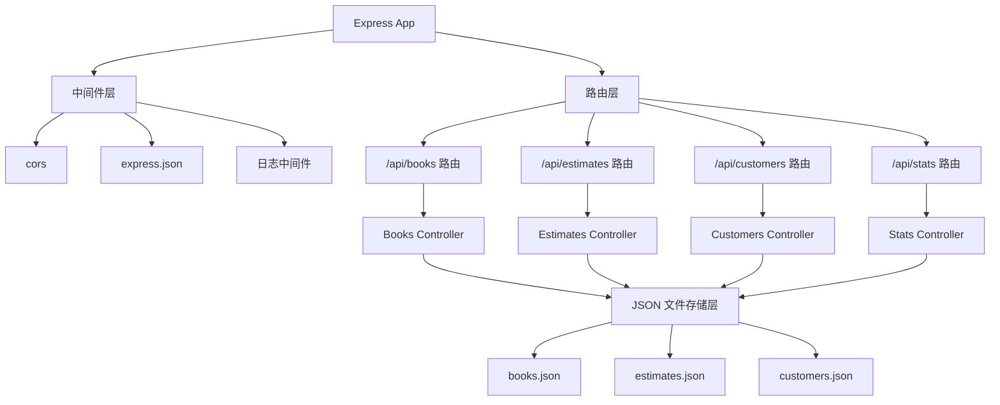
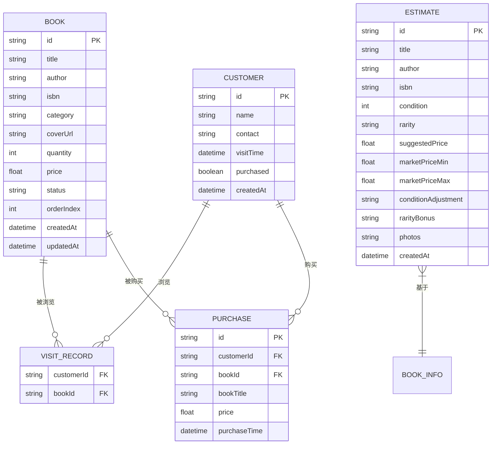

## 1. 架构设计



## 2. 技术描述

- **前端框架**：React 18 + TypeScript
- **构建工具**：Vite 5
- **状态管理**：Zustand 4
- **路由管理**：React Router DOM 6
- **HTTP客户端**：Axios
- **样式方案**：CSS Modules / 全局 CSS（暖色调主题）
- **拖拽库**：react-beautiful-dnd
- **图标库**：lucide-react
- **日期处理**：date-fns
- **唯一ID**：uuid
- **后端框架**：Express 4 + TypeScript
- **数据持久化**：JSON 文件存储
- **跨域处理**：cors 中间件 + Vite 代理

## 3. 路由定义

| 路由路径 | 页面组件 | 功能描述 |
|----------|----------|----------|
| / | DashboardPage | 数据统计仪表盘首页 |
| /inventory | InventoryPage | 库存管理页面 |
| /estimate | EstimatePage | 二手书估价页面 |
| /customers | CustomerPage | 顾客到店记录页面 |

## 4. API 定义

### 4.1 书籍管理 API

| 方法 | 路径 | 功能 | 请求体 | 响应 |
|------|------|------|--------|------|
| GET | /api/books | 获取书籍列表（支持搜索、筛选、分页） | query: search, category, status, page, limit | { data: Book[], total: number } |
| GET | /api/books/:id | 获取单本书籍详情 | - | Book |
| POST | /api/books | 新增书籍 | { title, author, isbn, category, coverUrl, quantity, price } | Book |
| PUT | /api/books/:id | 更新书籍 | { title, author, isbn, category, coverUrl, quantity, price } | Book |
| DELETE | /api/books/:id | 删除书籍 | - | { success: boolean } |
| GET | /api/books/export/csv | 导出CSV | - | CSV文件 |

### 4.2 估价 API

| 方法 | 路径 | 功能 | 请求体 | 响应 |
|------|------|------|--------|------|
| POST | /api/estimates | 创建估价请求 | { title, author, isbn, condition, rarity, photos } | EstimateResult |
| GET | /api/estimates | 获取估价历史 | query: page, limit | { data: Estimate[], total: number } |

### 4.3 顾客记录 API

| 方法 | 路径 | 功能 | 请求体 | 响应 |
|------|------|------|--------|------|
| GET | /api/customers | 获取顾客列表（支持搜索、日期范围） | query: search, startDate, endDate, page, limit | { data: Customer[], total: number } |
| GET | /api/customers/:id | 获取顾客详情 | - | CustomerDetail |
| POST | /api/customers | 新增顾客记录 | { name, contact, visitedBooks, purchased } | Customer |
| PUT | /api/customers/:id | 更新顾客记录 | { name, contact, visitedBooks, purchased } | Customer |
| DELETE | /api/customers/:id | 删除顾客记录 | - | { success: boolean } |

### 4.4 统计 API

| 方法 | 路径 | 功能 | 响应 |
|------|------|------|------|
| GET | /api/stats/dashboard | 获取仪表盘统计数据 | { totalBooks, todayNewBooks, monthEstimates, monthCustomers, weeklyTrend } |

### 4.5 TypeScript 类型定义

```typescript
// 书籍类型
interface Book {
  id: string;
  title: string;
  author: string;
  isbn: string;
  category: string;
  coverUrl: string;
  quantity: number;
  price: number;
  status: 'in-stock' | 'out-of-stock';
  orderIndex: number;
  createdAt: string;
  updatedAt: string;
}

// 估价结果
interface EstimateResult {
  id: string;
  title: string;
  author: string;
  isbn: string;
  condition: number; // 1-5
  rarity: 'common' | 'uncommon' | 'rare' | 'extremely-rare';
  suggestedPrice: number;
  marketPriceMin: number;
  marketPriceMax: number;
  conditionAdjustment: string;
  rarityBonus: string;
  photos: string[];
  createdAt: string;
}

// 顾客记录
interface Customer {
  id: string;
  name: string;
  contact: string;
  visitTime: string;
  visitedBookIds: string[];
  purchased: boolean;
  purchaseDetails?: PurchaseItem[];
  createdAt: string;
}

interface PurchaseItem {
  bookId: string;
  bookTitle: string;
  price: number;
  purchaseTime: string;
}

// 仪表盘统计
interface DashboardStats {
  totalBooks: number;
  todayNewBooks: number;
  monthEstimates: number;
  monthCustomers: number;
  weeklyTrend: { date: string; count: number }[];
}
```

## 5. 服务端架构图



## 6. 数据模型

### 6.1 数据模型 ER 图



### 6.2 JSON 文件结构

**books.json**
```json
{
  "books": [
    {
      "id": "uuid",
      "title": "书名",
      "author": "作者",
      "isbn": "978-7-xxx-xxxx-x",
      "category": "文学",
      "coverUrl": "https://...",
      "quantity": 10,
      "price": 59.00,
      "status": "in-stock",
      "orderIndex": 0,
      "createdAt": "2024-01-01T00:00:00.000Z",
      "updatedAt": "2024-01-01T00:00:00.000Z"
    }
  ]
}
```

**estimates.json**
```json
{
  "estimates": [
    {
      "id": "uuid",
      "title": "书名",
      "author": "作者",
      "isbn": "978-7-xxx-xxxx-x",
      "condition": 4,
      "rarity": "rare",
      "suggestedPrice": 45.50,
      "marketPriceMin": 30,
      "marketPriceMax": 60,
      "conditionAdjustment": "品相良好，扣减10%",
      "rarityBonus": "稀有书籍，加价30%",
      "photos": ["data:image/...", "..."],
      "createdAt": "2024-01-01T00:00:00.000Z"
    }
  ]
}
```

**customers.json**
```json
{
  "customers": [
    {
      "id": "uuid",
      "name": "张三",
      "contact": "13800138000",
      "visitTime": "2024-01-15T14:30:00.000Z",
      "visitedBookIds": ["book-id-1", "book-id-2"],
      "purchased": true,
      "purchaseDetails": [
        {
          "bookId": "book-id-1",
          "bookTitle": "书名",
          "price": 59.00,
          "purchaseTime": "2024-01-15T15:00:00.000Z"
        }
      ],
      "createdAt": "2024-01-15T14:30:00.000Z"
    }
  ]
}
```

## 7. 项目文件结构

```
project/
├── package.json
├── index.html
├── vite.config.js
├── tsconfig.json
├── server/
│   └── server.ts          # Express 后端服务
├── data/                  # JSON 数据文件
│   ├── books.json
│   ├── estimates.json
│   └── customers.json
└── src/
    ├── main.tsx           # React 入口
    ├── App.tsx            # 应用根组件
    ├── store/
    │   └── BookStore.ts   # Zustand 状态管理
    ├── pages/
    │   ├── DashboardPage.tsx   # 仪表盘
    │   ├── InventoryPage.tsx   # 库存管理
    │   ├── EstimatePage.tsx    # 二手书估价
    │   └── CustomerPage.tsx    # 顾客记录
    ├── components/
    │   ├── Layout.tsx          # 布局组件（导航栏）
    │   ├── BookCard.tsx        # 书籍卡片
    │   ├── BookForm.tsx        # 书籍表单
    │   ├── EstimateResult.tsx  # 估价结果卡片
    │   ├── CustomerCard.tsx    # 顾客卡片
    │   └── Modal.tsx           # 模态框组件
    ├── utils/
    │   ├── api.ts              # API 封装
    │   └── helpers.ts          # 工具函数
    └── styles/
        ├── global.css          # 全局样式
        └── variables.css       # CSS 变量
```

## 8. 调用关系与数据流向

### 8.1 前端数据流向

```
UI组件 → Zustand Actions → Axios API 调用 → Express 后端
    ↑                                                ↓
    └────────── 状态更新 ───────────────────────────┘
```

### 8.2 模块调用关系

- **src/store/BookStore.ts**：调用 `src/utils/api.ts` 中的 API 函数，管理全局状态
- **src/pages/*.tsx**：从 `BookStore` 读取状态和动作，渲染页面
- **src/components/*.tsx**：被页面组件调用，可接收 props 或从 store 读取状态
- **server/server.ts**：处理 HTTP 请求，读写 JSON 文件，返回响应
- **数据流向**：用户操作 → 组件触发 action → store 调用 API → 后端处理 → 返回数据 → store 更新 → 组件重新渲染
