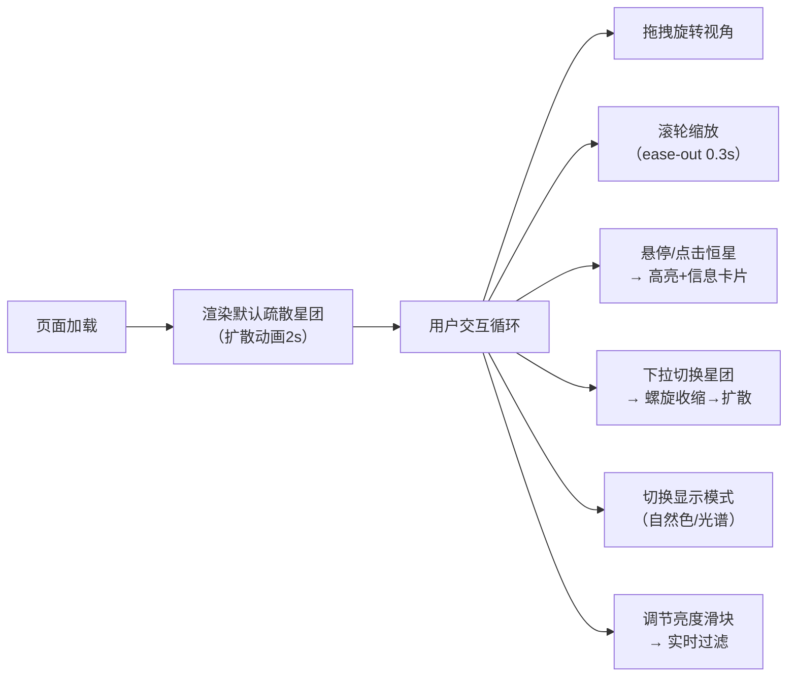

## 1. 产品概述

3D天文馆星团模拟器是一款在浏览器中运行的交互式天文可视化应用，通过WebGL技术在三维空间中真实还原疏散星团和球状星团的恒星分布。面向天文爱好者、学生和科普工作者，提供沉浸式的星团探索体验。

产品核心价值：将抽象的天文数据转化为直观可交互的3D视觉体验，降低星团天文学的学习门槛，激发用户对宇宙探索的兴趣。

## 2. 核心特性

### 2.1 用户角色
| 角色 | 注册方式 | 核心权限 |
|------|----------|----------|
| 访客用户 | 无需注册，直接访问 | 浏览星团、切换视角、查询恒星信息、调整显示参数 |

### 2.2 功能模块
1. **主界面（3D场景）**：星团3D渲染、视角交互控制、星空背景、恒星高亮
2. **左侧控制面板**：星团选择下拉、显示模式切换、亮度过滤滑块
3. **恒星信息卡片**：右上角悬停/点击弹出恒星详细数据

### 2.3 页面详情
| 页面名称 | 模块名称 | 功能描述 |
|----------|----------|----------|
| 主页面 | 3D星团渲染 | 使用PointsMaterial渲染恒星粒子系统，支持500-2000颗恒星 |
| 主页面 | 星团切换动画 | 旧星团螺旋收缩消失（2秒），新星团从中心向外扩散生成 |
| 主页面 | 视角交互 | 鼠标拖拽旋转视角、滚轮缩放（5-50距离），缓动平滑动画 |
| 主页面 | 星空背景 | 2000颗背景粒子缓慢旋转，营造深空氛围 |
| 主页面 | 呼吸光效 | 恒星粒子随时间产生微弱的明暗呼吸效果 |
| 控制面板 | 星团选择 | 下拉框切换5种星团（默认疏散星团、M13、昴星团等） |
| 控制面板 | 显示模式 | 自然色/光谱模式切换，0.2秒过渡动画 |
| 控制面板 | 亮度过滤 | 滑块实时过滤低亮度恒星，动态更新场景可见数量 |
| 信息卡片 | 恒星查询 | Raycaster检测悬停/点击，金色高亮放大，显示编号/类型/星等/距离 |

## 3. 核心流程

### 主用户流程
用户打开应用 → 默认加载疏散星团（~500颗恒星，螺旋扩散动画）→ 鼠标拖拽旋转视角 / 滚轮缩放观察 → 悬停恒星查看信息 → 从下拉菜单选择其他星团（螺旋过渡动画）→ 切换显示模式 / 调节亮度滑块 → 持续探索

## 4. 用户界面设计

### 4.1 设计风格
- **主色调**：深空深蓝 `#0a0e27` 背景，金色 `#ffd700` 强调色
- **辅助渐变**：控制面板深蓝(#0a0e27) → 紫黑(#1a0a2e) 垂直渐变
- **滑块轨道**：淡紫色渐变
- **字体**：标题使用 Orbitron（科幻感），正文使用 Roboto Mono（数字数据）
- **布局**：左侧300px固定控制面板 + 右侧80%宽度3D场景
- **视觉效果**：毛玻璃（backdrop-filter）、8px圆角、微光晕

### 4.2 页面设计概要
| 页面 | 模块 | UI元素 |
|------|------|--------|
| 主页面 | 控制面板 | 金色标题"星团模拟器"、深灰下拉框（悬停金色边框）、按钮组（选中金色填充，0.2s过渡）、渐变滑块（圆形带光晕） |
| 主页面 | 3D场景 | 全空间粒子系统、动态光照、底部中央半透明提示文字（hover不透明） |
| 主页面 | 信息卡片 | 右上角毛玻璃卡片、8px圆角、恒星数据四字段、金色高亮线 |

### 4.3 响应式
- 桌面优先设计，重点适配 1920x1080 和 1440x900
- 控制面板固定300px宽度，场景区域自适应填充剩余空间
- 最小窗口宽度1280px时布局完整无溢出

### 4.4 3D场景指引
- **环境**：纯深空背景 + 2000颗静态背景星
- **光照**：恒星自发光（PointsMaterial emissive + additive blending），无外部光源
- **相机**：PerspectiveCamera，初始距离20，fov 60°，near 0.1，far 1000
- **相机运动**：OrbitControls，enableDamping=true，dampingFactor=0.08
- **后处理**：轻微Bloom效果增强星光辉度，避免过度曝光
- **动画**：星团缓慢自转（0.05rad/s）、恒星呼吸光效（sin曲线调制大小）、切换动画（极坐标螺旋插值）
- **性能预算**：总粒子数 ≤ 4000，Draw Call ≤ 3，单帧耗时 ≤ 22ms（45fps）
