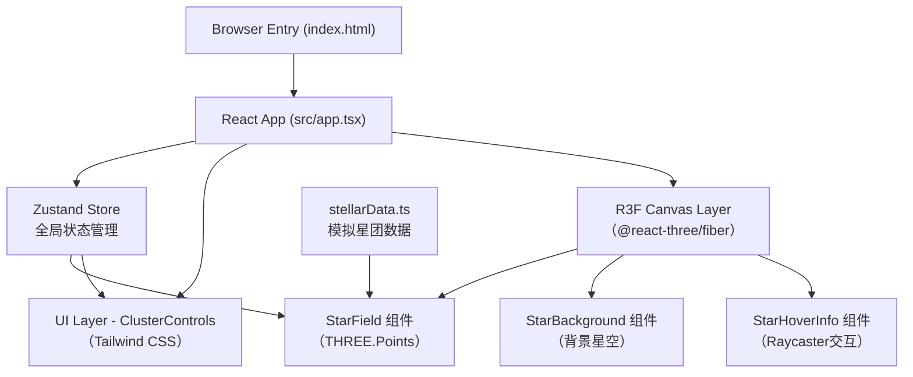

## 1. 架构设计



## 2. 技术说明
- **前端框架**：React 18 + TypeScript（严格模式）
- **构建工具**：Vite 5（热更新、按需编译）
- **3D渲染**：@react-three/fiber + @react-three/drei，底层 three.js r150+
- **状态管理**：Zustand 4
- **样式方案**：Tailwind CSS 3 + 原生 CSS 变量（主题色）
- **数据来源**：本地 mock 数据（5组星团），无后端依赖

## 3. 路由定义
| 路由 | 用途 |
|------|------|
| / | 单页应用主入口，直接渲染星团模拟器主界面 |

## 4. API定义
本项目为纯前端应用，无后端API。内部数据接口通过TypeScript类型约束：

```typescript
// src/types.ts
interface Star {
  id: string;
  position: [number, number, number];
  color: string;       // 自然色 hex
  spectralColor: string; // 光谱色 hex
  magnitude: number;   // 模拟星等 0(最亮)-6(最暗)
  colorType: 'blue' | 'white' | 'yellow' | 'red';
  distance: number;    // 距星团中心距离
}

interface StarCluster {
  id: string;
  name: string;
  type: 'open' | 'globular';
  description: string;
  starCount: number;
  stars: Star[];
}

type DisplayMode = 'natural' | 'spectral';

interface AppState {
  selectedClusterId: string;
  displayMode: DisplayMode;
  brightnessFilter: number;  // 0-1, 低于此阈值的星被隐藏
  hoveredStarId: string | null;
  isTransitioning: boolean;
  actions: {
    selectCluster: (id: string) => void;
    setDisplayMode: (mode: DisplayMode) => void;
    setBrightnessFilter: (v: number) => void;
    setHoveredStar: (id: string | null) => void;
  };
}
```

## 5. 项目目录结构
```
src/
├── types.ts                 # 全局类型定义
├── app.tsx                  # 顶层主组件
├── main.tsx                 # React入口
├── index.css                # Tailwind + 全局样式
├── store/
│   └── useAppStore.ts       # Zustand Store
├── data/
│   └── stellarData.ts       # 5组模拟星团数据
├── scene/
│   ├── starField.tsx        # 星团粒子系统 + 切换动画
│   ├── clusterControls.tsx  # 左侧UI控制面板
│   └── starBackground.tsx   # 背景星空层
└── components/
    └── starInfoCard.tsx     # 恒星信息卡片
```

## 6. 数据模型

### 6.1 数据生成策略（stellarData.ts）
```
疏散星团（默认，500星）：
  - 空间分布：盘状高斯分布（σ_XY=8, σ_Z=2）
  - 颜色分布：蓝30% 白40% 黄20% 红10%
  - 星等范围：2-6

M13球状星团（2000星）：
  - 空间分布：球对称分布 r^-2 密度衰减，最大半径15
  - 颜色分布：蓝10% 白25% 黄35% 红30%
  - 星等范围：0.5-5

昴星团Pleiades（800星）：
  - 疏散星团，偏蓝
  - 蓝55% 白35% 黄8% 红2%
  - 星等范围：1-4.5

半人马座ω球状星团（1500星）：
  - 最亮球状星团，核心致密
  - 蓝15% 白30% 黄35% 红20%
  - 星等范围：0.3-5.5

毕星团Hyades（600星）：
  - 最近的疏散星团
  - 蓝15% 白35% 黄40% 红10%
  - 星等范围：1.5-5
```

### 6.2 颜色映射表
| 颜色类型 | 自然色（hex） | 光谱色（hex） |
|----------|--------------|--------------|
| blue     | #a0c4ff      | #4466ff      |
| white    | #ffffff      | #e8f0ff      |
| yellow   | #ffe8a3      | #ffcc33      |
| red      | #ffb3a0      | #ff4422      |

## 7. 性能优化策略
1. **粒子合并**：每个星团单个 `THREE.Points` + `BufferGeometry`，顶点颜色存储
2. **Shader优化**：自定义 ShaderMaterial 实现呼吸光效 + 大小衰减，避免每帧CPU更新
3. **动画插值**：切换动画在顶点shader中通过uniform时间参数驱动，CPU仅设置一次目标位置
4. **LOD剔除**：亮度过滤通过 shader discard 实现，零重建开销
5. **背景星静态化**：背景星空BufferGeometry一次生成后无CPU更新
6. **OrbitControls优化**：enableDamping减少重渲染频率
