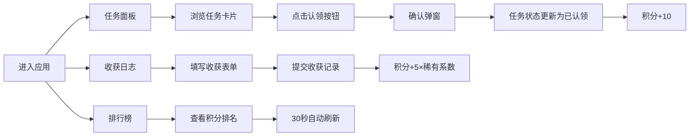

## 1. 产品概述

社区花园共建任务分配与收获记录平台，让社区成员能够认领花园维护任务、记录植物生长数据、登记每次收获的作物产量，并自动生成成员贡献积分排行榜。旨在促进社区互动，激励居民参与花园共建，共享收获成果。

## 2. 核心功能

### 2.1 用户角色

| 角色 | 注册方式 | 核心权限 |
|------|----------|----------|
| 社区成员 | 无需注册，使用昵称参与 | 认领任务、记录收获、查看排行榜、添加生长日记 |

### 2.2 功能模块

1. **任务面板**：任务列表展示、任务认领、任务状态更新
2. **收获日志**：收获登记表单、历史记录列表、照片上传预览
3. **排行榜**：积分排名列表、贡献统计展示、前三名奖牌动画
4. **生长日记**：时间线展示、日记条目添加、图片上传

### 2.3 页面详情

| 页面名称 | 模块名称 | 功能描述 |
|----------|----------|----------|
| 任务面板 | 任务卡片列表 | 展示所有花园维护任务，支持认领和状态更新 |
| 任务面板 | 认领确认弹窗 | 点击认领按钮弹出确认框，状态立即更新 |
| 收获日志 | 收获登记表单 | 作物选择、重量滑块、照片上传 |
| 收获日志 | 历史记录列表 | 按时间倒序展示收获记录，支持悬停高亮 |
| 排行榜 | 积分排名列表 | 按积分降序排列，显示头像、昵称、积分 |
| 排行榜 | 前三名动画效果 | 奖牌图标+跳跃动画，30秒自动刷新 |
| 生长日记 | 时间线组件 | 纵向时间线，圆形节点，虚线连接 |
| 生长日记 | 添加日记弹窗 | 输入内容+上传图片 |

## 3. 核心流程

## 4. 用户界面设计

### 4.1 设计风格

- **主色调**：深绿 #2e7d32、浅绿 #a5d6a7、米白 #f5f5dc
- **强调色**：橙色 #ff9800（可交互元素高亮）
- **卡片样式**：圆角 12px，阴影 0 2px 8px rgba(0,0,0,0.1)，间距 16px
- **按钮效果**：0.2秒 transform 和 box-shadow 过渡，点击时 scale(0.95)
- **字体**：页面标题 2rem 粗体深绿色，下方 2px 浅绿色分割线

### 4.2 页面设计概述

| 页面名称 | 模块名称 | UI 元素 |
|----------|----------|----------|
| 任务面板 | 任务卡片 | 浅绿色背景#e8f5e9，已认领顶部深绿条#2e7d32，已完成灰绿色+对勾 |
| 任务面板 | 认领按钮 | 橙色渐变，悬停发光+上浮3px，已认领后浅灰色不可用 |
| 任务面板 | 确认弹窗 | 半透明背景，向下淡出0.25秒 |
| 收获日志 | 重量滑块 | 0.1-50kg，步长0.1，实时数值悬浮标签 |
| 收获日志 | 照片上传 | 进度条动画，完成后边框变绿0.25秒，点击缩略图放大预览 |
| 收获日志 | 历史记录行 | 悬停背景#f1f8e9 |
| 排行榜 | 排名列表 | 前三名🥇🥈🥉奖牌，每2秒循环跳跃动画 |
| 排行榜 | 列表刷新 | 旧行淡出新行淡入0.5秒 |
| 生长日记 | 时间线 | 圆形绿色节点带白色日期数字，浅绿色虚线连接 |
| 生长日记 | 添加按钮 | 橙色加号按钮，弹窗输入 |
| 全局导航 | 桌面端 | 左侧固定200px，激活项深绿背景白色文字，0.2秒过渡 |
| 全局导航 | 移动端 | 底部tab栏，激活项下方绿色指示条，平滑滑动 |

### 4.3 响应式

- **桌面端**（≥768px）：左侧固定200px导航栏，右侧主内容区
- **移动端**（<768px）：导航栏折叠为底部tab栏，水平排列三个图标按钮
- **触摸优化**：按钮最小高度44px，确保可点击区域充足

### 4.4 积分规则

| 行为 | 积分 | 备注 |
|------|------|------|
| 认领任务 | +10分 | |
| 完成任务 | +20分 | |
| 登记收获 | +5×稀有系数 | 番茄1.0、生菜0.8、萝卜0.6、草莓1.5、向日葵2.0 |
