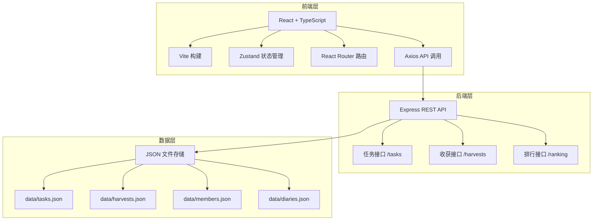
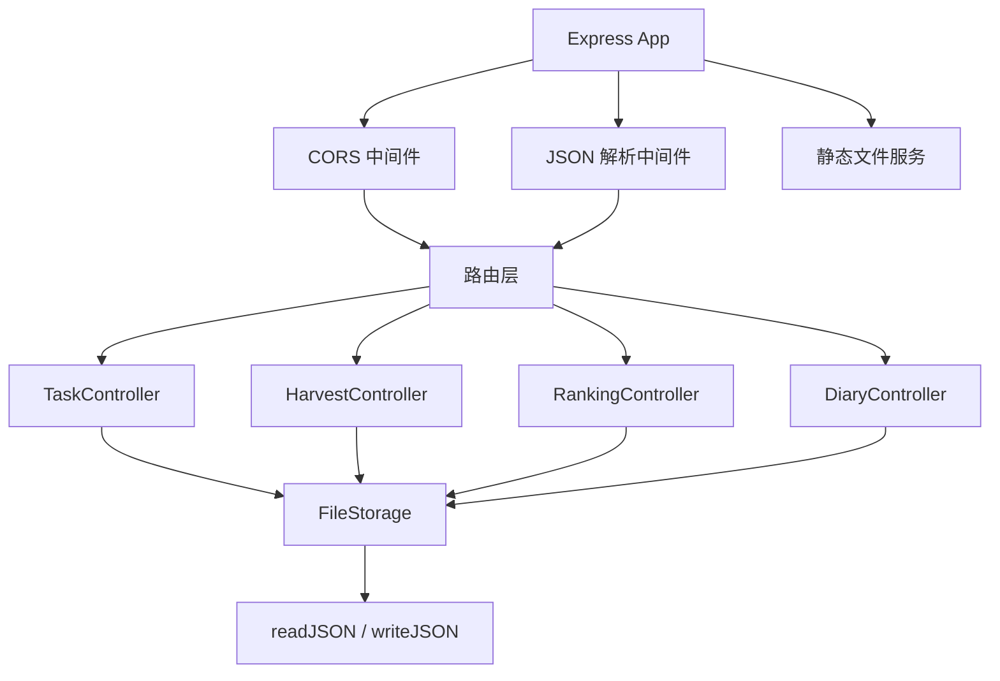
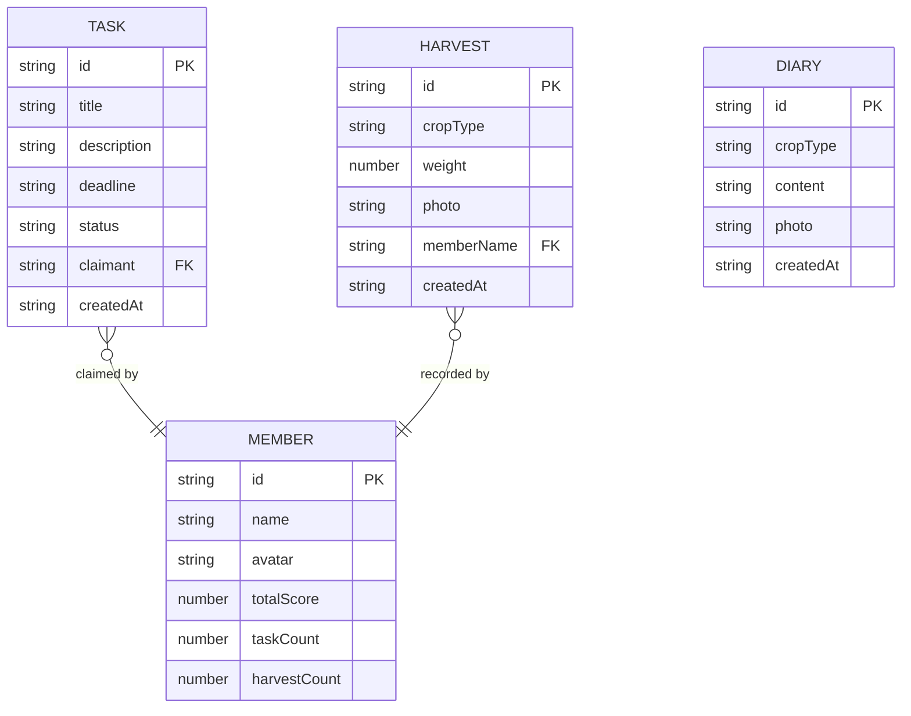

## 1. 架构设计



## 2. 技术描述

- **前端**：React@18 + TypeScript@5 + Vite@5
- **状态管理**：Zustand@4
- **路由**：React Router DOM@6
- **HTTP 客户端**：Axios@1
- **后端**：Express@4
- **数据存储**：JSON 文件（无需数据库）
- **工具库**：uuid、cors、date-fns

## 3. 路由定义

| 路由 | 用途 |
|------|------|
| / | 任务面板（主页） |
| /tasks | 任务面板 |
| /harvests | 收获日志 |
| /ranking | 排行榜 |

## 4. API 定义

### 4.1 任务接口

```typescript
interface Task {
  id: string;
  title: string;
  description: string;
  deadline: string;
  status: 'pending' | 'claimed' | 'completed';
  claimant: string | null;
  createdAt: string;
}

// GET /tasks - 获取所有任务
// Response: Task[]

// PUT /tasks/:id/claim - 认领任务
// Request: { claimant: string }
// Response: Task

// PUT /tasks/:id/complete - 完成任务
// Response: Task
```

### 4.2 收获接口

```typescript
interface Harvest {
  id: string;
  cropType: 'tomato' | 'lettuce' | 'radish' | 'strawberry' | 'sunflower';
  weight: number;
  photo: string | null;
  memberName: string;
  createdAt: string;
}

// GET /harvests - 获取所有收获记录
// Response: Harvest[]

// POST /harvests - 创建收获记录
// Request: Omit<Harvest, 'id' | 'createdAt'>
// Response: Harvest
```

### 4.3 排行接口

```typescript
interface RankingMember {
  id: string;
  name: string;
  avatar: string;
  totalScore: number;
  taskCount: number;
  harvestCount: number;
  rank: number;
}

// GET /ranking - 获取积分排行
// Response: RankingMember[]
```

### 4.4 生长日记接口

```typescript
interface Diary {
  id: string;
  cropType: string;
  content: string;
  photo: string | null;
  createdAt: string;
}

// GET /diaries - 获取所有日记
// Response: Diary[]

// POST /diaries - 创建日记
// Request: Omit<Diary, 'id' | 'createdAt'>
// Response: Diary
```

## 5. 服务器架构图



## 6. 数据模型

### 6.1 数据模型定义



### 6.2 初始数据

**tasks.json:**
```json
[
  {
    "id": "1",
    "title": "浇水",
    "description": "为所有植物浇水",
    "deadline": "2026-06-15",
    "status": "pending",
    "claimant": null,
    "createdAt": "2026-06-14T08:00:00Z"
  },
  {
    "id": "2",
    "title": "除草",
    "description": "清理花园杂草",
    "deadline": "2026-06-16",
    "status": "pending",
    "claimant": null,
    "createdAt": "2026-06-14T08:00:00Z"
  }
]
```

**members.json:**
```json
[
  {
    "id": "1",
    "name": "小明",
    "avatar": "M",
    "totalScore": 50,
    "taskCount": 3,
    "harvestCount": 2
  }
]
```
