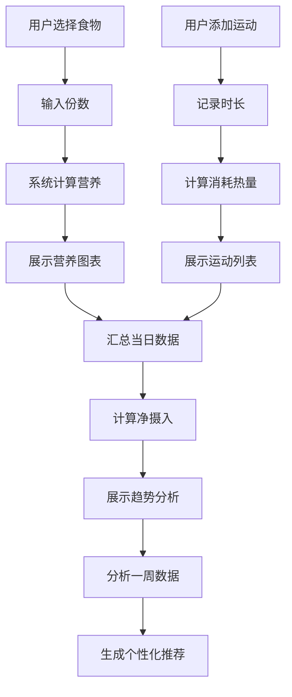

## 1. 产品概述

家庭饮食营养与运动消耗追踪全栈应用，帮助用户直观对比每日热量与营养素平衡，获取个性化饮食推荐，实现运动消耗与摄入的联动分析。

- **主要目的**：解决用户难以直观对比每日热量与营养素平衡、缺乏个性化饮食推荐、运动消耗与摄入联动分析不足的问题
- **目标用户**：关注健康饮食和运动的家庭用户
- **市场价值**：通过数据可视化和智能推荐，帮助用户养成健康的生活习惯

## 2. 核心功能

### 2.1 用户角色

| 角色 | 注册方式 | 核心权限 |
|------|---------|----------|
| 普通用户 | 无需注册，本地数据存储 | 记录饮食、记录运动、查看分析、获取推荐 |

### 2.2 功能模块

1. **饮食记录与营养分析模块**：食物库选择、份数输入、营养计算、堆叠长条图、圆环进度图
2. **运动记录模块**：运动项目添加、时长记录、消耗计算、动画列表展示
3. **摄入与消耗联动分析模块**：一周趋势折线图、每日净差值、状态指示器
4. **个性化饮食推荐模块**：营养素偏差分析、推荐建议列表、周报告跳转

### 2.3 页面详情

| 页面名称 | 模块名称 | 功能描述 |
|---------|---------|----------|
| 首页 | 饮食记录模块 | 食物卡片选择、份数输入、营养堆叠长条图、摄入圆环进度图 |
| 首页 | 运动记录模块 | 运动项目添加、时长记录、消耗计算、动画列表展示 |
| 首页 | 联动分析模块 | 一周趋势折线图、每日净差值、状态指示器 |
| 首页 | 推荐引擎模块 | 推荐建议卡片、查看周报告按钮 |
| 周报告页面 | 报告模块 | 完整周数据展示、详细营养分析、历史趋势 |

## 3. 核心流程

用户选择食物 → 输入份数 → 系统计算当餐营养 → 展示营养分析图表
用户添加运动 → 记录时长 → 系统计算消耗热量 → 展示运动列表
系统汇总当日数据 → 计算净摄入 → 展示趋势分析和状态指示
系统分析一周数据 → 生成个性化推荐 → 展示建议卡片

## 4. 用户界面设计

### 4.1 设计风格

- **主色调**：浅米色（#F5F1E8）
- **强调色**：深绿色（#2D5A27）
- **背景色**：浅灰色（#FAFAFA）
- **食物卡片配色**：
  - 主食类：米黄色（#F5E6C8）
  - 蔬菜类：浅绿色（#D4EDDA）
  - 肉类：粉红色（#F8D7DA）
  - 水果类：橙黄色（#FFE8CC）
- **营养素配色**：
  - 蛋白质：蓝色（#0066CC）
  - 碳水化合物：橙色（#FF8C00）
  - 脂肪：紫色（#9932CC）
- **按钮样式**：圆角矩形，hover 时背景加深、阴影扩大、1.05 倍缩放，点击时缩小至 0.95 倍
- **字体**：无衬线体
- **布局**：卡片化布局，每张卡片带极轻微阴影（0.5px 偏移，2px 模糊）和 6px 圆角
- **图标**：使用 lucide-react 图标库

### 4.2 页面设计概述

| 页面名称 | 模块名称 | UI 元素 |
|---------|---------|---------|
| 首页 | 饮食记录 | 食物卡片（按压动画）、份数输入框、堆叠长条图（宽度过渡动画 0.6s）、圆环进度图（超过目标时红色呼吸脉动） |
| 首页 | 运动记录 | 运动类型选择、时长输入、运动卡片（滑入动画 0.4s）、火焰图标（超过 500 千卡变红放大） |
| 首页 | 联动分析 | 折线图（双折线、圆形标记、hover 提示）、净差值圆形指示器（颜色状态、旋转光晕动画） |
| 首页 | 推荐引擎 | 建议卡片（圆形图标、两行文字、点击展开动画 0.3s）、查看周报告按钮 |
| 周报告页面 | 报告模块 | 周数据汇总、详细图表、历史对比 |

### 4.3 响应式

- 桌面端：多列卡片布局
- 移动端：单列纵向布局，卡片宽度 100%，边距自动缩小
- 触摸优化：按钮最小尺寸 44px，适当增加触摸区域

### 4.4 性能要求

- 数据更新时页面重绘响应时间不超过 100ms
- 图表渲染时 FPS 不低于 45 帧
- 使用 CSS transition 实现平滑过渡动画（0.3s ease）
