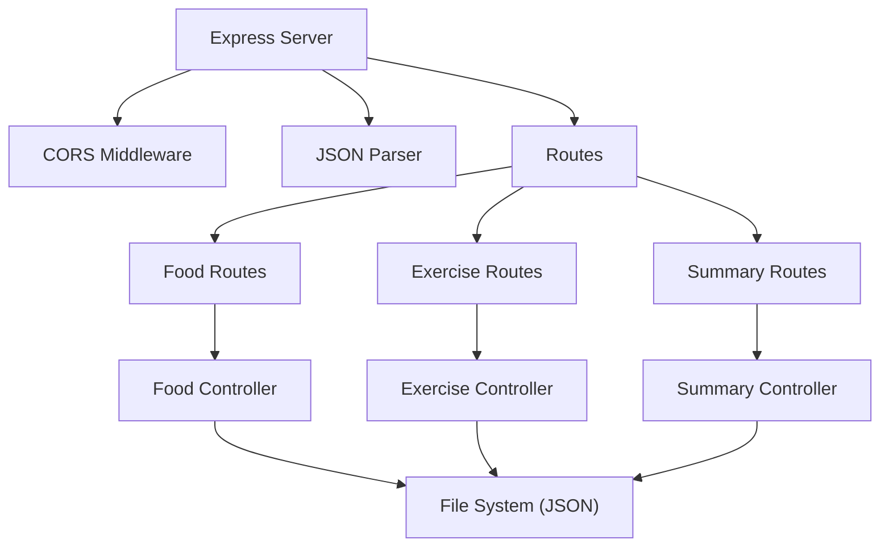

## 1. 架构设计

```mermaid
graph TD
    subgraph 前端
        A["React 应用] --> B["Zustand 状态管理"]
        A --> C["React Router 路由"]
        A --> D["Recharts 图表库"]
        A --> E["Lucide React 图标"]
        B --> F["饮食记录模块"]
        B --> G["运动分析模块"]
        B --> H["推荐引擎模块"]
        F --> I["foodRecord.ts"]
        F --> J["nutrientChart.tsx"]
        G --> K["exerciseRecord.ts"]
        G --> L["calorieDashboard.tsx"]
        H --> M["recommendationEngine.ts"]
    end
    
    subgraph 后端
        N["Express API"]
        N --> O["CORS 中间件"]
        N --> P["REST API 路由"]
        P --> Q["JSON 文件持久化"]
    end
    
    subgraph 数据层
        R["foods.json - 食物库数据"]
        S["foodRecords.json - 饮食记录"]
        T["exerciseRecords.json - 运动记录"]
    end
    
    前端 -->|Axios HTTP 请求| 后端
    后端 -->|读写| 数据层
```

## 2. 技术描述

- **前端**：React 18 + TypeScript + Vite
- **后端**：Express 4 + CORS
- **状态管理**：Zustand
- **图表库**：Recharts
- **路由**：React Router DOM
- **HTTP 客户端**：Axios
- **图标**：Lucide React
- **日期处理**：date-fns
- **唯一ID**：uuid
- **数据持久化**：JSON 文件
- **构建工具**：Vite

## 3. 路由定义

| 路由 | 用途 |
|-------|-------|
| / | 首页 - 包含所有功能模块 |
| /report | 周报告页面 |

## 4. API 定义

### 4.1 类型定义

```typescript
// 食物类型
interface Food {
  id: string;
  name: string;
  type: 'staple' | 'vegetable' | 'meat' | 'fruit';
  calories: number;
  protein: number;
  carbs: number;
  fat: number;
}

// 饮食记录
interface FoodRecord {
  id: string;
  date: string;
  mealType: 'breakfast' | 'lunch' | 'dinner' | 'snack';
  foodId: string;
  servings: number;
  createdAt: string;
}

// 运动类型
interface Exercise {
  id: string;
  name: string;
  type: 'running' | 'cycling' | 'swimming' | 'yoga' | 'strength' | 'other';
  met: number;
}

// 运动记录
interface ExerciseRecord {
  id: string;
  date: string;
  exerciseId: string;
  duration: number;
  calories: number;
  createdAt: string;
}

// 每日摘要
interface DailySummary {
  date: string;
  totalCalories: number;
  totalProtein: number;
  totalCarbs: number;
  totalFat: number;
  totalExerciseCalories: number;
  netCalories: number;
}

// 推荐建议
interface Recommendation {
  id: string;
  type: 'protein' | 'carbs' | 'fat' | 'vegetable' | 'fruit' | 'general';
  title: string;
  detail: string;
  fullDetail: string;
}
```

### 4.2 API 端点

| 方法 | 路径 | 描述 | 请求 | 响应 |
|------|------|------|------|------|
| GET | /api/foods | 获取食物库 | - | Food[] |
| GET | /api/food-records | 获取饮食记录 | ?date=YYYY-MM-DD | FoodRecord[] |
| POST | /api/food-records | 添加饮食记录 | { foodId, servings, mealType, date } | FoodRecord |
| DELETE | /api/food-records/:id | 删除饮食记录 | - | { success: boolean } |
| GET | /api/exercises | 获取运动项目 | - | Exercise[] |
| GET | /api/exercise-records | 获取运动记录 | ?date=YYYY-MM-DD | ExerciseRecord[] |
| POST | /api/exercise-records | 添加运动记录 | { exerciseId, duration, date } | ExerciseRecord |
| DELETE | /api/exercise-records/:id | 删除运动记录 | - | { success: boolean } |
| GET | /api/daily-summary | 获取每日摘要 | ?date=YYYY-MM-DD | DailySummary |
| GET | /api/weekly-summary | 获取一周摘要 | ?startDate=YYYY-MM-DD | DailySummary[] |

## 5. 后端架构



## 6. 项目文件结构

```
.
├── package.json
├── index.html
├── vite.config.js
├── tsconfig.json
├── api/
│   └── server.ts
│   ├── routes/
│   │   ├── foods.ts
│   │   ├── exercises.ts
│   │   └── summary.ts
│   ├── controllers/
│   │   ├── foodController.ts
│   │   ├── exerciseController.ts
│   │   └── summaryController.ts
│   └── data/
│       ├── foods.json
│       ├── exercises.json
│       ├── foodRecords.json
│       └── exerciseRecords.json
└── src/
    ├── main.tsx
    ├── App.tsx
    ├── store/
    │   └── useStore.ts
    ├── 饮食记录模块/
    │   ├── foodRecord.ts
    │   └── nutrientChart.tsx
    ├── 运动分析模块/
    │   ├── exerciseRecord.ts
    │   └── calorieDashboard.tsx
    ├── 推荐引擎/
    │   └── recommendationEngine.ts
    ├── pages/
    │   ├── Home.tsx
    │   └── Report.tsx
    ├── components/
    │   ├── FoodCard.tsx
    │   ├── ExerciseCard.tsx
    │   └── RecommendationCard.tsx
    ├── styles/
    │   └── index.css
    └── types/
        └── index.ts
```

## 7. 数据模型

### 7.1 食物库数据 (foods.json)

| 字段 | 类型 | 说明 |
|------|------|------|
| id | string | 唯一标识 |
| name | string | 食物名称 |
| type | string | 类型：staple/vegetable/meat/fruit |
| calories | number | 每100克热量（千卡） |
| protein | number | 每100克蛋白质（克） |
| carbs | number | 每100克碳水化合物（克） |
| fat | number | 每100克脂肪（克） |

### 7.2 运动项目数据 (exercises.json)

| 字段 | 类型 | 说明 |
|------|------|------|
| id | string | 类型：running/cycling/swimming/yoga/strength/other |
| name | string | 运动名称 |
| type | string | 运动类型 |
| met | number | 代谢当量值 |

### 7.3 饮食记录 (foodRecords.json)

| 字段 | 类型 | 说明 |
|------|------|------|
| id | string | 唯一标识 |
| date | string | 日期 YYYY-MM-DD |
| mealType | string | 餐次：breakfast/lunch/dinner/snack |
| foodId | string | 食物ID |
| servings | number | 份数 |
| createdAt | string | 创建时间 |

### 7.4 运动记录 (exerciseRecords.json)

| 字段 | 类型 | 说明 |
|------|------|------|
| id | string | 唯一标识 |
| date | string | 日期 YYYY-MM-DD |
| exerciseId | string | 运动ID |
| duration | number | 时长（分钟） |
| calories | number | 消耗热量（千卡） |
| createdAt | string | 创建时间 |
