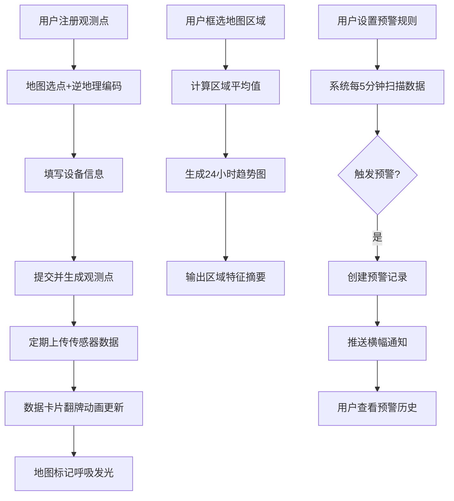

# 城市微气候观测站协作网络 - 产品需求文档

## 1. 产品概述
城市微气候观测站协作网络是一个让气象爱好者在城市不同地点设置个人观测点，实时采集并共享温湿度、气压、风速和PM2.5等环境数据的协作平台。通过汇聚所有观测点数据，生成城市热力图，帮助用户直观了解不同区域的微气候差异，并可订阅特定区域的异常天气预警。

- 主要目的：构建去中心化的城市环境监测网络，填补官方气象站点密度不足的空白
- 目标用户：气象爱好者、环保人士、城市规划研究者、普通市民
- 市场价值：提供高时空分辨率的城市微气候数据，为城市热岛效应研究、绿化规划、公共健康预警提供数据支撑

## 2. 核心功能

### 2.1 用户角色
| 角色 | 注册方式 | 核心权限 |
|------|----------|----------|
| 观测者 | 填写观测站信息注册 | 注册观测点、上传数据、设置预警规则 |
| 浏览者 | 无需注册 | 浏览热力图、查看区域数据、订阅预警通知 |

### 2.2 功能模块
1. **主界面（地图视图）**：Leaflet地图为中心，展示所有观测点颜色编码圆点，支持框选区域分析
2. **观测点管理**：地图选点注册、观测点信息编辑、数据上传、卡片列表视图
3. **热力图与趋势分析**：实时热力图层、区域框选统计、24小时趋势折线图、区域特征摘要
4. **预警订阅系统**：预警规则编辑、自动检查引擎、实时通知横幅、预警历史管理

### 2.3 页面详情
| 页面名称 | 模块名称 | 功能描述 |
|-----------|-------------|---------------------|
| 主界面 | 地图区域 | 占屏幕60%以上，Leaflet地图叠加观测点标记和热力图层，支持拖拽框选 |
| 主界面 | 左侧栏（可折叠） | 观测点列表卡片视图，支持hover效果和展开详情 |
| 主界面 | 右侧栏（可折叠） | 预警规则编辑器和预警历史面板 |
| 主界面 | 顶部横幅通知区 | 预警通知从右侧滑入，5秒后滑出 |
| 注册弹窗 | 观测点注册表单 | 地图点击选点、自动逆地理编码、设备型号、高度填写 |
| 数据卡片 | 实时数据展示 | 五色数据卡片（温湿度气压风速PM2.5），底色随数值变化，翻牌动画 |
| 趋势图面板 | 区域数据分析 | 三张并列折线图（温/湿/风），24小时趋势，区域特征文字摘要 |
| 预警历史 | 预警记录管理 | 时间倒序列表，红色竖条标记，支持标记已读/忽略 |

## 3. 核心流程

### 3.1 观测点注册与数据上传流程
用户打开应用 → 在地图上点击选点 → 系统自动逆地理编码获取街道名称 → 填写设备型号和高度 → 提交注册 → 观测点在地图上显示 → 用户定期上传传感器数据 → 数据卡片翻牌动画更新 → 地图标记呼吸发光

### 3.2 区域分析流程
用户在地图上拖拽框选区域 → 系统计算区域内所有观测点的平均温度、湿度、风力 → 生成三张24小时趋势折线图 → 输出区域特征文字摘要 → 列表展示区域内所有观测点（按数据类型排序）→ 点击观测点展开历史详情

### 3.3 预警触发与通知流程
用户选择观测点 → 设置预警规则（如温度连续三次超过35度）→ 系统每5分钟扫描所有观测点最新数据 → 匹配规则触发预警 → 创建预警记录 → 向订阅用户推送横幅通知 → 用户点击通知查看详情 → 在预警历史面板标记已读/忽略

## 4. 用户界面设计

### 4.1 设计风格
- **主题基调**：夜间模式深色主题
- **主背景色**：#1a1a2e（深蓝紫夜空色）
- **文字主色**：#e0e0e0（浅灰白）
- **强调色**：#00d2ff（科技蓝）、#ff6b6b（警示红）
- **卡片效果**：半透明磨砂玻璃（背景15%透明度，模糊8px，1px淡蓝发光边框）
- **卡片间距**：16px
- **字体**：使用现代无衬线字体，标题加粗，正文常规

### 4.2 视觉元素规范
- **温度卡片颜色**：0°C以下浅蓝、10-25°C淡绿、25°C以上橙红
- **空气质量发光颜色**：绿(优)、黄(良)、橙(轻度)、红(中度)、紫(重度)
- **数据卡片圆点**：温度红、湿度蓝、风力灰，圆点直径随数值变化
- **翻牌动画**：0.4秒滚动翻转动画
- **预警横幅**：从右侧滑入，停留5秒后滑出，红色警示背景
- **预警记录**：左侧红色竖条标记，已读后变灰

### 4.3 页面设计概览
| 页面名称 | 模块名称 | UI元素 |
|-----------|-------------|-------------|
| 主界面 | 地图区域 | 全屏深色背景、Leaflet暗色瓦片、彩色圆点标记、呼吸发光动画、框选工具 |
| 主界面 | 观测点卡片 | 磨砂玻璃效果、地点名称、相对时间（3分钟前）、三色数据圆点、hover上浮阴影加深 |
| 主界面 | 数据展示卡片 | 五色分类卡片、动态底色、数字翻牌动画 |
| 主界面 | 趋势图区域 | 纯CSS绘制折线图、虚线连接缺失数据、"暂无数据"占位文字 |
| 主界面 | 预警横幅 | 红色渐变背景、滑入/滑出动画、预警图标、查看详情链接 |
| 主界面 | 预警历史 | 时间倒序列表、红色竖条标记、已读/忽略操作按钮 |

### 4.4 响应式设计
- 桌面端优先设计，地图占屏幕中央60%以上
- 左右侧栏可折叠，折叠后显示为图标按钮
- 中等屏幕：侧栏默认折叠，通过按钮展开
- 移动端：地图全屏，面板以底部抽屉形式弹出

## 5. 性能要求
- 数据上传接口响应时间 ≤ 300ms
- 热力图重绘（框选/缩放）延迟 ≤ 500ms
- 预警检查每轮扫描10个观测点总耗时 ≤ 200ms
