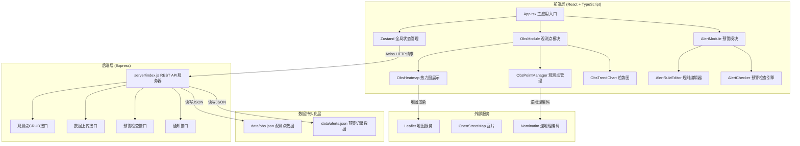
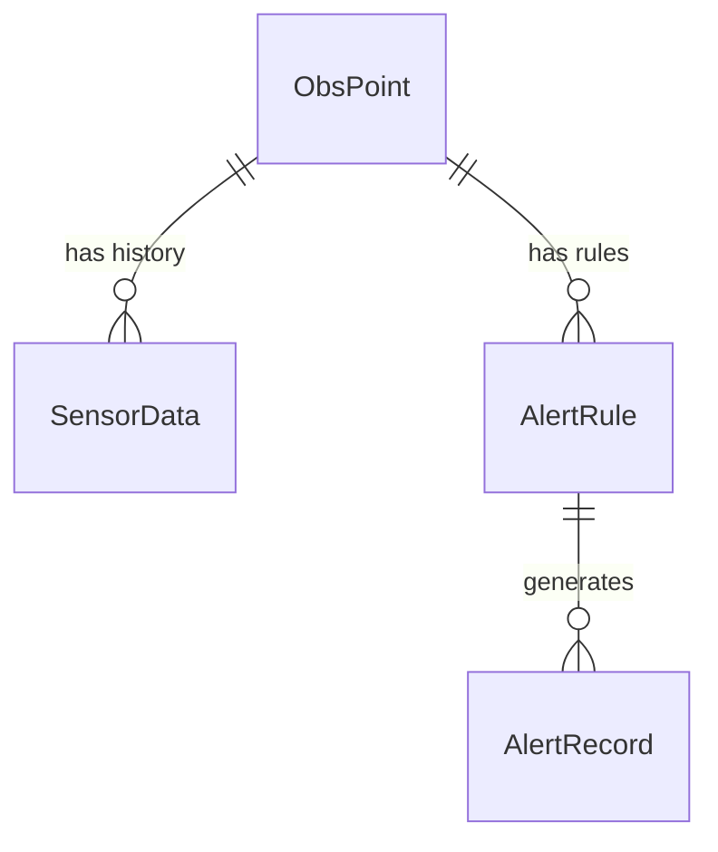

# 城市微气候观测站协作网络 - 技术架构文档

## 1. 架构设计



## 2. 技术描述

- **前端框架**：React 18 + TypeScript
- **状态管理**：Zustand 4
- **构建工具**：Vite 5
- **路由**：React Router DOM 6
- **HTTP客户端**：Axios
- **地图组件**：Leaflet + leaflet.heat
- **样式方案**：纯CSS（CSS变量 + CSS Modules风格内联样式）
- **后端框架**：Express 4
- **数据库**：JSON文件持久化（data/obs.json, data/alerts.json）
- **ID生成**：uuid
- **跨域**：cors中间件

## 3. 项目文件结构

```
auto141/
├── package.json              # 项目依赖和启动脚本
├── index.html                # Vite入口HTML
├── vite.config.js            # Vite配置（含API代理）
├── tsconfig.json             # TypeScript配置（严格模式+路径别名）
├── server/
│   └── index.js              # Express服务器（REST API）
├── data/
│   ├── obs.json              # 观测点和数据持久化
│   └── alerts.json           # 预警记录持久化
└── src/
    ├── main.tsx              # React入口
    ├── App.tsx               # 主应用组件（含通知横幅）
    ├── index.css             # 全局样式（夜间模式主题）
    ├── store/
    │   └── useStore.ts       # Zustand全局状态
    ├── types/
    │   └── index.ts          # TypeScript类型定义
    ├── ObsModule/
    │   ├── ObsPointManager.tsx   # 观测点管理主组件
    │   ├── ObsHeatmap.tsx        # 热力图展示组件
    │   └── ObsTrendChart.tsx     # 趋势图组件
    └── AlertModule/
        ├── AlertRuleEditor.tsx   # 预警规则编辑器
        └── AlertChecker.ts       # 预警检查引擎
```

## 4. 路由定义

| 路由 | 用途 |
|-------|---------|
| / | 主应用页面（地图+侧栏+通知） |

## 5. API定义

### 5.1 观测点接口

```typescript
// 观测点数据结构
interface ObsPoint {
  id: string;
  name: string;              // 街道名称（逆地理编码）
  lat: number;
  lng: number;
  deviceModel: string;
  height: number;            // 安装高度（米）
  createdAt: number;
  lastUpdate: number;
  currentData: SensorData;
  history: SensorData[];     // 最近24小时数据
}

interface SensorData {
  timestamp: number;
  temperature: number;       // 摄氏度
  humidity: number;          // 相对湿度%
  pressure: number;          // hPa
  windSpeed: number;         // m/s
  pm25: number;              // μg/m³
}
```

| 方法 | 路径 | 用途 | 请求体 | 响应 |
|------|------|------|--------|------|
| GET | /api/obs | 获取所有观测点列表 | - | ObsPoint[] |
| GET | /api/obs/:id | 获取单个观测点详情 | - | ObsPoint |
| POST | /api/obs | 创建新观测点 | {name, lat, lng, deviceModel, height} | ObsPoint |
| PUT | /api/obs/:id | 更新观测点信息 | {deviceModel?, height?} | ObsPoint |
| DELETE | /api/obs/:id | 删除观测点 | - | {success: true} |
| POST | /api/obs/:id/data | 上传传感器数据 | SensorData | ObsPoint |
| GET | /api/obs/region | 获取区域内观测点统计 | Query: {minLat, maxLat, minLng, maxLng} | RegionStats |

```typescript
interface RegionStats {
  points: ObsPoint[];
  avgTemperature: number;
  avgHumidity: number;
  avgWindSpeed: number;
  trend24h: {
    temperature: {time: number, value: number}[];
    humidity: {time: number, value: number}[];
    windSpeed: {time: number, value: number}[];
  };
}
```

### 5.2 预警接口

```typescript
// 预警规则
interface AlertRule {
  id: string;
  obsPointId: string;
  dataType: 'temperature' | 'humidity' | 'pressure' | 'windSpeed' | 'pm25';
  condition: 'gt' | 'lt' | 'gte' | 'lte' | 'eq';
  threshold: number;
  consecutiveCount: number;   // 连续触发次数
  risingTrend?: boolean;      // 是否要求持续上升
  subscribed: boolean;
  createdAt: number;
}

// 预警记录
interface AlertRecord {
  id: string;
  ruleId: string;
  obsPointId: string;
  obsPointName: string;
  triggerCondition: string;
  currentData: SensorData;
  timestamp: number;
  read: boolean;
  ignored: boolean;
}
```

| 方法 | 路径 | 用途 | 请求体 | 响应 |
|------|------|------|--------|------|
| GET | /api/alerts/rules | 获取所有预警规则 | - | AlertRule[] |
| POST | /api/alerts/rules | 创建预警规则 | AlertRule (不含id, createdAt) | AlertRule |
| PUT | /api/alerts/rules/:id | 更新预警规则 | Partial<AlertRule> | AlertRule |
| DELETE | /api/alerts/rules/:id | 删除预警规则 | - | {success: true} |
| GET | /api/alerts/records | 获取预警记录 | - | AlertRecord[] |
| PUT | /api/alerts/records/:id | 标记已读/忽略 | {read?: boolean, ignored?: boolean} | AlertRecord |
| POST | /api/alerts/check | 触发一次预警检查 | - | {triggered: AlertRecord[]} |

## 6. 数据模型

### 6.1 实体关系图



### 6.2 数据定义（JSON文件结构）

**data/obs.json:**
```json
{
  "points": [
    {
      "id": "uuid-string",
      "name": "朝阳区建国路88号",
      "lat": 39.9042,
      "lng": 116.4074,
      "deviceModel": "BME280-PMS5003",
      "height": 15,
      "createdAt": 1718000000000,
      "lastUpdate": 1718000300000,
      "currentData": {
        "timestamp": 1718000300000,
        "temperature": 26.5,
        "humidity": 62,
        "pressure": 1013,
        "windSpeed": 2.3,
        "pm25": 35
      },
      "history": []
    }
  ]
}
```

**data/alerts.json:**
```json
{
  "rules": [
    {
      "id": "uuid-string",
      "obsPointId": "obs-point-uuid",
      "dataType": "temperature",
      "condition": "gt",
      "threshold": 35,
      "consecutiveCount": 3,
      "risingTrend": false,
      "subscribed": true,
      "createdAt": 1718000000000
    }
  ],
  "records": [
    {
      "id": "uuid-string",
      "ruleId": "rule-uuid",
      "obsPointId": "obs-point-uuid",
      "obsPointName": "朝阳区建国路88号",
      "triggerCondition": "温度连续3次超过35°C",
      "currentData": { "temperature": 36.2, "humidity": 45, "pressure": 1008, "windSpeed": 1.1, "pm25": 82, "timestamp": 1718000300000 },
      "timestamp": 1718000300000,
      "read": false,
      "ignored": false
    }
  ]
}
```

## 7. 性能优化策略

1. **数据上传接口**：内存缓存 + 异步写入JSON文件，确保响应 < 300ms
2. **热力图重绘**：requestAnimationFrame节流 + 增量更新，延迟 < 500ms
3. **预警检查**：批量扫描 + 短路求值，10个观测点 < 200ms
4. **前端渲染**：React.memo优化列表渲染，Zustand选择器避免不必要重渲染
5. **地图性能**：Leaflet canvas渲染模式，观测点聚合显示
