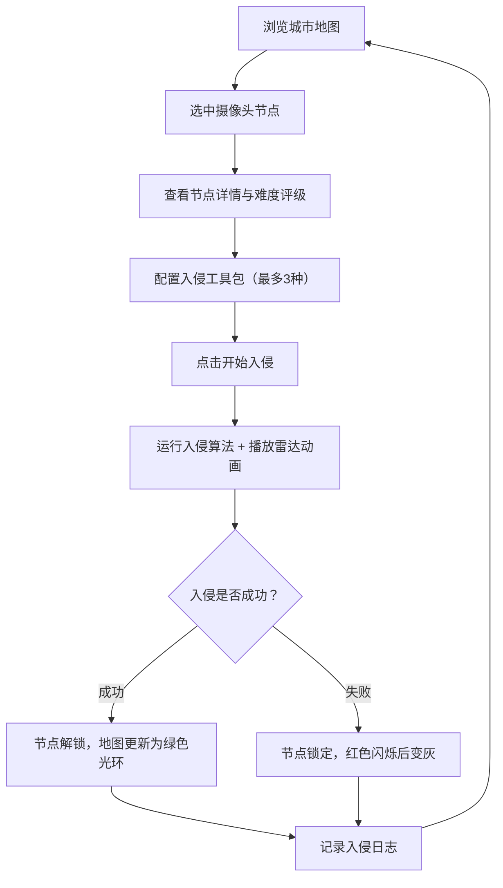

## 1. 产品概述

赛博朋克摄像头网络入侵模拟器——一款面向赛博朋克桌游玩家的战术辅助工具，用于可视化城市监控摄像头网络布局、模拟入侵过程（含破解时长计算、警报触发判定与信号干扰效果），并记录入侵日志与节点解锁状态，消除手工推演的繁琐，提升游戏沉浸感与决策效率。

## 2. 核心功能

### 2.1 用户角色

| 角色 | 注册方式 | 核心权限 |
|------|----------|----------|
| 玩家 | 无需注册 | 浏览摄像头网络、配置工具包、模拟入侵、查看历史日志 |

### 2.2 功能模块

1. **主界面**: 三栏布局城市地图 + 工具栏 + 详情面板 + 日志面板
2. **入侵模拟界面**: 雷达扫描动画 + 破解进度 + 警报风险指示 + 结果展示

### 2.3 页面详情

| 页面名称 | 模块名称 | 功能描述 |
|----------|----------|----------|
| 主界面 | 城市地图区域 | 网格化地图展示摄像头节点（六边形图标），悬停放大+信息卡，点击选中查看详情 |
| 主界面 | 入侵目标详情面板 | 展示选中节点的入侵难度评级（骷髅头图标）、防御等级、已知漏洞 |
| 主界面 | 入侵工具包配置栏 | 左侧工具栏选择最多3种工具，霓虹线框图标，脉冲选中光效 |
| 主界面 | 入侵过程模拟 | 点击入侵按钮后播放雷达扫描动画（5-8秒），动态破解进度条+警报风险指示器+数字雨背景 |
| 主界面 | 入侵历史日志面板 | 底部面板，时间倒序展示入侵概要，磁感线分隔，悬浮高亮 |

## 3. 核心流程

1. 玩家浏览城市地图上的摄像头节点，悬停查看基本信息，点击选中目标节点
2. 右侧面板展示选中节点的详细参数、入侵难度评级和已知漏洞
3. 玩家从左侧工具栏选择最多3种入侵工具配置工具包
4. 点击"开始入侵"按钮，系统运行入侵算法并播放雷达扫描动画
5. 入侵动画期间动态展示破解进度和警报风险变化
6. 入侵完成显示结果（成功/失败），更新节点状态和日志记录

## 4. 用户界面设计

### 4.1 设计风格

- **主背景**: 极深蓝黑色 `#0a0a1a`
- **辅助色**: 青色 `#00ffff`（霓虹边缘光效）、品红色 `#ff00ff`（脉冲光效与高亮）
- **字体**: JetBrains Mono 等宽字体，营造终端/黑客氛围
- **节点状态色**: 绿色=未加密、黄色=已加密、红色=警报联动、绿色光环=已解锁
- **按钮风格**: 霓虹线框按钮，悬浮时品红色脉冲边框
- **布局**: 左中右三栏（300px / 自适应 / 350px），页头60px，页脚30px
- **图标风格**: 线性霓虹线框，选中时动态脉冲光效
- **动画**: 信息卡底部滑入0.3s，入侵扫描雷达旋转+脉冲，状态切换0.5s颜色过渡+缩放

### 4.2 页面设计概览

| 页面名称 | 模块名称 | UI元素 |
|----------|----------|--------|
| 主界面 | 城市地图 | 网格背景，六边形节点图标带光晕，悬停放大+信息卡，颜色编码状态 |
| 主界面 | 工具栏 | 左侧300px，4种工具霓虹线框图标，最多选3个，选中脉冲光效 |
| 主界面 | 详情面板 | 右侧350px，节点参数表，骷髅头难度评级，漏洞列表 |
| 主界面 | 入侵动画 | 全屏遮罩，中央雷达扫描圆，破解进度条，警报风险指示器，数字雨背景 |
| 主界面 | 日志面板 | 底部面板，时间倒序列表，磁感线分隔，悬浮深蓝半透明 |

### 4.3 响应式

- 桌面优先设计，适配1200px以上屏幕
- 1920x1080分辨率下最佳体验
- 地图区最小宽度600px

### 4.4 3D场景指南

- 不涉及3D场景
