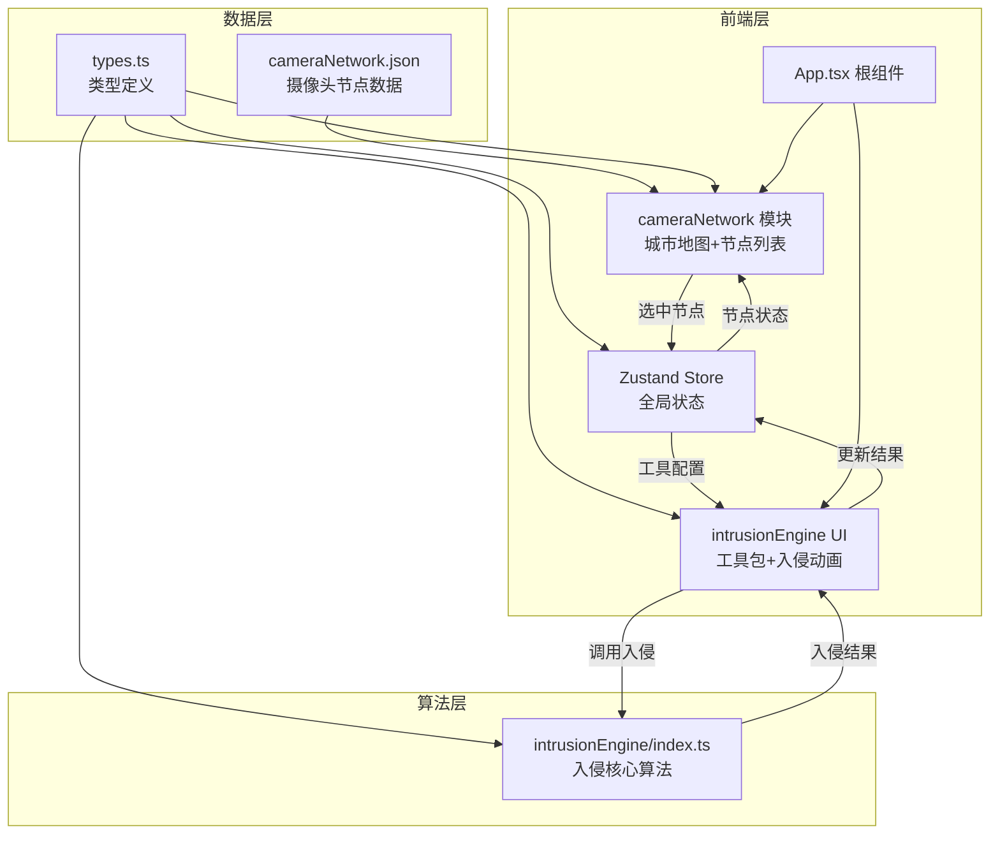
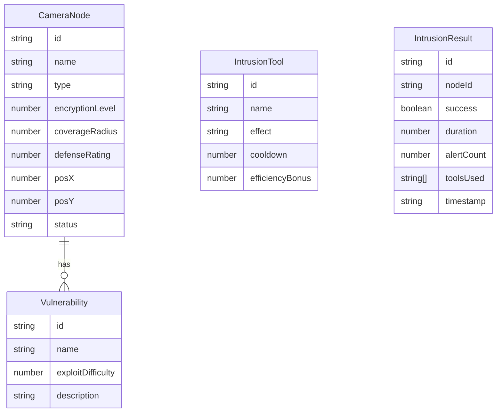

## 1. 架构设计



## 2. 技术说明

- **前端**: React 18 + TypeScript + Vite + Tailwind CSS
- **初始化工具**: vite-init (react-ts 模板)
- **后端**: 无（纯前端应用）
- **数据库**: 无（使用 JSON 静态数据 + Zustand 内存状态）
- **状态管理**: Zustand
- **依赖**: react, react-dom, zustand, uuid

## 3. 路由定义

| 路由 | 用途 |
|------|------|
| / | 主界面（单页应用，无路由切换） |

## 4. API定义

无后端API，所有数据在客户端处理。

## 5. 服务器架构图

不适用（纯前端应用）。

## 6. 数据模型

### 6.1 数据模型定义



### 6.2 数据定义

- 摄像头节点数据存储于 `src/data/cameraNetwork.json`
- 类型接口定义于 `src/types.ts`
- 入侵历史与解锁状态存储于 Zustand store（内存中）

## 7. 文件结构与调用关系

```
├── package.json
├── vite.config.js
├── tsconfig.json
├── index.html
├── src/
│   ├── types.ts                    ← 被所有模块引用
│   ├── data/
│   │   └── cameraNetwork.json      ← 被 cameraNetwork 模块读取
│   ├── store.ts                    ← Zustand 全局状态
│   ├── modules/
│   │   ├── cameraNetwork/
│   │   │   ├── index.tsx           ← 读取 JSON，展示地图，传选中节点
│   │   │   └── cameraNode.tsx      ← 接收节点数据，渲染六边形图标
│   │   └── intrusionEngine/
│   │       ├── index.ts            ← 接收节点+工具配置，返回入侵结果
│   │       └── intrusionUI.tsx     ← 调用算法，展示动画与结果
│   ├── App.tsx                     ← 组合模块，连接 Store
│   ├── main.tsx                    ← 入口
│   └── index.css                   ← 全局样式
```

**数据流向**:
1. `cameraNetwork.json` → `cameraNetwork/index.tsx` → 渲染地图节点
2. 用户点击节点 → `cameraNode.tsx` 触发选中 → Zustand Store 更新 `selectedNode`
3. Store `selectedNode` → `intrusionUI.tsx` 展示详情
4. 用户配置工具 → Store 更新 `selectedTools`
5. 用户点击入侵 → `intrusionUI.tsx` 调用 `intrusionEngine/index.ts`
6. `intrusionEngine/index.ts` 计算结果 → `intrusionUI.tsx` 展示动画
7. 入侵完成 → Store 更新 `intrusionHistory` + `unlockedNodes`
8. `cameraNode.tsx` 根据 Store 中的 `unlockedNodes` 更新节点样式
