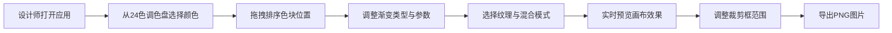

## 1. 产品概述

面向视觉设计师的色卡渐变与纹理实验工具，帮助设计师快速将头脑中的色彩组合转化为可交互的色卡面板，直观对比不同配色方案在渐变、阴影和纹理叠加下的实际表现，提升配色方案决策效率。

- 核心目标：提供沉浸式的色彩实验环境，支持色卡拖拽排序、渐变叠加、纹理混合和一键导出
- 目标用户：UI/UX 设计师、插画师、品牌设计师、前端开发者
- 市场价值：填补配色灵感从概念到可视化验证之间的工具空白

## 2. 核心功能

### 2.1 功能模块

1. **调色面板（左侧）**：24 色预设调色盘、色卡管理与拖拽排序、删除操作
2. **画布预览区（中央）**：色卡实时渲染、渐变叠加、纹理覆盖、裁剪预览框
3. **效果控制面板（右侧）**：纹理选择与密度、渐变类型与参数、混合模式、导出功能

### 2.2 页面详情

| 页面名称 | 模块名称 | 功能描述 |
|-----------|-------------|---------------------|
| 主面板 | 预设调色盘 | 24 色预设色库，点击即可添加到色卡列表 |
| 主面板 | 色卡列表 | 显示已选颜色圆形色块，支持拖拽排序、删除，选中时金色发光 |
| 主面板 | Canvas 画布 | 实时渲染色卡、渐变、纹理效果，支持拖拽 |
| 主面板 | 渐变控制 | 无/线性/径向切换、线性渐变角度(0-360°)、径向圆心偏移、最多5个颜色断点 |
| 主面板 | 纹理控制 | 噪点/水彩纸/斜纹布切换、密度滑块(10%-100%)、淡入过渡0.5s |
| 主面板 | 混合模式 | 正常/正片叠底/滤色 |
| 主面板 | 导出功能 | 虚线裁剪框可缩放、PNG导出下载 |

## 3. 核心流程

设计师打开应用后，首先从左侧24色调色盘中选择需要的颜色添加到色卡列表，通过拖拽调整色块顺序。接着在右侧控制面板中选择渐变类型（线性/径向）并调整角度、圆心偏移、颜色断点等参数。然后选择纹理类型（噪点、水彩纸、斜纹布）和密度，设置混合模式。中央画布实时反馈所有效果变化。满意后可调整虚线裁剪框确定导出范围，最终点击导出按钮下载PNG图片。

## 4. 用户界面设计

### 4.1 设计风格

- **主色调**：背景 `#1a1a2e`（深空蓝）、面板 `#16213e`（深海蓝）、卡片 `#0f3460`（墨蓝）
- **强调色**：选中状态金色发光、悬停边框 `#666` → `#333`
- **按钮样式**：统一圆角矩形，悬停边框变亮（0.2s 过渡）
- **字体**：现代无衬线字体（如 SF Pro Display / Segoe UI），数字等宽字体
- **布局**：左中右三栏桌面布局，<900px 时上下堆叠
- **动画**：色块选中金色发光 0.4s、纹理切换淡入 0.5s、渐变重绘 300ms、面板折叠旋转 180°

### 4.2 页面设计概览

| 页面名称 | 模块名称 | UI 元素 |
|-----------|-------------|-------------|
| 主面板 | 左侧调色盘 | 240px 固定宽度，色块网格布局，圆形色块，点击添加动画 |
| 主面板 | 中央画布 | 自适应宽度，Canvas 元素，虚线裁剪框可拖拽缩放 |
| 主面板 | 右侧控制面板 | 320px 可折叠，下拉菜单、滑块、开关控件，0.2s 透明度过渡 |
| 主面板 | 色卡列表 | 横向排列圆形色块，带删除叉号，拖拽时其他色块平滑让位 |

### 4.3 响应式

- **桌面优先**（>900px）：左 240px / 中央自适应 / 右 320px 三栏布局
- **移动端**（≤900px）：三栏变为上下堆叠，控制面板可折叠收起
- **触控优化**：色块最小触控区域 44×44px，滑块增大触控区域
