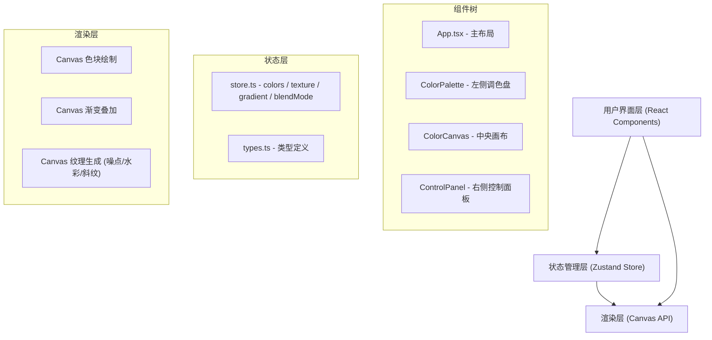

## 1. 架构设计



**数据流向**：
1. `App.tsx` 从 Zustand store 读取全局状态（colors、texture、gradient、blendMode）
2. 状态通过 props 传递给 `ColorCanvas` 和 `ControlPanel`
3. `ControlPanel` 内用户操作触发 store action 更新状态
4. 状态变更触发 `ColorCanvas` 重新调用 Canvas API 绘制
5. 色块拖拽排序直接在 store 的 colors 数组上操作

## 2. 技术描述

- **前端框架**：React@18 + TypeScript（严格模式 + ESNext 模块）
- **构建工具**：Vite@5
- **状态管理**：Zustand@4
- **辅助库**：uuid@9（生成色块唯一标识）
- **渲染引擎**：HTML5 Canvas API（原生，无额外绘图库）
- **样式方案**：原生 CSS（CSS Modules 或全局 CSS，使用 CSS 变量管理主题）

## 3. 文件结构与职责

| 文件路径 | 职责 | 调用关系 |
|----------|------|----------|
| `package.json` | 依赖声明与脚本配置 | 被 `npm run dev` 调用 |
| `index.html` | 应用入口 HTML | 加载 Vite 入口 |
| `vite.config.js` | Vite 构建配置 | 配置别名、端口等 |
| `tsconfig.json` | TypeScript 编译配置 | 严格模式、ESNext |
| `src/main.tsx` | React 渲染入口 | 渲染 `<App />` |
| `src/App.tsx` | 主应用布局组件 | 读取 store，组装 ColorPalette/ColorCanvas/ControlPanel |
| `src/types.ts` | 全局类型定义 | ColorSwatch / TextureType / BlendMode / GradientType |
| `src/store.ts` | Zustand 全局状态 | 管理 colors、texture、gradient、blendMode 及 actions |
| `src/ColorCanvas.tsx` | Canvas 画布组件 | 接收 props，调用 Canvas API 渲染色卡、渐变、纹理 |
| `src/ControlPanel.tsx` | 右侧控制面板 | 纹理/渐变/混合模式控件，调用 store actions |
| `src/ColorPalette.tsx` | 左侧调色盘组件 | 24 色预设 + 色卡列表（拖拽排序） |
| `src/styles/global.css` | 全局样式 | CSS 变量、暗色主题、响应式布局 |

## 4. 核心数据模型

### 4.1 ColorSwatch
```typescript
interface ColorSwatch {
  id: string;          // uuid
  hex: string;         // 十六进制颜色值
  name?: string;       // 颜色名称（可选）
}
```

### 4.2 枚举类型
```typescript
type TextureType = 'none' | 'noise' | 'watercolor' | 'fabric';
type BlendMode = 'normal' | 'multiply' | 'screen';
type GradientType = 'none' | 'linear' | 'radial';
```

### 4.3 GradientConfig
```typescript
interface GradientConfig {
  type: GradientType;
  angle: number;              // 线性渐变角度 0-360
  centerX: number;            // 径向渐变圆心 X (0-100%)
  centerY: number;            // 径向渐变圆心 Y (0-100%)
  stops: GradientStop[];      // 最多 5 个断点
}

interface GradientStop {
  position: number;           // 0-1
  colorIndex: number;         // 关联 colors 数组的下标
}
```

### 4.4 Store State
```typescript
interface ColorStore {
  colors: ColorSwatch[];
  texture: TextureType;
  textureDensity: number;     // 10-100
  blendMode: BlendMode;
  gradient: GradientConfig;
  cropArea: { x: number; y: number; width: number; height: number };
  showCropFrame: boolean;
  
  // actions
  addColor: (hex: string) => void;
  removeColor: (id: string) => void;
  reorderColors: (fromIndex: number, toIndex: number) => void;
  setTexture: (t: TextureType) => void;
  setTextureDensity: (d: number) => void;
  setBlendMode: (m: BlendMode) => void;
  setGradient: (g: Partial<GradientConfig>) => void;
  setCropArea: (area: Partial<CropArea>) => void;
  toggleCropFrame: () => void;
  exportCanvas: () => void;
}
```

## 5. 性能优化策略

- **Canvas 局部重绘**：使用 requestAnimationFrame 批量渲染，避免高频重复绘制
- **纹理缓存**：噪点/水彩/斜纹纹理图案使用 OffscreenCanvas 预生成并缓存，密度变化时才重绘
- **拖拽节流**：色块拖拽使用 pointermove 事件 + 16ms 节流，保持 60FPS
- **状态选择优化**：Zustand 使用 selector 避免不必要的组件重渲染
- **CSS 硬件加速**：拖拽动画使用 transform/opacity，触发 GPU 合成
