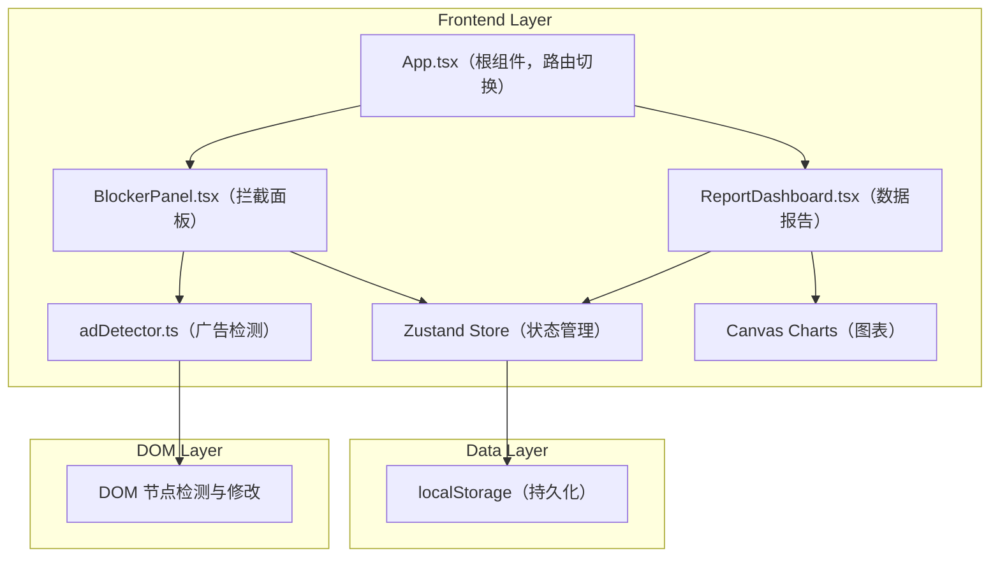

## 1. 架构设计



## 2. 技术描述

- **前端框架**：React 18 + TypeScript（严格模式）
- **构建工具**：Vite 5
- **状态管理**：Zustand 4
- **图表渲染**：Canvas API（原生）
- **数据持久化**：localStorage
- **ID 生成**：uuid
- **无后端，纯前端模拟**

## 3. 路由定义

本项目采用组件内部状态切换而非 URL 路由：

| 视图 | 切换触发 | 目的 |
|-------|---------|------|
| 拦截面板视图 | 默认显示浮动按钮 | 控制广告拦截开关、查看最近记录 |
| 数据报告视图 | 点击面板右下角统计按钮 | 查看统计数据、图表、域名排行 |

## 4. 数据模型

### 4.1 拦截记录数据结构

```typescript
// 广告类型枚举
type AdType = 'popup' | 'floating' | 'interstitial';

// 单条拦截记录
interface BlockRecord {
  id: string;                    // uuid
  type: AdType;                  // 广告类型: popup(弹窗)/floating(悬浮窗)/interstitial(插屏)
  domain: string;                // 来源域名
  timestamp: number;             // 拦截时间戳 (ms)
  elementSnapshot?: string;      // 可选：元素快照描述
}

// Store 状态
interface AdBlockerState {
  isEnabled: boolean;            // 拦截开关是否启用
  records: BlockRecord[];        // 所有拦截记录
  currentView: 'panel' | 'report'; // 当前视图

  // Actions
  toggleEnabled: () => void;
  addRecord: (record: Omit<BlockRecord, 'id' | 'timestamp'>) => void;
  removeRecord: (id: string) => void;
  clearAllRecords: () => void;
  setView: (view: 'panel' | 'report') => void;

  // 计算属性（getters）
  getTotalCount: () => number;
  getTodayCount: () => number;
  getActiveDomains: () => number;
  getLastSevenDaysData: () => { date: string; count: number }[];
  getDomainRanking: () => { domain: string; count: number }[];
  getRecordsByDomain: (domain: string) => BlockRecord[];
}
```

## 5. 项目文件结构

```
auto155/
├── package.json
├── vite.config.js
├── tsconfig.json
├── index.html
└── src/
    ├── App.tsx                          # 根组件，视图切换，store 注入
    ├── main.tsx                         # React 入口
    ├── vite-env.d.ts
    ├── store/
    │   └── useAdBlockerStore.ts         # Zustand store，记录管理+统计计算
    ├── utils/
    │   └── adDetector.ts                # 广告检测：checkAdRecursion / classifyAdType
    └── components/
        ├── BlockerPanel.tsx             # 浮动按钮+拦截面板+开关+计数+记录列表
        └── ReportDashboard.tsx          # 统计卡片+Canvas柱状图+域名排行+时间线
```

## 6. 关键算法与实现要点

### 6.1 广告检测算法（adDetector.ts）

- **classifyAdType(element: HTMLElement): AdType | null**
  - 规则：position:fixed/absolute + z-index>1000 → 疑似
  - 含遮罩层 (semi-transparent overlay + centered child) → popup
  - 悬浮角落 (position:fixed + 贴近边缘 + 宽高 < 300px) → floating
  - 全屏或大尺寸覆盖 (>80% viewport) → interstitial
  
- **checkAdRecursion(root: HTMLElement = document.body): HTMLElement[]**
  - 递归遍历所有子元素
  - 调用 classifyAdType 判断
  - 对已标记为广告的元素跳过其子树遍历（剪枝）
  - 返回匹配的广告元素数组

### 6.2 动画实现要点

- 开关弹性缩放：`transition: transform 0.3s cubic-bezier(0.34, 1.56, 0.64, 1)`，切换时先 scale(0.9) → scale(1)
- 数字翻转：使用 CSS `transform: rotateX(90deg)` → 数字变更 → `rotateX(0)`，0.4s 过渡
- 柱状图生长：Canvas 动画帧 `requestAnimationFrame`，progress 从 0→1 线性插值（0.6s），柱高 = maxHeight * progress
- 横向条形展开：同上，宽度 = maxWidth * progress
- 拦截高亮：添加 class 触发 keyframes animation，0.5s 后移除并加 blur filter
- 删除记录：`transform: translateX(100%)` + `opacity: 0`，0.3s 过渡完成后从数组移除

### 6.3 localStorage 持久化

- Store 初始化时从 localStorage 读取 `ad_blocker_records` 和 `ad_blocker_enabled`
- 每次 records 或 isEnabled 变化时，使用 `subscribe` 自动写回 localStorage
- JSON 序列化/反序列化处理

### 6.4 性能优化

- 图表动画统一使用 requestAnimationFrame，确保 60fps
- 长列表（如大量历史记录）在详情页使用按需渲染（当前场景 <1000 条可直接渲染，用户已明确提到虚拟列表概念但场景较小，故实现轻量虚拟列表接口以备扩展）
- DOM 检测使用节流：开关开启时立即检测一次，之后对 DOM 变化使用 MutationObserver + 节流 (100ms)
- 检测过的元素添加属性标记 `data-ad-blocked="true"` 避免重复处理
