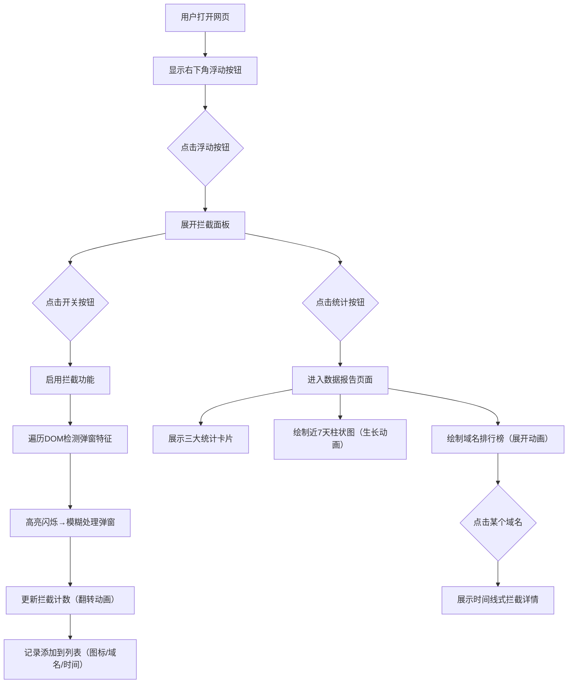

## 1. 产品概述

弹窗广告拦截与报告工具是一款浏览器端广告拦截管理应用，帮助用户一键屏蔽网页弹窗广告，同时记录广告来源、类型与时间，生成周度/月度拦截报告，让用户清晰了解广告分布情况。

- 核心目标：通过可视化的拦截面板和数据报告，提升用户对网页广告的掌控感和透明度
- 目标用户：日常浏览网页时深受弹窗广告困扰的普通用户

## 2. 核心功能

### 2.1 功能模块

1. **拦截控制面板**：浮动按钮、开关控制、实时拦截计数、最近10条拦截记录列表
2. **数据统计报告**：总/今日拦截数卡片、活跃域名数卡片、近7天柱状图、域名横向排行榜、域名详情时间线

### 2.2 页面详情

| 页面名称 | 模块名称 | 功能描述 |
|-----------|-------------|---------------------|
| 拦截控制面板 | 浮动按钮 | 固定右下角，半透明圆形，悬停放大1.2倍+光晕，点击展开面板 |
| 拦截控制面板 | 圆形开关按钮 | 渐变绿色/灰色，切换0.3秒弹性缩放动画 |
| 拦截控制面板 | 实时拦截计数 | 等宽字体，数字变化0.4秒翻滚动画 |
| 拦截控制面板 | 拦截记录列表 | 行卡片（左图标、中域名+时间、右删除），删除右滑淡出 |
| 拦截控制面板 | 拦截高亮效果 | 红色虚线边框闪烁0.5秒后CSS filter模糊 |
| 数据报告页面 | 统计数据卡片 | 总拦截/今日/活跃域名，渐变底色+错位层次感 |
| 数据报告页面 | 近7天柱状图 | Canvas绘制，浅蓝→深蓝渐变，柱顶数值标签，0.6秒生长动画 |
| 数据报告页面 | 域名排行榜 | 横向条形暖色渐变，条形左→右展开动画 |
| 数据报告页面 | 域名详情时间线 | 小圆点按类型变色（弹窗红/悬浮窗橙/插屏紫） |

## 3. 核心流程

用户打开网页 → 看到右下角浮动按钮 → 悬停按钮出现放大和光晕效果 → 点击展开拦截面板 → 点击圆形开关开启拦截 → 页面内符合特征的弹窗元素被高亮闪烁后模糊处理 → 拦截计数增加并触发翻转动画 → 新拦截记录出现在列表顶部 → 点击统计按钮切换到报告页 → 查看统计卡片、柱状图、域名排行 → 点击域名查看时间线详情

## 4. 用户界面设计

### 4.1 设计风格
- **主色调**：深色主题，背景 #1e1e2e，卡片 #2a2a3e，强调色 #7c3aed（紫色）
- **按钮风格**：大号圆形开关，开启时渐变绿，关闭时渐变灰，圆角卡片面板
- **字体**：系统无衬线字体，数字使用等宽字体
- **布局风格**：右下角浮动按钮，点击展开圆角卡片面板；报告页卡片错位布局产生层次感
- **动效**：开关弹性缩放、数字翻转、柱体生长、条形展开、删除右滑淡出、闪烁边框

### 4.2 页面设计概述

| 页面名称 | 模块名称 | UI 元素 |
|-----------|-------------|-------------|
| 拦截控制面板 | 浮动按钮 | 固定定位右下、圆形半透明、悬停 scale(1.2)+box-shadow 光晕 |
| 拦截控制面板 | 开关按钮 | width=64px 圆形、渐变背景绿/灰、transition 0.3s transform spring |
| 拦截控制面板 | 拦截计数 | font-family: monospace、数值变化时 rotateX 翻转 0.4s |
| 拦截控制面板 | 拦截记录 | 行卡片 padding:12px、左图标(24px)、中域名字体13px/时间11px、右删除按钮 |
| 拦截控制面板 | 高亮效果 | border:2px dashed #ff4444、animation: flash 0.5s、然后 filter: blur(3px) |
| 数据报告页面 | 统计卡片 | 3卡片错位（y偏移-4/0/4px）、渐变背景、border-radius:16px、总拦截数 font-size:36px bold |
| 数据报告页面 | 柱状图 | Canvas宽度自适应、每柱宽度32px、颜色线性渐变 #60a5fa → #1e40af、顶部文字标签 |
| 数据报告页面 | 域名排行 | 每行高度40px、条形高度24px、渐变 #f97316 → #ef4444、max-width:70%、左对齐条形 + 右侧域名文字 |
| 数据报告页面 | 时间线 | 左侧竖线 #444、每节点圆形 dot (12px)、dot颜色按类型、右侧卡片记录详情 |

### 4.3 响应式设计
- 桌面端优先设计
- 移动端：面板宽度 90vw，报告卡片纵向堆叠，柱状图缩小柱间距
- 触摸优化：按钮最小触控区域 44x44px
